# Dietary assessment: expert review packet

*Generated by `python -m turbotab.core.reference.packet --lens dietary` from the method contracts (`turbotab/core/contracts.py`), the model-family registry, the labels in `turbotab/core/custom_sound.py`, the lens catalog (`turbotab/core/reference/catalog.py`) and the reference journeys' captures (`docs/turbotab-next/review-packets/captures/`, run at commit `2ba3c5727a`). Do not edit it by hand: `turbotab/core/tests/test_reference.py` fails when it differs from what the code and the captures generate.*

**For the reviewer.** TurboTab v2 is released only after one methodologist per lens has reviewed the methods it offers, how they chain, the defaults, and the exact sentences it writes, and each finding is addressed (V2_DEFINITION_OF_DONE §4). This packet holds those four things for the dietary assessment lens; §5 lists the questions we ask you to answer. The full contract of every method, including the shared ones summarized here, is in `docs/turbotab-next/reference/METHODS_REFERENCE.md`.

Every option carries two independent labels (BLUEPRINT North star 5): *customary* (where the field uses it, with a source) and *sound* for the declared purpose (with the reason). The app offers options soundest first and says so when that departs from custom. A *rung* is how hard it holds an option (BLUEPRINT §11.3): recommended, available, ranked lower with its concern stated, blocked until recorded, refused with an exit, or not offered.

## 1 · The methods this lens offers

### 1.1 · Its own methods (15)

#### Rows read as imputed copies are not repeats (`copies_not_repeats`)

- **Slot:** reshape (before the seal).
- **Data scope:** row-local: needs no other row. which rows are copies of one record is read from the rows' own copy numbers; nothing is learned from other rows or the outcome
- **Needs:**
  - rows read as imputed copies (a copy number such as NHANES's _MULT_)
- **Question:** asked within the question of what repeats (`repeat_kind`)
- **Where:** recorded by `set_repeat_kind`; run by the `structure` stage; placed at the opening sequence (repeat kind).
- **The method's own leash:** prediction available; inference blocked until recorded.
- **Lenses:** Dietary assessment, Clinical. Declared by the LEASH package.

**Options**, each labeled customary and sound for each purpose, with its leash rung and its rank (1 is offered first):

| Option | Customary | Sound for prediction | Rung, rank (prediction) | Sound for inference | Rung, rank (inference) |
|---|---|---|---|---|---|
| `imputed_copies`: Imputed copies, pooled by Rubin's rules | NCHS's direction for its DXA files | Sound | available, 1 | Sound: the imputation's variability enters the intervals | recommended, 1 |
| `repeats`: Repeated measurements | customary for a unit's repeated rows | The copies' concern is stated | available, 2 | Unsound over imputed copies: imputed values analyzed as measured, intervals too narrow | blocked until recorded, 2 |

**Storyboard** (the transform player's real steps):

1. the rows read as copies of one record
2. each copy analyzed as a completed dataset
3. the estimates pooled by Rubin's rules

**Methods sentence:**

- Written by `turbotab.core.voice:_set_repeat_kind`.

**Relations:**

| Kind | Toward | Fires for | Purposes | What the app says | Enforced by |
|---|---|---|---|---|---|
| conflicts | `repeats over imputed copies` (id `copies-as-repeats-blocked`) | any option; when the repeats or time-points answer over rows read as imputed copies, under inference | inference | blocked and recorded: the exits answer imputed copies (Rubin's rules) or record the answer *(rung: blocked until recorded)* Exits: imputed copies, each analyzed and pooled by Rubin's rules; keep the answer, recorded: intervals too narrow. | `turbotab.core.structural:copies_refusal` |
| implies | `pooling by Rubin's rules` (id `copies-imply-pooling`) | any option; when the imputed-copies answer under inference, each copy kept as a record | inference | every estimate is pooled over the copies (MODELING_SEQUENCE §2) | `turbotab.core.stages.modeling:imputed_copies_column` |

**Primary sources:**

- CDC, NHANES 1999–2006 DXA, Multiple Imputation Details

#### The data's own imputed copies, pooled by Rubin's rules (`imputed_copies_pooled`)

- **Slot:** reshape (before the seal); place in it 1.
- **Data scope:** row-local: needs no other row. The copies were drawn by the data's provider; nothing is learned here: each row is kept as a record of its own copy, as it came, when the grain is read.
- **Needs:**
  - the column numbering the copies
  - the unit the copies belong to
- **Question:** The rows repeat as the data's own imputed copies: how are they analyzed?
- **Where:** recorded by `set_repeat_kind`; run by the `fit` stage; placed at 6 · Missing data.
- **The method's own leash:** prediction available; inference recommended.
- **Lenses:** Dietary assessment, Clinical. Declared by the MI package.

**Options**, each labeled customary and sound for each purpose, with its leash rung and its rank (1 is offered first):

| Option | Customary | Sound for prediction | Rung, rank (prediction) | Sound for inference | Rung, rank (inference) |
|---|---|---|---|---|---|
| `supplied`: Each copy analyzed with its own outcome, pooled by Rubin's rules | Customary in NHANES DXA analyses: each copy analyzed, the estimates combined (NCHS's combining rules) | The copies are kept as records; the concern is stated | available, 1 | Sound: each copy carries its own outcome; Rubin's rules carry the imputation's uncertainty | recommended, 1 |

**Storyboard** (the transform player's real steps):

1. Split the rows by their copy number
2. Fit each copy with its own outcome
3. Pool by Rubin's rules

**Methods sentence:**

- Written by `turbotab.core.methods.missing:mi_sentence`: The methods sentence of a pooled table's multiple imputation (STROBE-nut nut-13; Sterne et al. 2009's checklist: the imputation model, m, and how the results were combined).

**Relations:**

| Kind | Toward | Fires for | Purposes | What the app says | Enforced by |
|---|---|---|---|---|---|
| implies | `rubins_rules` (id `copies.imply_rubins_rules`) | any option; when imputed copies kept as records, under inference | inference | each copy analyzed with its own outcome and pooled by Rubin's rules | `turbotab.core.methods.missing:supplied_copies` |
| conflicts | `combined_copies` (id `copies.conflict_with_combining`) | any option; when imputed copies combined into one row per unit, under inference | inference | blocked and recorded: imputed values treated as measured *(rung: blocked until recorded)* Exits: Keep each copy as a record, pooled by Rubin's rules; Combine them, recorded: intervals too narrow. | `turbotab.core.structural:_imputed_copies_are_not_combined_unrecorded` |

**Primary sources:**

- NCHS, NHANES DXA multiple imputation data files (2008)
- Rubin 1987

#### Dietary patterns: how the food groups are made comparable (`pattern_inputs`)

- **Slot:** in-fold (fit on training rows only); place in it 0.4.
- **Data scope:** training fold: learns from study rows, so it is fit in-fold. Fitted on the training rows only under prediction and applied to the held-out rows with their means, standard deviations, energy coefficients, loadings and centers; under inference, on every analyzed row. The outcome never enters (a reduced rank regression response that is the outcome is refused).
- **Needs:**
  - the food-group intake columns
  - total energy, for the energy-adjusted forms
- **Question:** Before finding patterns, should the food groups be adjusted for how much people eat overall?
- **Where:** placed at Crosswalk D3: engine only; asked by the Describe goal and the stages in D1.
- **Lenses:** Dietary assessment. Declared by the PATTERNS package.

**Options**, each labeled customary and sound for each purpose, with its leash rung and its rank (1 is offered first):

| Option | Customary | Sound for prediction | Rung, rank (prediction) | Sound for inference | Rung, rank (inference) |
|---|---|---|---|---|---|
| `residual`: Adjusted for total energy (residual method), then standardized | Willett, Howe & Kushi 1997, Am J Clin Nutr 65:1220S: the residual method, standard for energy-adjusting intakes in cohort studies | Sound: the energy regression is fitted in each training fold | available, 1 | Sound: the patterns describe what people eat, not how much, so the first pattern does not just track total intake | recommended, 1 |
| `density`: Per 1,000 kcal, then standardized | Common in dietary-pattern reports (Newby & Tucker 2004, Nutr Rev 62:177) | Sound: a per-row ratio, then the fold's center and scale | available, 2 | Sound: the patterns describe the diet's make-up; the ratio keeps some dependence on energy | available, 2 |
| `standardized`: Standardized as eaten, no energy adjustment | The most common input: intakes standardized so the correlation matrix is used (Hu 2002, Curr Opin Lipidol 13:3) | Sound: the fold's center and scale | available, 3 | Sound with total energy kept in the outcome model; without it, the first pattern often tracks how much people eat | available, 3 |

**Storyboard** (the transform player's real steps):

1. Fit each food group on total energy (residual method), or divide by it (per 1,000 kcal)
2. Center and scale each food group with the training rows' weighted mean and standard deviation

**Methods sentence:**

- Written by `turbotab.core.methods.dietary_patterns:methods_sentence`: The dietary-pattern methods sentence: the method, the food groups' form, the weights, the retention rule and, under Predict, that the patterns were derived in each training fold.

**Relations:**

| Kind | Toward | Fires for | Purposes | What the app says | Enforced by |
|---|---|---|---|---|---|
| precedes | `dietary_patterns` | any option | prediction, inference | The food groups are made comparable before the patterns are found. |  |
| implies | `total energy in the outcome model` (id `energy_in_outcome`) | `standardized` | inference | With intakes not energy-adjusted, keep total energy as a covariate in the outcome model, since the first pattern often tracks how much people eat. |  |

**Primary sources:**

- Willett, Howe & Kushi 1997, Am J Clin Nutr 65:1220S
- Newby & Tucker 2004, Nutr Rev 62:177
- Hu 2002, Curr Opin Lipidol 13:3

#### Dietary patterns: foods eaten together (`dietary_patterns`)

- **Slot:** in-fold (fit on training rows only); place in it 0.41.
- **Data scope:** training fold: learns from study rows, so it is fit in-fold. Fitted on the training rows only under prediction and applied to the held-out rows with their means, standard deviations, energy coefficients, loadings and centers; under inference, on every analyzed row. The outcome never enters (a reduced rank regression response that is the outcome is refused).
- **Needs:**
  - two or more food-group intake columns
  - intermediate responses on the pathway, for reduced rank regression
  - the survey weights, when the rows are a weighted sample
- **Question:** How should eating patterns be found in the food groups?
- **Where:** placed at Crosswalk D3: engine only; asked by the Describe goal and the stages in D1.
- **Lenses:** Dietary assessment. Declared by the PATTERNS package.

**Options**, each labeled customary and sound for each purpose, with its leash rung and its rank (1 is offered first):

| Option | Customary | Sound for prediction | Rung, rank (prediction) | Sound for inference | Rung, rank (inference) |
|---|---|---|---|---|---|
| `pca`: Patterns of foods eaten together (principal components) | The most used method for empirical dietary patterns (Hu 2002, Curr Opin Lipidol 13:3; Newby & Tucker 2004, Nutr Rev 62:177) | Sound: derived from the food groups alone, in each training fold, and scored on the held-out rows with the fold's loadings | recommended, 1 | Sound for describing how foods go together; the patterns are derived without the outcome, so their association with it is not chosen to be large | recommended, 1 |
| `factor_analysis`: Patterns from shared variation only (exploratory factor analysis) | Common beside principal components, often reported as factor analysis (Newby & Tucker 2004, Nutr Rev 62:177); Fabrigar et al. 1999, Psychol Methods 4:272 on factors versus components | Sound: derived from the food groups alone, in each training fold | available, 2 | Sound when the patterns are taken as underlying habits that the food groups measure with error; it models each food group's own variation apart | available, 2 |
| `cluster_analysis`: Groups of people who eat alike (k-means clusters) | Used to place each person in one eating group (Newby et al. 2003, Am J Clin Nutr 77:1417; Newby & Tucker 2004, Nutr Rev 62:177) | Sound: the centers are learned in each training fold and held-out rows join the nearest one | available, 3 | Sound for describing groups of people; membership is all-or-nothing, so it carries less information than pattern scores | available, 3 |
| `reduced_rank_regression`: Patterns that explain intermediate responses (reduced rank regression) | Hoffmann et al. 2004, Am J Epidemiol 159:935: food-group combinations that explain the most variation in responses on the pathway (biomarkers, nutrients) | Sound with intermediate responses measured in the training rows; held-out rows need only their food groups | available, 4 | Sound with intermediate responses on the pathway, never the outcome being studied, which is refused | available, 4 |

**Storyboard** (the transform player's real steps):

1. Read the food groups (and the responses, for reduced rank regression)
2. Make the food groups comparable as declared, then standardize them
3. Compute their correlations, weighted by the survey weights when there are any
4. Find the patterns: components, factors, clusters or response-explaining factors
5. Rotate components and factors by varimax and order them by variance
6. Score every person, the held-out rows with the training rows' patterns

**Methods sentence:**

- Written by `turbotab.core.methods.dietary_patterns:methods_sentence`: The dietary-pattern methods sentence: the method, the food groups' form, the weights, the retention rule and, under Predict, that the patterns were derived in each training fold.
- Its clause in a chain's methods paragraph (`contracts.paragraph`) is written by `turbotab.core.methods.dietary_patterns:_clause`.
- Under prediction it is named in the in-fold group: “within each training fold, the dietary patterns … were fitted and applied to the held-out fold”.

**Relations:**

| Kind | Toward | Fires for | Purposes | What the app says | Enforced by |
|---|---|---|---|---|---|
| conflicts | `the outcome as a response` (id `outcome_as_response`) | `reduced_rank_regression`; when the outcome, or a column equal to it, among the responses | prediction, inference | Refused: the outcome being studied cannot be a reduced rank regression response, so the patterns are never chosen to explain it. *(rung: refused, with an exit)* Exits: choose intermediate responses on the pathway, such as biomarkers or nutrients; derive the patterns by principal components or factor analysis instead. | `turbotab.core.methods.dietary_patterns:check_responses` |
| implies | `patterns derived in each training fold` (id `in_each_fold`) | any option; when Predict | prediction | The patterns are derived from the training rows of each fold and applied to the held-out rows, never from every row. | `turbotab.core.methods.dietary_patterns:PatternTransformer` |
| implies | `survey_population` (id `weighted_covariance`) | any option; when a survey weight column | prediction, inference | The correlations, cluster centers and reduced rank regression are weighted by the survey weights, so the patterns are the surveyed population's. | `turbotab.core.methods.dietary_patterns:weighted_correlation` |
| implies | `varimax rotation` (id `varimax`) | `pca`, `factor_analysis`; when two or more patterns retained | prediction, inference | Components and factors are rotated by varimax, so each food group loads mainly on one pattern. | `turbotab.core.methods.dietary_patterns:varimax` |
| enables | `pattern_count` | `pca`, `factor_analysis` | prediction, inference | How many components or factors to keep is asked next. |  |
| enables | `pattern_clusters` | `cluster_analysis` | prediction, inference | How many groups of people to form is asked next. |  |
| implies | `one factor at most per response` (id `factors_per_response`) | `reduced_rank_regression` | prediction, inference | Reduced rank regression gives at most one factor per response; each factor's share of the responses' variation is reported. | `turbotab.core.methods.dietary_patterns:fit_patterns` |

**Primary sources:**

- Hu 2002, Curr Opin Lipidol 13:3
- Newby & Tucker 2004, Nutr Rev 62:177
- Newby et al. 2003, Am J Clin Nutr 77:1417
- Hoffmann et al. 2004, Am J Epidemiol 159:935
- Kaiser 1958, Psychometrika 23:187
- Fabrigar et al. 1999, Psychol Methods 4:272
- R stats::prcomp, stats::varimax; psych::fa (fm = "pa")

#### Dietary patterns: how many groups of people (`pattern_clusters`)

- **Slot:** in-fold (fit on training rows only); place in it 0.42.
- **Data scope:** training fold: learns from study rows, so it is fit in-fold. Fitted on the training rows only under prediction and applied to the held-out rows with their means, standard deviations, energy coefficients, loadings and centers; under inference, on every analyzed row. The outcome never enters (a reduced rank regression response that is the outcome is refused).
- **Needs:**
  - the standardized food groups
  - a range of group numbers, or the declared one
- **Question:** How many groups of people who eat alike should be formed?
- **Where:** placed at Crosswalk D3: engine only; asked by the Describe goal and the stages in D1.
- **Lenses:** Dietary assessment. Declared by the PATTERNS package.

**Options**, each labeled customary and sound for each purpose, with its leash rung and its rank (1 is offered first):

| Option | Customary | Sound for prediction | Rung, rank (prediction) | Sound for inference | Rung, rank (inference) |
|---|---|---|---|---|---|
| `silhouette`: The number whose groups are most distinct (silhouette width) | Rousseeuw 1987, J Comput Appl Math 20:53: the average silhouette width | Sound: a rule fixed in advance, rerun in each training fold | recommended, 1 | Sound: chooses the number whose people sit most clearly in their own group; under survey weights the widths are weighted | recommended, 1 |
| `declared`: A number stated in advance | Common: the number chosen for interpretability and group size (Newby et al. 2003, Am J Clin Nutr 77:1417; Newby & Tucker 2004, Nutr Rev 62:177) | Sound if stated before the folds | available, 2 | Sound when stated with its reason; it is a judgment | available, 2 |

**Storyboard** (the transform player's real steps):

1. Run k-means from many random starts for each number of groups
2. Compute each person's silhouette width and average it, weighted
3. Keep the number with the largest average width

**Methods sentence:**

- Written by `turbotab.core.methods.dietary_patterns:methods_sentence`: The dietary-pattern methods sentence: the method, the food groups' form, the weights, the retention rule and, under Predict, that the patterns were derived in each training fold.

**Relations:**

| Kind | Toward | Fires for | Purposes | What the app says | Enforced by |
|---|---|---|---|---|---|
| implies | `survey_population` (id `weighted_widths`) | any option; when a survey weight column | prediction, inference | The cluster centers are weighted means and the silhouette widths are averaged with the survey weights. | `turbotab.core.methods.dietary_patterns:silhouette_widths` |

**Primary sources:**

- Rousseeuw 1987, J Comput Appl Math 20:53
- Newby et al. 2003, Am J Clin Nutr 77:1417
- R stats::kmeans; R cluster::silhouette

#### Dietary patterns: how many to keep (`pattern_count`)

- **Slot:** in-fold (fit on training rows only); place in it 0.42.
- **Data scope:** training fold: learns from study rows, so it is fit in-fold. Fitted on the training rows only under prediction and applied to the held-out rows with their means, standard deviations, energy coefficients, loadings and centers; under inference, on every analyzed row. The outcome never enters (a reduced rank regression response that is the outcome is refused).
- **Needs:**
  - the food groups' correlation matrix
  - the number read from the scree plot, for the scree rule
- **Question:** How many patterns should be kept?
- **Where:** placed at Crosswalk D3: engine only; asked by the Describe goal and the stages in D1.
- **Lenses:** Dietary assessment. Declared by the PATTERNS package.

**Options**, each labeled customary and sound for each purpose, with its leash rung and its rank (1 is offered first):

| Option | Customary | Sound for prediction | Rung, rank (prediction) | Sound for inference | Rung, rank (inference) |
|---|---|---|---|---|---|
| `parallel_analysis`: Those that stand out from random data (parallel analysis) | Horn 1965, Psychometrika 30:179; Glorfeld 1995, Educ Psychol Meas 55:377 (the 95th percentile); recommended by Zwick & Velicer 1986, Psychol Bull 99:432 | Sound: a rule fixed in advance, rerun in each training fold | recommended, 1 | Sound: keeps only patterns larger than random data of the same size would give; under survey weights the random data are weighted the same way | recommended, 1 |
| `scree`: The number read from the scree plot (the scree rule) | Cattell 1966, Multivariate Behav Res 1:245; most dietary-pattern reports combine it with interpretability (Newby & Tucker 2004, Nutr Rev 62:177) | Sound if the number is fixed before the folds; read per fold it is not repeatable | available, 2 | Sound when the number and the plot are reported; it is a judgment | available, 2 |
| `eigenvalue_over_one`: Every pattern with an eigenvalue above 1 | Kaiser 1960, Educ Psychol Meas 20:141: the most used default in software and in reports | Keeps too many with many food groups (Zwick & Velicer 1986, Psychol Bull 99:432); rank lower | ranked lower, concern stated, 3 | Keeps too many with many food groups (Zwick & Velicer 1986, Psychol Bull 99:432); rank lower | ranked lower, concern stated, 3 |

**Storyboard** (the transform player's real steps):

1. Compute the eigenvalues of the food groups' correlation matrix
2. Simulate random data of the same size (under the same weights) and take the 95th percentile of their eigenvalues
3. Keep the leading patterns whose eigenvalue is above that

**Methods sentence:**

- Written by `turbotab.core.methods.dietary_patterns:methods_sentence`: The dietary-pattern methods sentence: the method, the food groups' form, the weights, the retention rule and, under Predict, that the patterns were derived in each training fold.

**Relations:**

| Kind | Toward | Fires for | Purposes | What the app says | Enforced by |
|---|---|---|---|---|---|
| implies | `survey_population` (id `weighted_reference`) | `parallel_analysis`; when a survey weight column | prediction, inference | Parallel analysis draws its random data under the same survey weights as the food groups' correlations. | `turbotab.core.methods.dietary_patterns:parallel_analysis` |

**Primary sources:**

- Horn 1965, Psychometrika 30:179
- Glorfeld 1995, Educ Psychol Meas 55:377
- Cattell 1966, Multivariate Behav Res 1:245
- Kaiser 1960, Educ Psychol Meas 20:141
- Zwick & Velicer 1986, Psychol Bull 99:432

#### Regression calibration from repeated 24-hour recalls (`regression_calibration`)

- **Slot:** in-fold (fit on training rows only); place in it 0.75.
- **Data scope:** training fold: learns from study rows, so it is fit in-fold. Training rows: it learns the within-person covariance and the calibration from every analyzed participant's recalls and covariates, never from the outcome (the scope test holds it there); under inference there is no held-out fold, so it reads every analyzed row, inside each imputed copy.
- **Needs:**
  - two or more recall days for some participants, combined by the mean
  - the outcome model's covariates (its adjustment set)
  - the energy model's terms the recalls measure
  - the survey design or the clusters, for the bootstrap
- **Question:** Correct the coefficients for day-to-day error in the recalls (regression calibration, declared as a secondary analysis)?
- **Where:** recorded by `set_measurement_error`; run by the `calibration` stage; placed at MODELING_SEQUENCE §1 step 4 (planned), run as a declared secondary analysis (row 11).
- **The method's own leash:** prediction refused, with an exit; inference recommended.
- **Lenses:** Dietary assessment. Declared by the RC package.

**Options**, each labeled customary and sound for each purpose, with its leash rung and its rank (1 is offered first):

| Option | Customary | Sound for prediction | Rung, rank (prediction) | Sound for inference | Rung, rank (inference) |
|---|---|---|---|---|---|
| `multivariate`: Every error-prone intake calibrated jointly (multivariate regression calibration) | Freedman et al. 2011, J Natl Cancer Inst 103:1086: multivariate calibration for the standard and partition models; Rosner, Spiegelman & Willett 1990, Am J Epidemiol 132:734 | Not for prediction: the model is used on recalls measured the same way as these, so its predictions need no correction. | refused, with an exit, 1 | Sound under its assumption (corrects only within-person random error, assuming recalls are unbiased for usual intake (customary; sound under that assumption)): with several error-prone intakes only the joint calibration removes the bias, which can go either way | recommended, 1 |
| `univariate`: One error-prone intake calibrated (an energy-adjusted intake with energy out of the model, or one exposure) | Freedman et al. 2011, J Natl Cancer Inst 103:1086: univariate calibration of energy-adjusted intakes; Rosner, Willett & Spiegelman 1989, Stat Med 8:1051 | Not for prediction: the model is used on recalls measured the same way as these, so its predictions need no correction. | refused, with an exit, 2 | Sound under its assumption (corrects only within-person random error, assuming recalls are unbiased for usual intake (customary; sound under that assumption)) when the model holds one error-prone intake; with several, the joint calibration is implied | recommended, 2 |
| `one_at_a_time`: Each intake calibrated on its own while the others stay uncorrected | Seen in cohort reports that apply a univariate attenuation factor per nutrient | Not for prediction: the model is used on recalls measured the same way as these, so its predictions need no correction. | refused, with an exit, 3 | Unsound with several error-prone intakes: the attenuation factor is wrong and the bias can go either way (Rosner, Spiegelman & Willett 1990, Am J Epidemiol 132:734); never offered | refused, with an exit, 4 |
| `none`: No correction: the mean of the recalls, uncorrected | Most reports; STROBE-nut nut-12.3 asks that any adjustment be reported | Not for prediction: the model is used on recalls measured the same way as these, so its predictions need no correction. | refused, with an exit, 4 | Sound as the primary: its test of no association stays valid; its estimate is attenuated | available, 3 |

**Storyboard** (the transform player's real steps):

1. Read each person's recall days of every intake the outcome model holds
2. Adjust energy on each recall day with the copy's own energy model
3. Estimate the day-to-day covariance from people with two or more recalls
4. Calibrate every error-prone intake jointly, given every other covariate
5. Refit the outcome model on the calibrated intakes, beside the uncorrected one
6. Redraw the whole chain (PSUs within strata, clusters or people) for its interval

**Methods sentence:**

- Written by `turbotab.core.stages.calibration:methods_sentence`: The methods text: the reviewers' clause (:func:`main_clause`) and what it rests on.
- Its clause in a chain's methods paragraph (`contracts.paragraph`) is written by `turbotab.core.methods.calibration:_clause`.
- Under prediction it is named in the in-fold group: “within each training fold, regression calibration … were fitted and applied to the held-out fold”.

**Relations:**

| Kind | Toward | Fires for | Purposes | What the app says | Enforced by |
|---|---|---|---|---|---|
| implies | `every outcome-model covariate in the calibration model` (id `covariates_in_calibration`) | any option; when regression calibration declared | inference | The calibration equation holds every other column of the outcome model, and never the outcome (Boe et al. 2023). | `turbotab.core.methods.calibration:correct` |
| implies | `multivariate calibration` (id `multivariate`) | any option; when two or more error-prone intakes in the outcome model (total energy beside an adjusted nutrient; every source of the all-components model) | inference | Every error-prone intake is calibrated jointly, never one nutrient at a time (Rosner, Spiegelman & Willett 1990, Am J Epidemiol 132:734). | `turbotab.core.stages.calibration:error_prone` |
| enables | `the all-components model calibrated` (id `all_components`) | any option; when the all-components or partition energy model | inference | The all-components model's energy sources are calibrated jointly, so the calibration and the all-components substitution coexist (MODELING_SEQUENCE §0 ruling 7). | `turbotab.core.stages.calibration:error_prone` |
| implies | `energy adjusted per recall day before calibration` (id `energy_per_day_first`) | any option; when the residual or density energy model | inference | Energy is adjusted on each recall day with the copy's own energy model, then calibrated. | `turbotab.core.stages.calibration:recall_matrix` |
| implies | `a whole-chain bootstrap interval` (id `whole_chain_bootstrap`) | any option; when regression calibration declared | inference | Its interval comes from a bootstrap that repeats the imputation, the energy model, the calibration and the outcome model, resampling PSUs within strata under a survey design and clusters under repeated units. | `turbotab.core.methods.calibration:whole_chain` |
| conflicts | `model-based or Rubin-only intervals` (id `model_or_rubin_intervals`) | any option | inference | Refused for a calibrated coefficient: the outcome model's own standard errors are too small (Keogh, Shaw & Gustafson 2020, Stat Med 39:2197, §6.1.2). *(rung: refused, with an exit)* Exits: the whole-chain bootstrap interval; no correction. | `turbotab.core.decisions:_calibrated_interval_is_the_whole_chain` |
| implies | `multiple_imputation_compatible` (id `inside_each_copy`) | any option; when multiple imputation under inference | inference | The calibration runs inside each completed copy, after the copy's energy model, and each bootstrap resample is imputed again (Boot MI, Schomaker & Heumann 2018, Stat Med 37:2252). | `turbotab.core.stages.calibration:calibration_stage` |
| implies | `survey_population` (id `psu_within_strata`) | any option; when the surveyed-population answer | inference | The calibration and the outcome model are survey-weighted, and PSUs are resampled within strata (Rao & Wu 1988, J Am Stat Assoc 83:231); with no stratum of two PSUs it is blocked and recorded, the sample-only attestation its exit. | `turbotab.core.stages.calibration:resampling_of` |
| implies | `a lonely PSU resampled as the primary centers it` (id `lonely_psu`) | any option; when the surveyed-population answer, a stratum with a single PSU | inference | A stratum with a single PSU is drawn twice or not at all, each with chance 1/2, so its PSU total varies about zero as R survey's lonely.psu "adjust" centers it, so the calibrated interval treats it as the primary's design-based table does, never as a stratum with no variance. | `turbotab.core.methods.calibration:psu_draw` |
| conflicts | `fewer clusters than the floor` (id `cluster_floor`) | any option; when repeated units below the cluster floor | inference | Refused: with fewer whole clusters than cluster-robust intervals require, a bootstrap of clusters cannot carry the calibrated coefficient's interval, as the fit reports none for the uncorrected one. *(rung: refused, with an exit)* Exits: no correction. | `turbotab.core.stages.calibration:cluster_floor` |
| implies | `a declared secondary analysis beside the uncorrected estimate` (id `secondary_beside_uncorrected`) | any option; when regression calibration declared | inference | The calibrated estimate sits beside the uncorrected one, whose estimate, interval and test of no association are the primary's; it corrects only within-person random error, assuming recalls are unbiased for usual intake (customary; sound under that assumption). | `turbotab.core.stages.calibration:calibration_stage` |
| implies | `the calibration in the manuscript bundle` (id `in_the_export`) | any option; when regression calibration declared | inference | The calibrated estimates, their label and the methods paragraph reach the export; a declared calibration that was not run is said to be blocked, there and in the record. | `turbotab.core.export.tables:calibration_table` |
| invalidates | `the calibration's declaration` (id `adjustment_set_invalidates`) | any option; when a change to the adjustment set | inference | Declared again under the current adjustment set, never silently kept; until then the record says it is re-asked and the export waits for it. | `turbotab.core.stages.calibration:current_calibration` |

**Primary sources:**

- Rosner, Willett & Spiegelman 1989, Stat Med 8:1051
- Rosner, Spiegelman & Willett 1990, Am J Epidemiol 132:734
- Carroll, Ruppert, Stefanski & Crainiceanu 2006, Measurement Error in Nonlinear Models, §4.4
- Freedman et al. 2011, J Natl Cancer Inst 103:1086
- Schomaker & Heumann 2018, Stat Med 37:2252
- Rao & Wu 1988, J Am Stat Assoc 83:231
- Keogh, Shaw & Gustafson 2020, Stat Med 39:2197
- Boe et al. 2023, Am J Epidemiol 192:1406
- R survey 4.5, lonely.psu "adjust" (onestage, onestrat)
- Beaumont & Patak 2012, Int Stat Rev 80:127

#### Usual-intake distribution (NCI method) (`nci_usual_intake`)

- **Slot:** the model.
- **Data scope:** training fold: learns from study rows, so it is fit in-fold. It learns from study rows (every eligible person's recalls), so it is fit on the analysis rows; under inference those are every eligible row (BLUEPRINT §12 ruling 3). It reads no outcome and feeds no other model.
- **Needs:**
  - the dietary lens
  - two or more recalls for at least two people
  - a dietary component's recalls (a long table's repeated rows or a wide table's day columns)
  - optional: an order column, a weekend indicator, a column marking consumers, the survey design
  - for a prevalence of inadequacy below an EAR: the answer that it is every participant's DRI life-stage group's EAR (and, for iron, that no participant is a menstruating woman)
- **Question:** Estimate the usual-intake distribution of a dietary component (percentiles, and the share below a cut-off)?
- **Where:** recorded by `set_usual_intake`; run by the `usual_intake` stage; placed at MODELING_SEQUENCE §1 step 2, exposure and estimand: its own estimand, beside any association analysis.
- **The method's own leash:** prediction not offered; inference recommended.
- **Lenses:** Dietary assessment.

**Options**, each labeled customary and sound for each purpose, with its leash rung and its rank (1 is offered first):

| Option | Customary | Sound for prediction | Rung, rank (prediction) | Sound for inference | Rung, rank (inference) |
|---|---|---|---|---|---|
| `amount_only`: Amount-only model | the NCI method for nutrients consumed nearly every day (Tooze et al. 2010) | not offered: no prediction reads a usual-intake distribution | not offered, 1 | sound when zero days are rare; above 5% of recalls at zero it turns those days into half the smallest amount (block and record) | recommended, 1 |
| `two_part`: Two-part model (episodically consumed foods) | the NCI method for episodically consumed foods (Tooze et al. 2006; Kipnis et al. 2009) | not offered | not offered, 2 | sound for a food with many zero days; refused with no zero day | recommended, 2 |
| `mean_of_days`: The distribution of each person's mean of recalls | customary in older surveys ("We averaged the two 24-hour recalls to obtain usual intake", NUTRITION_PACK §03) | not offered | not offered, 3 | unsound for percentiles and prevalence: the tails are too fat; shown only beside the usual-intake distribution, labeled | ranked lower, concern stated, 3 |

**Ranked by the data:** the app offers these options in another order than the rank above where the data decide it; what it offers first under each condition:

- Under inference, a component with 5% of its recalls at zero or fewer: `amount_only`: consumed nearly every day, so the amount-only model ranks first (Tooze et al. 2010).
- Under inference, a component with more than 5% of its recalls at zero: `two_part`: an episodically consumed food, so the two-part model ranks first (Tooze et al. 2006).

**Storyboard** (the transform player's real steps):

1. Box-Cox-transform each recall (λ estimated with the model)
2. Fit the mixed model: between-person and within-person variance (and, for an episodic food, the probability of a consumption day, correlated with the amount)
3. Set the nuisance covariates to a first recall and the 4/7 weekday, 3/7 weekend mix
4. Remove the within-person variance and back-transform by quadrature
5. Read the percentiles and the share below the cut-off; replicate for standard errors

**Methods sentence:**

- Written by `turbotab.core.usual_intake:_methods_sentence`.

**Relations:**

| Kind | Toward | Fires for | Purposes | What the app says | Enforced by |
|---|---|---|---|---|---|
| enables | `repeats_offer` | any option; when the dietary lens, an inference purpose and two or more recalls for at least two people | prediction, inference | the usual-intake distribution is offered as its own estimand |  |
| conflicts | `association_is_calibration` | any option; when an association between the intake and an outcome | prediction, inference | is not answered by the usual-intake distribution or any person's predicted usual intake *(rung: refused, with an exit)* Exits: regression calibration of the exposure (set_measurement_error). |  |
| implies | `zeros_two_part` | any option; when zero days above 5% of a component's recalls | prediction, inference | the two-part model ranks first; the amount-only model is recorded with the concern that its zero days became half the smallest amount |  |
| conflicts | `no_zero_no_two_part` | any option; when a component reported on every recall | prediction, inference | the two-part model's probability part has nothing to estimate (refused) *(rung: refused, with an exit)* Exits: the amount-only model. |  |
| implies | `population_design` | any option; when a survey design answered as the surveyed population | prediction, inference | the fit and the distribution are weighted, and the standard errors come from Fay's balanced repeated replication (two PSUs per stratum) or a bootstrap of PSUs within strata, stated in the sentence |  |
| implies | `sample_attestation` | any option; when a survey design answered as these participants | prediction, inference | unweighted estimates, a bootstrap over participants, and the attestation in the sentence |  |
| conflicts | `consumers_need_a_column` | any option; when consumers only with no column that says who ever consumes the food | prediction, inference | refused: the recall days cannot say who the consumers are *(rung: refused, with an exit)* Exits: the whole population, or a column marking consumers (nut-14 stated). |  |
| conflicts | `prediction_not_offered` | any option; when a prediction purpose | prediction, inference | usual intake is not offered and its answer is refused *(rung: refused, with an exit)* Exits: change the purpose to inference. |  |
| conflicts | `time_points_not_recalls` | any option; when rows that repeat as time points | prediction, inference | they are not recalls of one usual intake: not offered, and a recorded answer is not applied *(rung: refused, with an exit)* Exits: answer the repeats as repeated measurements. |  |
| conflicts | `ai_no_prevalence` | any option; when a cut-off that is an Adequate Intake | prediction, inference | no prevalence of inadequacy is computed (refused) *(rung: refused, with an exit)* Exits: no cut-off, or a plain share below it. |  |
| conflicts | `energy_no_ear` | any option; when an EAR for total energy | prediction, inference | refused: energy has no EAR *(rung: refused, with an exit)* Exits: no cut-off, or a plain share below it. |  |
| conflicts | `ear_for_every_group` | any option; when an EAR cut-off not answered as every participant's group's EAR | prediction, inference | the share below it is reported as a plain share and the prevalence of inadequacy is blocked and recorded until the cut-off is answered as the EAR of every participant's DRI life-stage group *(rung: blocked until recorded)* Exits: answer that it is every participant's group's EAR, a plain share, or no cut-off. |  |
| conflicts | `iron_skewed_requirement` | any option; when an EAR for a component whose name reads as iron, its requirement not answered as symmetric in these participants | prediction, inference | refused: iron's requirement is skewed in menstruating women, where the probability approach applies, not the cut-point *(rung: refused, with an exit)* Exits: no cut-off, a plain share, or the answer that no participant is a menstruating woman. |  |
| conflicts | `survey_unanswered` | any option; when survey design columns in the table and the survey question unanswered | prediction, inference | nothing is estimated until the survey question is answered *(rung: blocked until recorded)* Exits: answer the survey question, or the sample-only attestation. |  |
| conflicts | `lonely_psu` | any option; when the surveyed population with a stratum of one PSU | prediction, inference | no design-based variance: the distribution is blocked and recorded *(rung: blocked until recorded)* Exits: the sample-only attestation. |  |
| invalidates | `structure_invalidates` | any option; when the repeats answer changing after the usual-intake answer | prediction, inference | the recorded answer is re-read against the new structure and not applied where the rows are no longer recalls; never silently kept |  |

**Primary sources:**

- Tooze et al. 2006, J Am Diet Assoc 106:1575 (PMC2517157)
- Tooze et al. 2010, Stat Med 29:2857 (PMC3865776)
- Kipnis et al. 2009, Biometrics 65:1003 (PMC2881223)
- NCI MIXTRAN and DISTRIB macros v2.1 (epi.grants.cancer.gov/diet/usualintakes)
- Lachat et al. 2016, STROBE-nut, PLoS Med 13:e1002036 (nut-14)
- Institute of Medicine 2000, Dietary Reference Intakes: Applications in Dietary Assessment

#### The population estimand under a survey design (`survey_population`)

- **Slot:** the model.
- **Data scope:** model: the outcome model itself. The answer chooses the outcome model's estimator. Each row's weight is its own, but every design-based estimate and its variance read the outcome and every PSU's rows.
- **Needs:**
  - design columns read as the weight, the strata and the PSUs (settled readings)
  - purpose: inference
- **Question:** Do the estimates describe the surveyed population or these participants?
- **Where:** recorded by `set_survey`; run by the `fit` stage; placed at Asked after the roles, as the survey question (the Router's survey step); MODELING_SEQUENCE §1 step 9 orders the shelf by it.
- **The method's own leash:** prediction not offered; inference recommended.
- **Lenses:** Dietary assessment, Clinical, Survey instruments. Declared by the SURVEY package.

**Options**, each labeled customary and sound for each purpose, with its leash rung and its rank (1 is offered first):

| Option | Customary | Sound for prediction | Rung, rank (prediction) | Sound for inference | Rung, rank (inference) |
|---|---|---|---|---|---|
| `population`: The surveyed population (weights, strata and PSUs) | NCHS's analytic guidelines for NHANES: the sample weights with the design's strata and PSUs (NHANES Analytic Guidelines 2011–2016) | Not asked: under prediction the scores describe the rows they were computed on, and the weights are noted, not used. | not offered, 1 | Sound for a population estimand: every family and display is design-based, or blocked and recorded where none exists (MODELING_SEQUENCE §0 ruling 6). | recommended, 1 |
| `sample`: These participants (the sample-only attestation) | Unweighted analyses of survey participants, stated as such | Not asked: under prediction the scores describe the rows they were computed on, and the weights are noted, not used. | not offered, 2 | Sound only as attested: the estimates describe these participants, unweighted, and their standard errors ignore the strata and PSUs; the record carries the attestation. | available, 2 |

**Storyboard** (the transform player's real steps):

1. The survey question: the surveyed population, or these participants
2. Each chosen family: its design-based estimator, or its block with exits
3. Each display: design-based (the coefficient table, the form tests, the substitution curve, the relative effects), or blocked with exits
4. The record: each sentence restated on the answer as it stands

**Methods sentence:**

- Written by `turbotab.core.voice:sentence_for`: The one publishable sentence this decision records (backticks around data values).
- Its clause in a chain's methods paragraph (`contracts.paragraph`) is written by `turbotab.core.models.survey:_population_clause`.

**Relations:**

| Kind | Toward | Fires for | Purposes | What the app says | Enforced by |
|---|---|---|---|---|---|
| implies | `every family and display` (id `design_based_or_blocked`) | any option; when the survey answer "the surveyed population" | inference | A design-based estimator, or block and record with the sample-only attestation as its exit (MODELING_SEQUENCE §2). | `turbotab.core.models.survey:no_design_estimator` |
| conflicts | `families with no design-based estimator` (id `no_design_estimator`) | any option | inference | The mixed model, GEE, feature-wise tests, the elastic net and boosted trees have no design-based estimator: their estimates are blocked and recorded. *(rung: blocked until recorded)* Exits: the design-based family for the task in its place, every other chosen family kept; the sample-only attestation. | `turbotab.core.models.survey:no_design_estimator` |
| invalidates | `the substitution band from row resampling` (id `bootstrap_band`) | any option | inference | A row bootstrap ignores the strata and PSUs, so the curve's band is the design's linearization instead, and the refits asked for are not drawn. | `turbotab.core.models.survey:population_curve` |
| implies | `multiple imputation on the design's degrees of freedom` (id `multiple_imputation`) | any option | inference | Each completed copy is analyzed design-based, and Rubin's rules take the design's degrees of freedom as the complete-data degrees of freedom (MS2). | `turbotab.core.stages.modeling:pooled_table` |
| implies | `regression calibration by PSU within strata` (id `regression_calibration`) | any option | inference | Regression calibration and its outcome model are survey-weighted, and its interval comes from a bootstrap resampling PSUs within strata over the whole chain (Rao and Wu's); with no stratum of two PSUs it is blocked and recorded, with the sample-only attestation or no correction as its exits. | `turbotab.core.stages.calibration:resampling_of` |
| conflicts | `a scale's corrected coefficient` (id `scale_correction`) | any option | inference | A scale's correction and the uncorrected coefficient beside it are fit on the rows as sampled, so they are blocked and recorded. *(rung: blocked until recorded)* Exits: the sample-only attestation. | `turbotab.core.stages.scales:population_block` |
| implies | `the record restated` (id `restated`) | any option | inference | Every sentence that says what the survey answer does to a family, a curve or a correction is restated in the methods text on the answer as it stands; the Record keeps it as said. | `turbotab.core.provenance:restated` |
| implies | `cross-validated scores labeled unweighted` (id `unweighted_scores`) | any option | inference | Under inference no cross-validated score is shown (MODELING_SEQUENCE ruling 13): the fit's unweighted scores, about the fitting procedure on these rows, are withheld from a client; under prediction the population's are design-based cross-validation (EXPLORE). | `turbotab.core.stages.evaluation:withhold_scores` |

**Primary sources:**

- MODELING_SEQUENCE §0 ruling 6, §2, §4
- NHANES Analytic Guidelines 2011–2016 §3.2
- Korn & Graubard 1999, Analysis of Health Surveys

#### Survey-weighted Cox regression (Binder's pseudo-likelihood) (`survey_cox`)

- **Slot:** the model; place in it 1.
- **Data scope:** model: the outcome model itself. The weighted fit learns from the outcome and every study row in its domain (the analysis rows); the strata and PSUs enter only its variance. Lockbox §06's test: row i's fitted value moves with the outcome.
- **Needs:**
  - the survey answer: the surveyed population (a weight, and strata and PSUs)
  - a time-to-event outcome with its follow-up
  - the Cox family chosen
- **Question:** Do the estimates describe the surveyed population or these participants? (the survey question; this estimator answers "the surveyed population")
- **Where:** recorded by `select_models`; run by the `fit` stage; placed at MODELING_SEQUENCE §1 step 9, the shelf: under the population answer the families with a design-based estimator come first ("design-based for surveys").
- **The method's own leash:** prediction not offered; inference recommended.
- **Lenses:** Dietary assessment, Clinical, Survey instruments. Declared by the SURVEY package.

**Options**, each labeled customary and sound for each purpose, with its leash rung and its rank (1 is offered first):

| Option | Customary | Sound for prediction | Rung, rank (prediction) | Sound for inference | Rung, rank (inference) |
|---|---|---|---|---|---|
| `design_based`: Design-based: hazard ratios came from survey-weighted Cox regression (Binder's pseudo-likelihood, Efron ties) | NCHS's analytic guidelines: weights, strata and PSUs, Taylor linearization (NHANES Analytic Guidelines 2011–2016 §3.2) | Not asked: under prediction the scores describe the rows they were computed on, and the weights are noted, not used. | not offered, 2 | Sound for the surveyed population: weighted estimating equations with a linearized variance (Binder 1983; Lumley 2010). | recommended, 1 |
| `unweighted`: Unweighted, with model-based standard errors | Common where an analysis is of the participants themselves | The fit prediction uses: its scores describe these rows. | recommended, 1 | Under the population answer it describes these participants and its interval ignores the strata and PSUs, so it is blocked and recorded; it is reported only with the sample-only attestation. | blocked until recorded, 2 |

**Storyboard** (the transform player's real steps):

1. Weight each row in every risk set
2. Solve the weighted partial-likelihood score (Efron ties)
3. Take each row's weighted score residual
4. Spread the PSU totals within strata

**Methods sentence:**

- Written by `turbotab.core.models.survey:models_sentence`: What the population answer does to the chosen families, for the `select_models` sentence: each design-based estimator named, weighted by the survey weight with Taylor- linearized standard errors; each family with none named as blocked. None unless the answer is the surveyed population under inference.
- Its clause in a chain's methods paragraph (`contracts.paragraph`) is written by `a function in turbotab.core.models.survey`.

**Relations:**

| Kind | Toward | Fires for | Purposes | What the app says | Enforced by |
|---|---|---|---|---|---|
| implies | `design-based intervals` (id `design_based_intervals`) | any option | inference | Every interval is design-based: Taylor linearization over the strata and PSUs, on t with the design's degrees of freedom (the PSUs minus the strata that hold the analysis rows). | `turbotab.core.models.survey:design_table` |
| implies | `lonely PSUs centered` (id `lonely_psus`) | any option | inference | A stratum with a single PSU is centered at the mean PSU total of the strata that hold analysis rows (R survey's lonely.psu "adjust"), and the table names it. | `turbotab.core.models.survey:total_variance` |
| implies | `adjusted Wald F for joint tests` (id `adjusted_wald`) | any option | inference | A spline's overall and nonlinear tests are adjusted Wald F tests on (q, d − q + 1) degrees of freedom (Korn & Graubard 1990). | `turbotab.core.models.survey:adjusted_wald` |
| implies | `proportional hazards checked on these participants` (id `proportional_hazards`) | any option | inference | The Schoenfeld check is a diagnostic on these participants, not a design-based test. | `turbotab.core.models.survival:survey_cox_table` |

**Primary sources:**

- Binder 1983, Int Stat Rev 51:279
- Lumley 2010, Complex Surveys
- R survey::svycoxph

#### Survey-weighted linear, logistic and multinomial models (`survey_linear`)

- **Slot:** the model; place in it 1.
- **Data scope:** model: the outcome model itself. The weighted fit learns from the outcome and every study row in its domain (the analysis rows); the strata and PSUs enter only its variance. Lockbox §06's test: row i's fitted value moves with the outcome.
- **Needs:**
  - the survey answer: the surveyed population (a weight, and strata and PSUs)
  - a continuous, yes/no or multiclass outcome
  - the linear family chosen
- **Question:** Do the estimates describe the surveyed population or these participants? (the survey question; this estimator answers "the surveyed population")
- **Where:** recorded by `select_models`; run by the `fit` stage; placed at MODELING_SEQUENCE §1 step 9, the shelf: under the population answer the families with a design-based estimator come first ("design-based for surveys").
- **The method's own leash:** prediction not offered; inference recommended.
- **Lenses:** Dietary assessment, Clinical, Survey instruments. Declared by the SURVEY package.

**Options**, each labeled customary and sound for each purpose, with its leash rung and its rank (1 is offered first):

| Option | Customary | Sound for prediction | Rung, rank (prediction) | Sound for inference | Rung, rank (inference) |
|---|---|---|---|---|---|
| `design_based`: Design-based: estimates came from survey-weighted least squares, logistic or multinomial logistic regression (pseudo-maximum likelihood) | NCHS's analytic guidelines: weights, strata and PSUs, Taylor linearization (NHANES Analytic Guidelines 2011–2016 §3.2) | Not asked: under prediction the scores describe the rows they were computed on, and the weights are noted, not used. | not offered, 2 | Sound for the surveyed population: weighted estimating equations with a linearized variance (Binder 1983; Lumley 2010). | recommended, 1 |
| `unweighted`: Unweighted, with model-based standard errors | Common where an analysis is of the participants themselves | The fit prediction uses: its scores describe these rows. | recommended, 1 | Under the population answer it describes these participants and its interval ignores the strata and PSUs, so it is blocked and recorded; it is reported only with the sample-only attestation. | blocked until recorded, 2 |

**Storyboard** (the transform player's real steps):

1. Weight each row by the people it stands for
2. Solve the weighted estimating equations
3. Sum each PSU's weighted scores
4. Spread the PSU totals within strata
5. Read intervals on t, the PSUs minus the strata

**Methods sentence:**

- Written by `turbotab.core.models.survey:models_sentence`: What the population answer does to the chosen families, for the `select_models` sentence: each design-based estimator named, weighted by the survey weight with Taylor- linearized standard errors; each family with none named as blocked. None unless the answer is the surveyed population under inference.
- Its clause in a chain's methods paragraph (`contracts.paragraph`) is written by `a function in turbotab.core.models.survey`.

**Relations:**

| Kind | Toward | Fires for | Purposes | What the app says | Enforced by |
|---|---|---|---|---|---|
| implies | `design-based intervals` (id `design_based_intervals`) | any option | inference | Every interval is design-based: Taylor linearization over the strata and PSUs, on t with the design's degrees of freedom (the PSUs minus the strata that hold the analysis rows). | `turbotab.core.models.survey:design_table` |
| implies | `lonely PSUs centered` (id `lonely_psus`) | any option | inference | A stratum with a single PSU is centered at the mean PSU total of the strata that hold analysis rows (R survey's lonely.psu "adjust"), and the table names it. | `turbotab.core.models.survey:total_variance` |
| implies | `adjusted Wald F for joint tests` (id `adjusted_wald`) | any option | inference | A spline's overall and nonlinear tests are adjusted Wald F tests on (q, d − q + 1) degrees of freedom (Korn & Graubard 1990). | `turbotab.core.models.survey:adjusted_wald` |

**Primary sources:**

- Binder 1983, Int Stat Rev 51:279
- Lumley 2010, Complex Surveys
- R survey::svyglm

#### Survey-weighted proportional-odds model (`survey_ordinal`)

- **Slot:** the model; place in it 1.
- **Data scope:** model: the outcome model itself. The weighted fit learns from the outcome and every study row in its domain (the analysis rows); the strata and PSUs enter only its variance. Lockbox §06's test: row i's fitted value moves with the outcome.
- **Needs:**
  - the survey answer: the surveyed population (a weight, and strata and PSUs)
  - an ordered outcome with its declared order
  - the proportional-odds family chosen
- **Question:** Do the estimates describe the surveyed population or these participants? (the survey question; this estimator answers "the surveyed population")
- **Where:** recorded by `select_models`; run by the `fit` stage; placed at MODELING_SEQUENCE §1 step 9, the shelf: under the population answer the families with a design-based estimator come first ("design-based for surveys").
- **The method's own leash:** prediction not offered; inference recommended.
- **Lenses:** Dietary assessment, Clinical, Survey instruments. Declared by the SURVEY package.

**Options**, each labeled customary and sound for each purpose, with its leash rung and its rank (1 is offered first):

| Option | Customary | Sound for prediction | Rung, rank (prediction) | Sound for inference | Rung, rank (inference) |
|---|---|---|---|---|---|
| `design_based`: Design-based: cumulative odds ratios came from a survey-weighted proportional-odds model (pseudo-maximum likelihood) | NCHS's analytic guidelines: weights, strata and PSUs, Taylor linearization (NHANES Analytic Guidelines 2011–2016 §3.2) | Not asked: under prediction the scores describe the rows they were computed on, and the weights are noted, not used. | not offered, 2 | Sound for the surveyed population: weighted estimating equations with a linearized variance (Binder 1983; Lumley 2010). | recommended, 1 |
| `unweighted`: Unweighted, with model-based standard errors | Common where an analysis is of the participants themselves | The fit prediction uses: its scores describe these rows. | recommended, 1 | Under the population answer it describes these participants and its interval ignores the strata and PSUs, so it is blocked and recorded; it is reported only with the sample-only attestation. | blocked until recorded, 2 |

**Storyboard** (the transform player's real steps):

1. Weight each row's cumulative-logit likelihood
2. Solve the weighted score
3. Spread the PSU totals within strata

**Methods sentence:**

- Written by `turbotab.core.models.survey:models_sentence`: What the population answer does to the chosen families, for the `select_models` sentence: each design-based estimator named, weighted by the survey weight with Taylor- linearized standard errors; each family with none named as blocked. None unless the answer is the surveyed population under inference.
- Its clause in a chain's methods paragraph (`contracts.paragraph`) is written by `a function in turbotab.core.models.survey`.

**Relations:**

| Kind | Toward | Fires for | Purposes | What the app says | Enforced by |
|---|---|---|---|---|---|
| implies | `design-based intervals` (id `design_based_intervals`) | any option | inference | Every interval is design-based: Taylor linearization over the strata and PSUs, on t with the design's degrees of freedom (the PSUs minus the strata that hold the analysis rows). | `turbotab.core.models.survey:design_table` |
| implies | `lonely PSUs centered` (id `lonely_psus`) | any option | inference | A stratum with a single PSU is centered at the mean PSU total of the strata that hold analysis rows (R survey's lonely.psu "adjust"), and the table names it. | `turbotab.core.models.survey:total_variance` |
| implies | `adjusted Wald F for joint tests` (id `adjusted_wald`) | any option | inference | A spline's overall and nonlinear tests are adjusted Wald F tests on (q, d − q + 1) degrees of freedom (Korn & Graubard 1990). | `turbotab.core.models.survey:adjusted_wald` |
| implies | `proportional odds checked on these participants` (id `proportional_odds`) | any option | inference | The Brant check is a diagnostic on these participants, not a design-based test. | `turbotab.core.models.ordinal:survey_ordinal_table` |

**Primary sources:**

- Binder 1983, Int Stat Rev 51:279
- Lumley 2010, Complex Surveys
- R survey::svyolr

#### The substitution curve over the surveyed population (`survey_substitution`)

- **Slot:** evaluation (after the fit); place in it 1.
- **Data scope:** model: the outcome model itself. The weighted fit learns from the outcome and every study row in its domain (the analysis rows); the strata and PSUs enter only its variance. Lockbox §06's test: row i's fitted value moves with the outcome.
- **Needs:**
  - the survey answer: the surveyed population (a weight, and strata and PSUs)
  - a substitution answer
  - the linear family chosen
- **Question:** Which energy substitution, in what steps? (the substitution question)
- **Where:** recorded by `set_substitution`; run by the `substitution` stage; placed at MODELING_SEQUENCE §1 step 11's displays, beside the coefficient table.
- **The method's own leash:** prediction not offered; inference recommended.
- **Lenses:** Dietary assessment. Declared by the SURVEY package.

**Options**, each labeled customary and sound for each purpose, with its leash rung and its rank (1 is offered first):

| Option | Customary | Sound for prediction | Rung, rank (prediction) | Sound for inference | Rung, rank (inference) |
|---|---|---|---|---|---|
| `design_band`: A band by Taylor linearization over the survey design | Predictive margins with survey data (Graubard & Korn 1999) | Not asked: under prediction the scores describe the rows they were computed on, and the weights are noted, not used. | not offered, 2 | Sound for the surveyed population: the band carries both the error of the weighted fit and which people were sampled. | recommended, 1 |
| `row_bootstrap`: A band from refits on bootstrap resamples of rows | The band this app draws without a survey design | The band prediction draws on its training rows. | recommended, 1 | Not under the population answer: a row bootstrap ignores the strata and PSUs, so the design's band replaces it. | not offered, 2 |

**Storyboard** (the transform player's real steps):

1. Refit the linear family with the weights
2. Move k kcal on every row on support
3. Average each row's change over the population (weighted)
4. Linearize the average over the design for its band

**Methods sentence:**

- Written by `turbotab.core.models.survey:substitution_clause`: The `set_substitution` sentence's clause under the population answer (the curve's contract sentence), or None. `n_boot`: the bootstrap refits the answer asked for, which the design's band replaces and the clause says are not drawn. `per_class`: a multiclass outcome's curves, one per class (`methods.substitution.class_clause`).
- Its clause in a chain's methods paragraph (`contracts.paragraph`) is written by `turbotab.core.models.survey:_substitution_contract_clause`.

**Relations:**

| Kind | Toward | Fires for | Purposes | What the app says | Enforced by |
|---|---|---|---|---|---|
| invalidates | `the substitution band from row resampling` (id `bootstrap_band`) | any option | inference | A row bootstrap ignores the strata and PSUs, so the band is the design's instead. | `turbotab.core.models.survey:design_curve` |
| conflicts | `a curve from a family with no design-based estimator` (id `blocked_curve`) | any option | inference | Blocked and recorded: no curve, its reason and its exits. *(rung: blocked until recorded)* Exits: the design-based family in its place, every other chosen family kept; the sample-only attestation. | `turbotab.core.models.survey:population_curve` |

**Primary sources:**

- Graubard & Korn 1999, Biometrics 55:652
- R survey::svyglm + svycontrast

#### Substitution curves for a multiclass outcome, one per class (`multiclass_substitution`)

- **Slot:** evaluation (after the fit); place in it 2.
- **Data scope:** model: the outcome model itself. Each curve follows the fitted outcome model, so a row's predicted change moves with the outcome and with every row the model was fit on. Lockbox §06's test: row i's change in each class's probability moves when the outcome does.
- **Needs:**
  - a multiclass outcome (three or more unordered classes)
  - two energy-bearing exposures whose kcal per unit is settled
  - a fitted family that predicts each class's probability
  - the substitution answer (donor, recipient and step)
- **Question:** Which energy substitution, in what steps? (the substitution question; a multiclass outcome draws one curve per class)
- **Where:** recorded by `set_substitution`; run by the `substitution` stage; placed at MODELING_SEQUENCE §1 step 11's displays: beside the coefficient table under inference, beside the comparison under prediction.
- **The method's own leash:** prediction recommended; inference recommended.
- **Lenses:** Dietary assessment. Declared by the MULTISUB package.

**Options**, each labeled customary and sound for each purpose, with its leash rung and its rank (1 is offered first):

| Option | Customary | Sound for prediction | Rung, rank (prediction) | Sound for inference | Rung, rank (inference) |
|---|---|---|---|---|---|
| `class_curves`: One curve per class: the average change in each class's predicted probability | Average discrete changes of a multinomial model on each outcome's probability (Long & Freese 2014, ch. 8; Stata margins and R marginaleffects per outcome) | Sound as a model contrast: what the fitted model predicts for each class when k kcal move. | recommended, 1 | Sound: a marginal, isocaloric contrast on the probability scale over the stated population; the curves sum to zero at every k, as each person's probabilities sum to one. | recommended, 1 |
| `reference_ratios`: Relative-risk ratios against the reference class per kcal swapped | The multinomial coefficients' contrast, as categorical-outcome analyses report them | Not a prediction: the class curves say what the model predicts. | not offered, 2 | Conditional on every covariate and against one reference class: it says how the odds of a class against the reference move, not how any class's probability does, and it is one number only when every energy source is a linear term. The coefficient table reports each class's ratios per unit. | not offered, 2 |

**Storyboard** (the transform player's real steps):

1. Predict every class's probability on every row
2. Move k kcal from the donor to the recipient on every row on support
3. Predict again, and take each class's change
4. Average each class's change over the same rows (weighted under a surveyed population)
5. Check that the class curves sum to zero at every k
6. Band each class: refits on bootstrap resamples, Rubin's rules over the imputations, or the survey design's linearization

**Methods sentence:**

- Written by `turbotab.core.methods.substitution:class_clause`: The `set_substitution` sentence's clause for a multiclass outcome (its contract's sentence), or None. It reads the recorded task only, so the methods text restates it whole.
- Its clause in a chain's methods paragraph (`contracts.paragraph`) is written by `turbotab.core.methods.substitution:_contract_clause`.

**Relations:**

| Kind | Toward | Fires for | Purposes | What the app says | Enforced by |
|---|---|---|---|---|---|
| implies | `class_probabilities_sum_to_one` (id `curves_sum_to_zero`) | any option | prediction, inference | The class curves sum to zero at every k, because each row's class probabilities sum to one before and after the move; a set that does not is a defect, raised and never drawn. | `turbotab.core.methods.substitution:check_sums_to_zero` |
| implies | `refit_band` | any option; when a band asked for (n_boot > 0) with no surveyed population | prediction, inference | Each class's band comes from refits of the model on bootstrap resamples of the rows it was fit on (whole units when rows repeat), its interval read from that class's refits. | `turbotab.core.methods.substitution:class_refit_band` |
| implies | `multiple_imputation_compatible` (id `pooled_per_k`) | any option; when multiple imputation under inference | inference | Each completed copy's class curves are drawn on that copy's rows through that copy's own fit (a family with no coefficient table refit on each copy), and pooled at each k by Rubin's rules; a curve from one fill is never shown. | `turbotab.core.methods.substitution:pool_class_curves` |
| conflicts | `imputation_blocked` (id `blocked_with_the_table`) | any option; when multiple imputation under inference with blanks among the analyzed rows, blocked and recorded or with no copies drawn | inference | While the missing-values answer blocks the coefficient table under inference (passive imputation with a declared nonlinear term, single-level imputation on clustered rows, imputation that cannot run on these data), or no imputed copies were drawn for the fit, no class curve is drawn: each family's curves are blocked and recorded with the table's own refusal and exits, never drawn on one fill of the blanks. *(rung: blocked until recorded)* Exits: the coefficient table's own exits (complete cases, with their assumption stated, among them); with no copies drawn: the linear model added, whose coefficient table draws them. | `turbotab.core.methods.substitution:missing_values_block` |
| implies | `survey_population` (id `design_based`) | any option; when the survey answer "the surveyed population" | inference | Each class's curve comes from the survey-weighted multinomial fit, averaged with the weights, and its band is Taylor linearization over the survey design; refits on bootstrap resamples of rows are not drawn. | `turbotab.core.methods.substitution:design_class_curves` |
| conflicts | `survey_population` (id `blocked_family`) | any option; when the survey answer "the surveyed population" and a family with no design-based estimator | inference | A family with no design-based estimator draws no class curves under the surveyed population: blocked and recorded. *(rung: blocked until recorded)* Exits: the design-based family in its place, every other chosen family kept; the sample-only attestation. | `turbotab.core.stages.class_substitution:population_blocked` |
| conflicts | `survey_population` (id `no_design_df`) | any option; when the survey answer "the surveyed population" with no design degrees of freedom (every PSU alone in its stratum) | inference | A design whose analysis rows lie in no more PSUs than strata leaves no degrees of freedom for an interval: the coefficient table is refused, and no class curve is drawn either, blocked and recorded, never shown as points under a caption that promises intervals. *(rung: blocked until recorded)* Exits: the sample-only attestation. | `turbotab.core.methods.substitution:no_design_df` |
| conflicts | `omitted_energy_sources` (id `omitted_sources`) | any option; when energy sources left out above MAX_OMITTED_SHARE of total energy | inference | Energy sources left out of the model, above the stated share of total energy, block the swap under inference until it is recorded: the curves carry the confounding of the sources total energy holds as one composite. *(rung: blocked until recorded)* Exits: add each missing energy source to the model as an exposure; Keep this swap; the curve carries their confounding; Choose another swap. | `turbotab.core.decisions:_substitution_has_every_energy_source` |
| implies | `omitted_energy_sources` (id `omitted_stated`) | any option; when energy sources left out of the model | prediction | Under prediction the curves are model contrasts: the sources the model leaves out are named as a concern, never blocked. | `turbotab.core.methods.energy:omitted_sentence` |
| implies | `estimand_label` | any option | prediction, inference | The estimand names the probability scale, the isocaloric move and the population the curves average over; each class's label is the change in its probability at the stated k, an average over that population, since a multinomial model's change depends on k and on each person's intake (MODELING_SEQUENCE §2). | `turbotab.core.methods.substitution:class_estimand` |

**Primary sources:**

- Long & Freese 2014, Regression Models for Categorical Dependent Variables Using Stata, 3rd ed., ch. 8
- Graubard & Korn 1999, Biometrics 55:652
- Rubin 1987, Multiple Imputation for Nonresponse in Surveys
- Tomova, Gilthorpe & Tennant 2022 (substitution models; PMC9630885)
- MODELING_SEQUENCE §2, §4

#### Design-based cross-validation (`design_based_cv`)

- **Slot:** evaluation (after the fit); place in it 8.
- **Data scope:** training fold: learns from study rows, so it is fit in-fold. Each fold's model learns from the training rows as the procedure does; the design only places whole PSUs in the folds and weighs every score.
- **Needs:**
  - the surveyed-population answer
  - the weight, and the strata and PSUs if named
- **Question:** (stated by the survey answer: the population's performance, or these rows')
- **Where:** recorded by `set_survey`; run by the `evaluation` stage; placed at 11 · Tuning and comparison.
- **Lenses:** Dietary assessment, Clinical, Survey instruments. Declared by the EXPLORE package.

**Options**, each labeled customary and sound for each purpose, with its leash rung and its rank (1 is offered first):

| Option | Customary | Sound for prediction | Rung, rank (prediction) | Sound for inference | Rung, rank (inference) |
|---|---|---|---|---|---|
| `population`: Design-based cross-validation: whole PSUs within strata, every score weighted | Unweighted cross-validation is the habit even on survey data | Sound for performance in the surveyed population (Wieczorek et al. 2022) | recommended, 1 | Not shown: under inference no cross-validated score is reported | not offered, 1 |
| `sample`: Unweighted scores, labeled as these rows' performance | The field's habit | Sound for the procedure's performance on these rows, and labeled so | available, 2 | Not shown: under inference no cross-validated score is reported | not offered, 2 |

**Storyboard** (the transform player's real steps):

1. deal each stratum's PSUs to the folds
2. fit on the other folds
3. weigh each held-out row's loss by its survey weight
4. average the folds' weighted means

**Methods sentence:**

- Written by `turbotab.core.stages.evaluation:design_sentence`: The design-based cross-validation clause the survey answer implies under prediction.

**Relations:**

| Kind | Toward | Fires for | Purposes | What the app says | Enforced by |
|---|---|---|---|---|---|
| implies | `design_folds` (id `design_based_scores`) | `population`; when the surveyed-population answer under prediction | prediction | folds keep whole PSUs together within strata, and every loss, calibration and comparison is survey-weighted, labeled design-based cross-validation | `turbotab.core.models.design_cv:design_folds` |
| implies | `no_cv_under_inference` (id `no_cv_score_under_inference`) | any option | inference | no cross-validated score is shown under inference | `turbotab.core.stages.evaluation:withhold_scores` |

**Primary sources:**

- Wieczorek, Guerin & McMahon, Stat 2022;11:e454
- MODELING_SEQUENCE §0 ruling 13

### 1.2 · Model families

The shelf ranks every family that can model the outcome by its own assessment of the data and never shortens the list: no family is withheld from a lens, so every family is offered here.

Every other family on the shelf, each in full in the methods reference:

| Family | Outcomes | Purposes | Inductive bias | Reviewed in full in |
|---|---|---|---|---|
| Linear model (`linear`) | regression, binary, multiclass, ordinal | prediction, inference | Each predictor adds a straight-line effect; effects add up, with no interactions unless you build them. | every lens (shared): the methods reference |
| Elastic net (`elastic_net`) | regression, binary, multiclass, ordinal | prediction, inference | Straight-line effects shrunk toward zero; few predictors matter, correlated ones share weight. | every lens (shared): the methods reference |
| Boosted trees (`boosted_trees`) | regression, binary, multiclass, ordinal | prediction, inference | Effects are step functions that can bend and interact; many shallow trees each correct the last. | every lens (shared): the methods reference |
| Feature-wise regression (`featurewise`) | regression, binary | inference | Each exposure tested on its own with the covariates; Benjamini–Hochberg holds the false-discovery rate. | the metabolomics and genomics packets |
| Proportional-odds model (`proportional_odds`) | ordinal | prediction, inference | Each predictor shifts the odds of a higher level by one factor, the same at every cut-point. | every lens (shared): the methods reference |
| Random-intercept mixed model (`mixed`) | regression | prediction, inference | Straight-line effects, plus a level of its own for each unit whose rows repeat. | every lens (shared): the methods reference |
| GEE (exchangeable) (`gee`) | regression, binary | prediction, inference | Population-average straight-line or log-odds effects; a unit's rows share one correlation. | every lens (shared): the methods reference |
| Cox proportional hazards (`cox`) | time_to_event | prediction, inference | Each predictor multiplies the hazard by a constant ratio over all of follow-up; effects add on the log scale. | every lens (shared): the methods reference |
| Screened elastic net (`screened_elastic_net`) | regression, binary | prediction | Only features with a strong marginal association survive; among them, straight-line effects shrunk toward zero. | the metabolomics and genomics packets |

### 1.3 · Shared methods (45)

Every lens offers these; their full contracts are in the methods reference.

| Method | Key | Slot | Scope | Recorded by |
|---|---|---|---|---|
| Importing a codebook | `import_codebook` | ingest | descriptive | `import_codebook` |
| Joining files on a shared identifier | `join_files` | ingest | row_local | `join_files` |
| Explore after the seal | `explore` | in_fold | descriptive | `view_outcome` |
| Multiple imputation compatible with the analysis model | `multiple_imputation_compatible` | in_fold | model | `set_missing` |
| Passive multiple imputation (chained equations, terms derived per copy) | `multiple_imputation_passive` | in_fold | model | `set_missing` |
| Single-level multiple imputation on clustered rows | `multiple_imputation_single_level` | in_fold | model | `set_missing` |
| Subgroups of similar people (cluster analysis) | `subgroups` | in_fold | training_fold | not declared |
| A domain transform of the exposure (log, energy model, scale scoring, omics normalization) | `exposure_transform` | in_fold | training_fold | not declared |
| The functional form of a continuous exposure or confounder | `functional_form` | in_fold | training_fold | `set_exposure_form` |
| Splines for every continuous predictor, knots by a stated rule | `spline_rule` | in_fold | training_fold | `set_levers` |
| Nonlinearity chosen by inner cross-validation | `inner_cv_form` | in_fold | model | `set_levers` |
| A variance filter fitted in each training fold | `variance_filter` | in_fold | training_fold | `set_levers` |
| Selection of predictors | `variable_selection` | in_fold | model | `set_selection` |
| An imbalance correction in-fold, then recalibration | `imbalance_correction` | in_fold | model | `set_levers` |
| The adjustment card's guesses, by exposure–outcome pairing | `adjustment_guesses` | model | descriptive | `set_adjustment` |
| Double ML, interactive | `dml_irm` | model | model | `set_causal` |
| Double ML, partially linear | `dml_plr` | model | model | `set_causal` |
| The effect measure (difference or ratio; conditional or marginal) | `effect_measure` | model | descriptive | `set_estimand` |
| Effect modification (the exposure's effect across strata of a modifier) | `effect_modification` | model | model | `set_modification` |
| Marginal standardization (g-computation) | `g_computation` | model | model | `set_estimand` |
| The grouping question, asked by structure | `grouping_by_structure` | model | descriptive | `set_clusters` |
| Interaction (the joint effect of two exposures) | `interaction` | model | model | `set_modification` |
| Post-double-selection lasso | `pds_lasso` | model | model | `set_causal` |
| A time-varying exposure by g-methods | `time_varying` | model | model | `set_time_varying` |
| Targeted maximum likelihood | `tmle` | model | model | `set_causal` |
| Diagnostics of the primary model | `diagnostics` | evaluation | descriptive | `respond_diagnostic` |
| The E-value of a difference, standardized by the estimand's SD | `evalue_sd` | evaluation | descriptive | not declared |
| An exposure family and its multiplicity | `exposure_family` | evaluation | descriptive | `set_estimand` |
| Outcome-model fit statistics wait with the estimates | `fit_statistics_withheld` | evaluation | model | not declared |
| The declared model sequence (Table 2) | `model_sequence` | evaluation | model | `set_model_sequence` |
| The analysis-plan export | `plan_export` | evaluation | descriptive | `lock_plan` |
| Sensitivity to unmeasured confounding | `unmeasured_confounding` | evaluation | descriptive | not declared |
| Model explanations | `explain` | evaluation | model | `set_explain` |
| Multiplicity control | `multiplicity` | evaluation | model | `set_multiplicity` |
| A strictly proper primary score | `proper_primary` | evaluation | training_fold | `set_split` |
| Repeated k-fold comparison substrate | `comparison_substrate` | evaluation | training_fold | `set_split` |
| Bootstrap bias-corrected cross-validation | `bbc_cv` | evaluation | training_fold | `set_split` |
| Bootstrap optimism correction | `bootstrap_optimism` | evaluation | training_fold | `set_split` |
| Calibration by a horizon, and by level | `horizon_calibration` | evaluation | training_fold | `set_split` |
| The nested cross-validation interval | `nested_cv_interval` | evaluation | training_fold | `set_split` |
| Leave-one-site-out validation, pooled across sites | `site_validation` | evaluation | training_fold | `set_validation` |
| Intended use, the decision curve and the threshold | `intended_use` | evaluation | training_fold | `set_intended_use` |
| Agreement between two measurements (Bland–Altman) | `bland_altman` | evaluation | descriptive | not declared |
| Which of my decisions mattered? (specification curve) | `specification_curve` | evaluation | model | not declared |
| The manuscript bundle and its replay | `manuscript_export` | evaluation | descriptive | not declared |

### 1.4 · Methods another lens reviews in full (14)

No method contract is declared for one lens: the app reaches each of these through the data it needs, not through the lens, though some are reached through findings or stages their own lens raises. Each is offered here whenever this lens's data hold what it needs, and is reviewed in full in the packet named.

| Method | Key | Reviewed in full in | Slot | What it needs |
|---|---|---|---|---|
| Values below a detection limit belong to the below-detection repair | `censored_below_detection` | the metabolomics and clinical packets | repairs | a text column with values below a detection limit (<0.20) |
| QC detection-rate filter | `qc_detection_filter` | the metabolomics packet | repairs | pooled-QC injections |
| QC-RLSC drift and batch correction | `qc_rlsc` | the metabolomics packet | repairs | pooled-QC injections; an injection order (a reading each option names); a batch column, or the whole run as one batch (a reading each option names); at least five QCs per batch |
| QC-RSD filter | `qc_rsd_filter` | the metabolomics packet | repairs | pooled-QC injections |
| PQN against the pooled-QC reference | `qc_pqn` | the metabolomics packet | repairs | pooled-QC injections |
| The QC rows leave | `qc_rows_leave` | the metabolomics packet | eligibility | the pooled-QC label |
| D-ratio filter | `d_ratio_filter` | the metabolomics packet | in_fold | pooled-QC standard deviations |
| Omics normalization | `omics_normalization` | the metabolomics and genomics packets | in_fold | an assay block read as raw counts or raw intensities |
| Values below detection | `detection_limit` | the metabolomics packet | in_fold | columns whose blanks are non-detections |
| Log transformation | `log_transform` | the metabolomics and genomics packets | in_fold | positive values |
| Batch handling | `batch` | the metabolomics and genomics packets | in_fold | a batch column |
| Scale scores, their reliability and the correction for measurement error | `scales` | the survey instruments packet | in_fold | three or more numeric items on one response scale, each a confirmed exposure or covariate (a reflective scale's answers whole numbers; a formative index's components may be continuous scores); the instrument's key: its reverse-coded items and its response scale; for a test–retest reliability: the repeat administration's columns, or its score; for a calibration substudy: a reference measure read as an amount, blank outside the substudy |
| In-fold screening | `screen` | the metabolomics and genomics packets | in_fold | an outcome; many more features than rows |
| Autoscaling | `autoscaling` | the metabolomics and genomics packets | in_fold | a family that standardizes its inputs |

### 1.5 · Methods with no contract yet (20)

These are offered (V2_DEFINITION_OF_DONE §2, or by a question the Router asks) and implemented in the code named, but no method contract declares their slot, scope, labeled options, leash, storyboard, sentence and relations. They are gaps in the registry, listed so the review covers them too; one is a limit of the app as well (its note says so).

| Method | Where v2 offers it | Lenses | Recorded by | Implemented in | Labels | Contracts covering part of it | Note |
|---|---|---|---|---|---|---|---|
| Energy adjustment (the five models and all components) | Dietary | Dietary assessment | `set_energy_adjustment` | `turbotab.core.methods.energy`, `turbotab.core.methods.percent_energy` | `custom_sound:energy_adjustment` | `exposure_transform` | Its options carry both labels (methods.energy.METHOD_TABLE, ranked by RANKING), but its slot, scope, storyboard and relations are declared nowhere as a contract; exposure_transform names it only as one of the exposure's transforms. |
| Implausible intake: fixed kcal rules and the Goldberg screen | Dietary | Dietary assessment | `set_exclusions` | `turbotab.core.stages.proposals`, `turbotab.core.methods.misreporting` | `custom_sound:exclusions` | none |  |
| Declared secondary analyses (the exclusions' sensitivity view) | Inference (shared); Dietary | every lens (shared) | `set_sensitivity` | `turbotab.core.stages.secondary`, `turbotab.core.stages.sensitivity` | none | none |  |
| Repeated recalls combined by averaging | Dietary | Dietary assessment | `set_aggregation` | `turbotab.core.structural`, `turbotab.core.stages.working` | none | `regression_calibration` |  |
| Substitution curves with refit bands (one outcome) | Dietary | Dietary assessment | `set_substitution` | `turbotab.core.methods.substitution` | none | `multiclass_substitution`, `survey_substitution` | Only the multiclass and survey-weighted variants have contracts. |
| Missing values: complete cases, a fill in each training fold, indicators and a missing category | Prediction (shared); Inference (shared) | every lens (shared) | `set_missing` | `turbotab.core.methods.missing` | `custom_sound:missing` | `multiple_imputation_compatible`, `multiple_imputation_passive`, `multiple_imputation_single_level`, `detection_limit` |  |
| The seal and the split (a holdout, k-fold and repeated k-fold, internal–external) | Prediction (shared) | every lens (shared) | `set_split`, `open_seal` | `turbotab.core.seal`, `turbotab.core.models.validation` | `custom_sound:split` | `bootstrap_optimism`, `comparison_substrate`, `bbc_cv`, `nested_cv_interval` |  |
| In-fold preprocessing and nested tuning (the pipeline's fill and scaling; the penalized families' inner cross-validation) | Prediction (shared) | every lens (shared) | `select_models` | `turbotab.core.models.pipeline`, `turbotab.core.models.inner_cv` | none | none |  |
| DeLong's interval and test for the AUC | Prediction (shared) | every lens (shared) | computed, not asked | `turbotab.core.models.performance` | none | none |  |
| The price of explainability, measured | Prediction (shared) | every lens (shared) | computed, not asked | `turbotab.core.models.cost` | none | none |  |
| Cluster-robust (CR2) and HC3 intervals | Inference (shared) | every lens (shared) | `select_models`, `set_clusters` | `turbotab.core.models.inference` | none | `grouping_by_structure` |  |
| Calibration of a continuous or yes/no outcome's predictions | Prediction (shared); Clinical | every lens (shared) | computed, not asked | `turbotab.core.models.performance` | none | `horizon_calibration` | horizon_calibration covers a time to event and an ordinal or multiclass outcome. |
| The model families (linear and logistic, elastic net, boosted trees, feature-wise, proportional odds, mixed, GEE, Cox, screened elastic net) | Prediction (shared); Inference (shared) | every lens (shared) | `select_models` | `turbotab.core.models.base` | none | none | Declared in the model-family registry (tasks, inductive bias, strengths, cautions, each family's own assessment), not as contracts: no family declares a question, options labeled customary and sound, a leash, a storyboard, relations or sources. |
| The architecture lane (the fitted equation, split structure, shrinkage) | Explainability | every lens (shared) | computed, not asked | `turbotab.core.models.explain` | none | `explain` | A display on the canvas; the explain contract covers the curves, SHAP and the interaction ranking. |
| Model updating by uniform shrinkage of the regression's coefficients | Prediction (shared): the evaluation stage's offer (TRIPOD+AI 12f) | every lens (shared) | `set_updating` | `turbotab.core.stages.evaluation`, `turbotab.core.models.decision_curve` | none | none | Offered beside the calibration slope: “As model updating, the regression's coefficients were multiplied by …”. |
| The outcome's scale: the log scale (a ratio of geometric means), an ordinal outcome's level order, and its unit | The Router's task question (its follow-ups) | every lens (shared) | `set_outcome_scale`, `set_outcome_order`, `set_outcome_unit` | `turbotab.core.structural`, `turbotab.core.interview`, `turbotab.core.models.ordinal`, `turbotab.core.units` | none | none | The log scale changes the estimand (a ratio of geometric means for a difference in means); the order and the unit are asked, never inferred. |
| Time-to-event follow-up: a landmark with left truncation, an administrative horizon, the prediction horizon, and the yes/no outcome over one period | The Router's follow-up question | every lens (shared) | `set_follow_up`, `set_censoring` | `turbotab.core.estimand`, `turbotab.core.models.survival` | none | `horizon_calibration` | horizon_calibration covers scoring at the prediction horizon; who is at risk from the landmark, and when follow-up ends, are declared nowhere as a contract. |
| The unit of analysis for repeated rows (one row per unit, or each record) | The Router's grain and unit questions | every lens (shared) | `set_grain`, `set_unit` | `turbotab.core.structural`, `turbotab.core.stages.working` | none | none | With set_aggregation (recall_averaging) it decides what one row of the analysis is. |
| Re-sealing after the held-out rows were opened | Prediction (shared): the seal | every lens (shared) | `reseal` | `turbotab.core.seal` | none | none | The scores at the first opening stay the reported result; later held-out scores are not an independent test. |
| Numbers that are codes for categories, entered as indicators | Inference (shared); Prediction (shared): the code-or-amount reading | every lens (shared) | `set_categorical` | `turbotab.core.readings`, `turbotab.core.models.pipeline` | none | none | One indicator per level after the first, never one straight line. |

Their options are labeled customary and sound outside the registry where shown here:

#### The energy model (`energy_adjustment`)

Under **prediction**, soundest first. The field reaches for `residual_energy_dropped` first. Tension the coach names: “The residual method is the field's default; in its energy-dropped form it discards total energy's signal, so the methods that keep energy rank first.”

| Rank | Option | Customary (field: text, source) | Sound | Reason |
|---|---|---|---|---|
| 1 | `standard`: Standard (multivariate) model | nutritional epidemiology: Yes (NUTRITION_PACK §04; Tomova et al. 2022). (Willett, Nutritional Epidemiology (NUTRITION_PACK §04)) | sound | Good: keeps total energy. |
| 2 | `residual`: Willett residual model, total energy kept | nutritional epidemiology: Yes (McCullough & Byrd 2023, AJE 192(11):1801-1805). (McCullough & Byrd 2023, AJE 192:1801) | sound | Fine: keeps total energy. |
| 3 | `density_multivariate`: Multivariate nutrient density model | nutritional epidemiology: Yes (NUTRITION_PACK §04). (NUTRITION_PACK §04) | sound | Fine: keeps total energy. |
| 4 | `partition`: Energy partition model | nutritional epidemiology: Yes (NUTRITION_PACK §04). (NUTRITION_PACK §04) | sound | Fine: carries total energy in its parts. |
| 5 | `all_components`: All-components model | nutritional epidemiology: Emerging (Tomova et al. 2022, AJCN 115(1):189-198); disputed (Willett, Stampfer & Tobias 2022, AJCN 116(2):608-609). (Tomova et al. 2022, AJCN 115:189; disputed by Willett, Stampfer & Tobias 2022) | sound | Information-equivalent to keeping total energy. |
| 6 | `none`: No energy adjustment | nutritional epidemiology: As the unadjusted model beside an adjusted one (NUTRITION_PACK §04). (NUTRITION_PACK §04 and §08 (the crude model beside the adjusted ones)) | conditional | Rarely: it drops total energy, often the strongest predictor. |
| 7 | `residual_energy_dropped`: Willett residual model, total energy left out | nutritional epidemiology: Yes, the field default (NUTRITION_PACK §04). (Willett, Nutritional Epidemiology (NUTRITION_PACK §04: the field default)) | unsound | Avoid: discards total energy's signal. |
| 8 | `density`: Nutrient density alone | nutritional epidemiology: Yes, the weakest (NUTRITION_PACK §04). (NUTRITION_PACK §04) | unsound | Rank low: drops total energy. |

Under **inference**, soundest first. The field reaches for `residual_energy_dropped` first. Tension the coach names: “The residual method is the field's default; all components ranks first for substitution, with no composite-variable bias at a precision cost (Tomova et al. 2022, AJCN 115:189).”

| Rank | Option | Customary (field: text, source) | Sound | Reason |
|---|---|---|---|---|
| 1 | `all_components`: All-components model | nutritional epidemiology: Emerging (Tomova et al. 2022, AJCN 115(1):189-198); disputed (Willett, Stampfer & Tobias 2022, AJCN 116(2):608-609). (Tomova et al. 2022, AJCN 115:189; disputed by Willett, Stampfer & Tobias 2022) | sound | Sound for total and average relative effects, at a precision cost. |
| 2 | `standard`: Standard (multivariate) model | nutritional epidemiology: Yes (NUTRITION_PACK §04; Tomova et al. 2022). (Willett, Nutritional Epidemiology (NUTRITION_PACK §04)) | conditional | Acceptable with the omitted energy sources named. |
| 3 | `residual`: Willett residual model, total energy kept | nutritional epidemiology: Yes (McCullough & Byrd 2023, AJE 192(11):1801-1805). (McCullough & Byrd 2023, AJE 192:1801) | sound | The sound form of the residual method: the standard model's coefficient, with the nutrient in its own units. |
| 4 | `partition`: Energy partition model | nutritional epidemiology: Yes (NUTRITION_PACK §04). (NUTRITION_PACK §04) | conditional | For total-effect questions: unbiased only without confounding by the other sources, or when their effects are equal (Tomova 2022). |
| 5 | `density_multivariate`: Multivariate nutrient density model | nutritional epidemiology: Yes (NUTRITION_PACK §04). (NUTRITION_PACK §04) | conditional | Below standard and all components, with its caveat. |
| 6 | `none`: No energy adjustment | nutritional epidemiology: As the unadjusted model beside an adjusted one (NUTRITION_PACK §04). (NUTRITION_PACK §04 and §08 (the crude model beside the adjusted ones)) | conditional | As a stated crude or sensitivity model, beside an adjusted one. |
| 7 | `residual_energy_dropped`: Willett residual model, total energy left out | nutritional epidemiology: Yes, the field default (NUTRITION_PACK §04). (Willett, Nutritional Epidemiology (NUTRITION_PACK §04: the field default)) | unsound | Avoid in this form: covariates that track energy change it. |
| 8 | `density`: Nutrient density alone | nutritional epidemiology: Yes, the weakest (NUTRITION_PACK §04). (NUTRITION_PACK §04) | unsound | Avoid: an obscure estimand, severely biased (Tomova 2022). |

**Ranked by the data:** the app offers these options in another order than the rank above where the data decide it; what it offers first under each condition:

- Under prediction, a table with total energy: `standard`: Good: keeps total energy.
- Under inference, a table with every source of energy as a column (all components needs each): `all_components`: Sound for total and average relative effects, at a precision cost.
- Under inference, a table without every source, or whose sources nest (a total beside its parts, such as sugar inside carbohydrate: the partition check refuses it, `proposals.partition_check`): `standard`: Acceptable with the omitted energy sources named.

#### The eligibility screens (`exclusions`)

Under **prediction**, soundest first. The field reaches for `willett_2013_by_sex` first. Tension the coach names: “Screens are the field's habit; under prediction the people they remove will still be scored, so keeping every row comes first.”

| Rank | Option | Customary (field: text, source) | Sound | Reason |
|---|---|---|---|---|
| 1 | `keep_every_row`: Keep every row | nutritional epidemiology: Reported beside any screen (Banna et al. 2017, Front Nutr 4:45: "analyses in the total sample without exclusion of participants should also be conducted and reported") | sound | The model will be used on everyone, misreporters included, so they stay in its development rows. |
| 2 | `goldberg_schofield`: Goldberg screen | the misreporting literature: Goldberg's cut-off, energy against predicted needs (Banna et al. 2017, Front Nutr 4:45) | conditional | The people it removes are still among those the model will be used on. |
| 3 | `willett_2013_by_sex`: Willett 2013, by sex | nutritional epidemiology: Fixed kcal cut-offs: women 500–3,500, men 800–4,000 (Banna et al. 2017, Front Nutr 4:45) | conditional | The people it removes are still among those the model will be used on. |
| 4 | `nhs_hpfs_by_sex`: NHS/HPFS, by sex | nutritional epidemiology: Fixed kcal cut-offs: women 500–3,500, men 800–4,200 (Banna et al. 2017, Front Nutr 4:45; NUTRITION_PACK §02) | conditional | The people it removes are still among those the model will be used on. |
| 5 | `sex_neutral_500_5000`: Sex-neutral 500–5,000 | nutritional epidemiology: A fixed kcal cut-off for both sexes (NUTRITION_PACK §02) | conditional | The people it removes are still among those the model will be used on. |
| 6 | `sex_neutral_500_3500`: Sex-neutral 500–3,500 | nutritional epidemiology: A fixed kcal cut-off for both sexes (NUTRITION_PACK §02) | conditional | The people it removes are still among those the model will be used on. |

Under **inference**, soundest first. The field reaches for `willett_2013_by_sex` first. Tension the coach names: “Fixed kcal cut-offs are the field's habit; they are not individualized, so the every-row analysis is reported beside the screen (Banna et al. 2017, Front Nutr 4:45).”

| Rank | Option | Customary (field: text, source) | Sound | Reason |
|---|---|---|---|---|
| 1 | `goldberg_schofield`: Goldberg screen | the misreporting literature: Goldberg's cut-off, energy against predicted needs (Banna et al. 2017, Front Nutr 4:45) | conditional | Individualized: accounts for within-person error in intake and expenditure; reported with the every-row analysis beside it. |
| 2 | `willett_2013_by_sex`: Willett 2013, by sex | nutritional epidemiology: Fixed kcal cut-offs: women 500–3,500, men 800–4,000 (Banna et al. 2017, Front Nutr 4:45) | conditional | Not individualized and misses some implausible reports (Banna et al. 2017, Front Nutr 4:45); report the every-row analysis beside it. |
| 3 | `nhs_hpfs_by_sex`: NHS/HPFS, by sex | nutritional epidemiology: Fixed kcal cut-offs: women 500–3,500, men 800–4,200 (Banna et al. 2017, Front Nutr 4:45; NUTRITION_PACK §02) | conditional | Not individualized and misses some implausible reports (Banna et al. 2017, Front Nutr 4:45); report the every-row analysis beside it. |
| 4 | `sex_neutral_500_5000`: Sex-neutral 500–5,000 | nutritional epidemiology: A fixed kcal cut-off for both sexes (NUTRITION_PACK §02) | conditional | Cruder than a sex-specific screen; report the every-row analysis beside it. |
| 5 | `sex_neutral_500_3500`: Sex-neutral 500–3,500 | nutritional epidemiology: A fixed kcal cut-off for both sexes (NUTRITION_PACK §02) | conditional | Women's bounds applied to men too, so it removes more men's plausible intakes; report the every-row analysis beside it. |
| 6 | `keep_every_row`: Keep every row | nutritional epidemiology: Reported beside any screen (Banna et al. 2017, Front Nutr 4:45: "analyses in the total sample without exclusion of participants should also be conducted and reported") | conditional | The every-row analysis, reported beside the screen so a reader sees how far it moves the answer. |

**Ranked by the data:** the app offers these options in another order than the rank above where the data decide it; what it offers first under each condition:

- Under prediction, whatever screens can run: `keep_every_row`: The model will be used on everyone, misreporters included, so they stay in its development rows.
- Under inference, the screens can run on the table (the Goldberg screen needs energy, age, sex, weight and height): `goldberg_schofield`: Individualized: accounts for within-person error in intake and expenditure; reported with the every-row analysis beside it.
- Under inference, no screen can run on the table: `keep_every_row`: The every-row analysis, reported beside the screen so a reader sees how far it moves the answer.

#### Missing values (`missing`)

Under **prediction**, soundest first. The field reaches for `complete_case` first. Tension the coach names: “Complete cases are the field's habit, but a new row with a blank cannot be scored; a fill learned in each training fold without the outcome can (Sisk et al. 2023, Stat Methods Med Res 32:1461).”

| Rank | Option | Customary (field: text, source) | Sound | Reason |
|---|---|---|---|---|
| 1 | `impute`: Single fill in each training fold | machine learning: Customary in machine-learning pipelines (scikit-learn's SimpleImputer) (scikit-learn's SimpleImputer, the pipelines' default fill) | sound | Sound: fit in each training fold without the outcome, it imputes a new row as it was developed (Josse et al. 2019; Sisk et al. 2023). |
| 2 | `indicators`: Single fill with missing indicators | prediction from health records: Customary in prediction from health records (Sperrin et al. 2020) (Sperrin et al. 2020, J Clin Epidemiol 125:183) | conditional | Sound when a blank carries information, but harmful when missingness depends on the outcome (Sisk et al. 2023). |
| 3 | `complete_case`: Complete cases | epidemiology: Customary in epidemiology; most software's default (Sterne et al. 2009, BMJ 338:b2393: "Researchers usually address missing data by including in the analysis only complete cases") | conditional | Valid but wasteful, and a new row with a blank cannot be scored. |
| 4 | `missing_category`: Blanks as their own level | survey and health-record analysis: Customary for questions not asked (a blank medication answer) (NUTRITION_PACK §06 (a blank that means not asked)) | sound | Sound: keeps the signal when a blank means not asked. |
| 5 | `multiple_imputation`: Multiple imputation (m at least 20, more when more rows are incomplete) | epidemiology: Customary in epidemiology (Sterne et al. 2009, BMJ 338:b2393) (Sterne et al. 2009, BMJ 338:b2393) | unsound | Not here: it uses the outcome, which a new row does not have; impute in each fold without it (Sisk et al. 2023). |

Under **inference**, soundest first. The field reaches for `complete_case` first. Tension the coach names: “Complete cases are the field's habit; when the blanks depend on measured variables they may be biased, and multiple imputation with the outcome is sounder (Sterne et al. 2009, BMJ 338:b2393).”

| Rank | Option | Customary (field: text, source) | Sound | Reason |
|---|---|---|---|---|
| 1 | `multiple_imputation`: Multiple imputation (m at least 20, more when more rows are incomplete) | epidemiology: Customary in epidemiology (Sterne et al. 2009, BMJ 338:b2393) (Sterne et al. 2009, BMJ 338:b2393) | sound | Sound: with the outcome and energy in the imputation model it is unbiased under missing at random and its intervals carry the imputation's uncertainty (Moons et al. 2006). |
| 2 | `complete_case`: Complete cases | epidemiology: Customary in epidemiology; most software's default (Sterne et al. 2009, BMJ 338:b2393: "Researchers usually address missing data by including in the analysis only complete cases") | conditional | Sound if complete cases give unbiased coefficients only if whether a value is missing does not depend on the outcome, given the predictors (Groenwold et al. 2012; White & Carlin 2010); it costs every incomplete row. |
| 3 | `impute`: Single fill in each training fold | machine learning: Customary in machine-learning pipelines (scikit-learn's SimpleImputer) (scikit-learn's SimpleImputer, the pipelines' default fill) | unsound | Unsound for an interval: a single fill treats each imputed value as measured, so the intervals are too narrow, and a median fill biases a coefficient whenever who is missing depends on another variable. |
| 4 | `indicators`: Single fill with missing indicators | prediction from health records: Customary in prediction from health records (Sperrin et al. 2020) (Sperrin et al. 2020, J Clin Epidemiol 125:183) | unsound | Unsound for an estimate: the missing-indicator method almost always biases the estimates of a nonrandomized study (Groenwold et al. 2012); it is valid for baseline covariates in a randomized trial. |
| 5 | `missing_category`: Blanks as their own level | survey and health-record analysis: Customary for questions not asked (a blank medication answer) (NUTRITION_PACK §06 (a blank that means not asked)) | conditional | The missing-indicator method for categories: the missing-indicator method almost always biases the estimates of a nonrandomized study (Groenwold et al. 2012); it is valid for baseline covariates in a randomized trial; sound when a blank means not asked (then it is a value, not missing). |

#### The split and the validation (`split`)

Under **prediction**, soundest first. The field reaches for `holdout` first. Tension the coach names: “A single holdout is the journals' habit; resampling the whole pipeline uses every row and is more efficient at this size (Steyerberg 2018, J Clin Epidemiol 103:131).”

| Rank | Option | Customary (field: text, source) | Sound | Reason |
|---|---|---|---|---|
| 1 | `bootstrap`: Bootstrap optimism correction | clinical prediction: The recommended default (Harrell, Lee & Mark 1996) (CLINICAL_SURVEY_PACK §A5.5) | sound | Uses every row and refits the whole pipeline in each resample (Steyerberg 2018, J Clin Epidemiol 103:131: "more efficient approaches" in small samples). |
| 2 | `repeated_kfold`: Repeated cross-validation | clinical prediction: Acceptable internal validation (CLINICAL_SURVEY_PACK §A5.5) | sound | Draws the folds several times, so the score no longer rests on one partition. |
| 3 | `kfold`: Cross-validation, once | machine learning: The default resampling of scikit-learn and caret (scikit-learn and caret documentation) | conditional | Every row trains and scores, but one partition is noisy at small sizes. |
| 4 | `internal_external`: Internal–external, by cluster | clinical prediction: Increasingly expected across sites or periods (Collins et al. 2024, BMJ 384:e074819) | sound | Each site or period scored by models fit on the others, with the spread: what a new site would see. |
| 5 | `holdout`: Hold out a share of rows | clinical prediction and machine learning: The standard requirement in major medical journals: validity shown outside the development sample (Steyerberg 2018, J Clin Epidemiol 103:131) | conditional | A lockbox against the analyst's own overfitting, sound at large sizes; at small ones its rows neither train nor score the pipeline (Steyerberg 2018, J Clin Epidemiol 103:131). |

Under **inference**, soundest first. The field reaches for `holdout` first. Tension the coach names: “Holding out rows is the journals' habit; under inference every row estimates the coefficients, so no holdout comes first (Shmueli 2010, Stat Sci 25:289).”

| Rank | Option | Customary (field: text, source) | Sound | Reason |
|---|---|---|---|---|
| 1 | `kfold`: Cross-validation, once | machine learning: The default resampling of scikit-learn and caret (scikit-learn and caret documentation) | sound | The scores describe how well the model fits; every row still estimates the coefficients. |
| 2 | `repeated_kfold`: Repeated cross-validation | clinical prediction: Acceptable internal validation (CLINICAL_SURVEY_PACK §A5.5) | sound | Steadier fit scores; it does not change the estimates. |
| 3 | `bootstrap`: Bootstrap optimism correction | clinical prediction: The recommended default (Harrell, Lee & Mark 1996) (CLINICAL_SURVEY_PACK §A5.5) | sound | Corrects the fit scores for optimism; it does not change the estimates. |
| 4 | `internal_external`: Internal–external, by cluster | clinical prediction: Increasingly expected across sites or periods (Collins et al. 2024, BMJ 384:e074819) | conditional | Shows how fit varies across groups; the grouping question decides the intervals. |
| 5 | `holdout`: Hold out a share of rows | clinical prediction and machine learning: The standard requirement in major medical journals: validity shown outside the development sample (Steyerberg 2018, J Clin Epidemiol 103:131) | unsound | Serves no estimand: every analyzed row estimates the coefficients whatever is held out, so it costs rows for a score (Shmueli 2010, Stat Sci 25:289). |

**Ranked by the data:** the app offers these options in another order than the rank above where the data decide it; what it offers first under each condition:

- Under prediction, no time order, fewer than 20,000 units: `bootstrap` (Bootstrap optimism correction): Uses every row and refits the whole pipeline in each resample (Steyerberg 2018, J Clin Epidemiol 103:131: "more efficient approaches" in small samples).
- Under prediction, no time order, 20,000 units or more, the usual 20% holdout at or above its floor (100 rows, or 100 in each class): `holdout` (20%), validated by `kfold` (Cross-validation, once): At this size the held-out rows measure precisely, and they guard against the analyst's own overfitting.
- Under prediction, no time order, 20,000 units or more, the usual 20% holdout below its floor (a rare event): `kfold` (Cross-validation, once): Every row trains and scores, but one partition is noisy at small sizes.
- Under prediction, rows in time order (the temporal seal), the usual 20% holdout below its floor: `kfold` (Time-ordered cross-validation): Every row trains and scores, but one partition is noisy at small sizes.
- Under prediction, rows in time order (the temporal seal), the usual 20% holdout at or above its floor, whatever the number of units (the latest rows held out): `holdout` (20%), validated by `kfold` (Time-ordered cross-validation): At this size the held-out rows measure precisely, and they guard against the analyst's own overfitting.
- Under inference, at any size: `kfold` (Cross-validation, once): The scores describe how well the model fits; every row still estimates the coefficients.

#### The causal lane's estimator (`causal`)

Under **prediction** it is not asked (`causal.plan_reason`): “Under prediction no coefficient is read as an effect, so no causal estimate is offered.”

Under **inference** it is stated, never asked by default (`causal.causal_gate`): “the primary model estimates the declared effect; double/debiased machine learning, targeted maximum likelihood and post-double selection are one step away.” The primary model only (`none`) is the declared analysis; “Ask me anyway” opens the lane, whose estimators are each a method contract (`dml_plr`, `dml_irm`, `tmle`, `pds_lasso`) recorded by `set_causal`. Its options are labeled in `causal.options`, outside the registry, and ranked by the exposure's kind, the outcome, how many candidate terms there are for n (more than one per 10 of the limiting sample size), and the survey answer. Soundest first under each condition:

| When | Rank | Option | Customary (field: text, source) | Sound | Reason |
|---|---|---|---|---|---|
| a yes/no exposure, a numeric outcome with many candidates for n | 1 | `pds_lasso`: Post-double-selection lasso | economics: standard in applied economics (Belloni, Chernozhukov & Hansen 2014, Rev Econ Stud 81:608) | sound | many candidates for n: selecting by both lassos keeps the intervals valid |
|  | 2 | `tmle`: Targeted maximum likelihood | epidemiology: growing in epidemiology; rare in nutrition so far (Schuler & Rose 2017, Am J Epidemiol 185:65) | sound | doubly robust, efficient, and keeps each estimate inside the outcome's range |
|  | 3 | `dml_irm`: Double ML, interactive | econometrics: standard in econometrics; rare in nutrition so far (Chernozhukov et al. 2018, Econom J 21:C1) | sound | doubly robust score with cross-fitting: valid intervals with flexible learners |
|  | 4 | `dml_plr`: Double ML, partially linear | econometrics: standard in econometrics; rare in nutrition so far (Chernozhukov et al. 2018, Econom J 21:C1) | conditional | for a yes/no exposure it estimates a variance-weighted average, not the average effect |
|  | 5 | `none`: The primary model only | nutritional epidemiology: a regression adjusted for a set chosen from subject knowledge is the field's analysis (Walter & Tiemeier 2009, Eur J Epidemiol 24:733) | conditional | valid when the outcome model's form is right; the lane checks that |
| a yes/no exposure, a numeric outcome with few candidates for n | 1 | `tmle`: Targeted maximum likelihood | epidemiology: growing in epidemiology; rare in nutrition so far (Schuler & Rose 2017, Am J Epidemiol 185:65) | sound | doubly robust, efficient, and keeps each estimate inside the outcome's range |
|  | 2 | `dml_irm`: Double ML, interactive | econometrics: standard in econometrics; rare in nutrition so far (Chernozhukov et al. 2018, Econom J 21:C1) | sound | doubly robust score with cross-fitting: valid intervals with flexible learners |
|  | 3 | `dml_plr`: Double ML, partially linear | econometrics: standard in econometrics; rare in nutrition so far (Chernozhukov et al. 2018, Econom J 21:C1) | conditional | for a yes/no exposure it estimates a variance-weighted average, not the average effect |
|  | 4 | `pds_lasso`: Post-double-selection lasso | economics: standard in applied economics (Belloni, Chernozhukov & Hansen 2014, Rev Econ Stud 81:608) | conditional | with few candidates for n there is little to select; valid all the same |
|  | 5 | `none`: The primary model only | nutritional epidemiology: a regression adjusted for a set chosen from subject knowledge is the field's analysis (Walter & Tiemeier 2009, Eur J Epidemiol 24:733) | conditional | valid when the outcome model's form is right; the lane checks that |
| a yes/no exposure, a numeric outcome, the surveyed population | 1 | `tmle`: Targeted maximum likelihood | epidemiology: growing in epidemiology; rare in nutrition so far (Schuler & Rose 2017, Am J Epidemiol 185:65) | sound | doubly robust, efficient, and keeps each estimate inside the outcome's range |
|  | 2 | `dml_irm`: Double ML, interactive | econometrics: standard in econometrics; rare in nutrition so far (Chernozhukov et al. 2018, Econom J 21:C1) | sound | doubly robust score with cross-fitting: valid intervals with flexible learners |
|  | 3 | `dml_plr`: Double ML, partially linear | econometrics: standard in econometrics; rare in nutrition so far (Chernozhukov et al. 2018, Econom J 21:C1) | conditional | for a yes/no exposure it estimates a variance-weighted average, not the average effect |
|  | 4 | `pds_lasso`: Post-double-selection lasso | economics: standard in applied economics (Belloni, Chernozhukov & Hansen 2014, Rev Econ Stud 81:608) | unsound | its plug-in penalty assumes unweighted rows, so a population estimate is blocked |
|  | 5 | `none`: The primary model only | nutritional epidemiology: a regression adjusted for a set chosen from subject knowledge is the field's analysis (Walter & Tiemeier 2009, Eur J Epidemiol 24:733) | conditional | valid when the outcome model's form is right; the lane checks that |
| a yes/no exposure, a yes/no outcome | 1 | `tmle`: Targeted maximum likelihood | epidemiology: growing in epidemiology; rare in nutrition so far (Schuler & Rose 2017, Am J Epidemiol 185:65) | sound | doubly robust, efficient, and keeps each estimate inside the outcome's range |
|  | 2 | `dml_irm`: Double ML, interactive | econometrics: standard in econometrics; rare in nutrition so far (Chernozhukov et al. 2018, Econom J 21:C1) | sound | doubly robust score with cross-fitting: valid intervals with flexible learners |
|  | 3 | `dml_plr`: Double ML, partially linear | econometrics: standard in econometrics; rare in nutrition so far (Chernozhukov et al. 2018, Econom J 21:C1) | conditional | for a yes/no exposure it estimates a variance-weighted average, not the average effect |
|  | 4 | `none`: The primary model only | nutritional epidemiology: a regression adjusted for a set chosen from subject knowledge is the field's analysis (Walter & Tiemeier 2009, Eur J Epidemiol 24:733) | conditional | valid when the outcome model's form is right; the lane checks that |
| a continuous exposure, a numeric outcome with many candidates for n | 1 | `pds_lasso`: Post-double-selection lasso | economics: standard in applied economics (Belloni, Chernozhukov & Hansen 2014, Rev Econ Stud 81:608) | sound | many candidates for n: selecting by both lassos keeps the intervals valid |
|  | 2 | `dml_plr`: Double ML, partially linear | econometrics: standard in econometrics; rare in nutrition so far (Chernozhukov et al. 2018, Econom J 21:C1) | sound | orthogonal score with cross-fitting: valid intervals with flexible learners |
|  | 3 | `none`: The primary model only | nutritional epidemiology: a regression adjusted for a set chosen from subject knowledge is the field's analysis (Walter & Tiemeier 2009, Eur J Epidemiol 24:733) | conditional | valid when the outcome model's form is right; the lane checks that |
| a continuous exposure, a numeric outcome with few candidates for n | 1 | `dml_plr`: Double ML, partially linear | econometrics: standard in econometrics; rare in nutrition so far (Chernozhukov et al. 2018, Econom J 21:C1) | sound | orthogonal score with cross-fitting: valid intervals with flexible learners |
|  | 2 | `pds_lasso`: Post-double-selection lasso | economics: standard in applied economics (Belloni, Chernozhukov & Hansen 2014, Rev Econ Stud 81:608) | conditional | with few candidates for n there is little to select; valid all the same |
|  | 3 | `none`: The primary model only | nutritional epidemiology: a regression adjusted for a set chosen from subject knowledge is the field's analysis (Walter & Tiemeier 2009, Eur J Epidemiol 24:733) | conditional | valid when the outcome model's form is right; the lane checks that |
| a continuous exposure, a numeric outcome, the surveyed population | 1 | `dml_plr`: Double ML, partially linear | econometrics: standard in econometrics; rare in nutrition so far (Chernozhukov et al. 2018, Econom J 21:C1) | sound | orthogonal score with cross-fitting: valid intervals with flexible learners |
|  | 2 | `pds_lasso`: Post-double-selection lasso | economics: standard in applied economics (Belloni, Chernozhukov & Hansen 2014, Rev Econ Stud 81:608) | unsound | its plug-in penalty assumes unweighted rows, so a population estimate is blocked |
|  | 3 | `none`: The primary model only | nutritional epidemiology: a regression adjusted for a set chosen from subject knowledge is the field's analysis (Walter & Tiemeier 2009, Eur J Epidemiol 24:733) | conditional | valid when the outcome model's form is right; the lane checks that |
| a continuous exposure, a yes/no outcome | 1 | `dml_plr`: Double ML, partially linear | econometrics: standard in econometrics; rare in nutrition so far (Chernozhukov et al. 2018, Econom J 21:C1) | sound | orthogonal score with cross-fitting: valid intervals with flexible learners |
|  | 2 | `none`: The primary model only | nutritional epidemiology: a regression adjusted for a set chosen from subject knowledge is the field's analysis (Walter & Tiemeier 2009, Eur J Epidemiol 24:733) | conditional | valid when the outcome model's form is right; the lane checks that |

**Ranked by the data:** the app offers these options in another order than the rank above where the data decide it; what it offers first under each condition:

- Under inference, a yes/no exposure, a numeric outcome with many candidates for n: `none` (the primary model only), stated and not asked; “Ask me anyway” opens the lane, which offers `pds_lasso`, then `tmle`, then `dml_irm`, then `dml_plr` (conditional)
- Under inference, a yes/no exposure, a numeric outcome with few candidates for n: `none` (the primary model only), stated and not asked; “Ask me anyway” opens the lane, which offers `tmle`, then `dml_irm`, then `dml_plr` (conditional), then `pds_lasso` (conditional)
- Under inference, a yes/no exposure, a numeric outcome, the surveyed population: `none` (the primary model only), stated and not asked; “Ask me anyway” opens the lane, which offers `tmle`, then `dml_irm`, then `dml_plr` (conditional), then `pds_lasso` (unsound)
- Under inference, a yes/no exposure, a yes/no outcome: `none` (the primary model only), stated and not asked; “Ask me anyway” opens the lane, which offers `tmle`, then `dml_irm`, then `dml_plr` (conditional)
- Under inference, a continuous exposure, a numeric outcome with many candidates for n: `none` (the primary model only), stated and not asked; “Ask me anyway” opens the lane, which offers `pds_lasso`, then `dml_plr`
- Under inference, a continuous exposure, a numeric outcome with few candidates for n: `none` (the primary model only), stated and not asked; “Ask me anyway” opens the lane, which offers `dml_plr`, then `pds_lasso` (conditional)
- Under inference, a continuous exposure, a numeric outcome, the surveyed population: `none` (the primary model only), stated and not asked; “Ask me anyway” opens the lane, which offers `dml_plr`, then `pds_lasso` (unsound)
- Under inference, a continuous exposure, a yes/no outcome: `none` (the primary model only), stated and not asked; “Ask me anyway” opens the lane, which offers `dml_plr`

## 2 · How they chain

Every relation this lens's own methods take part in: declared by them, or declared by another method toward them (BLUEPRINT §13). Blue: this lens's methods; grey: other methods; orange: a named consequence (a state, a concern or a refusal, not a method). Solid: implies or precedes; dotted: enables, disables or conflicts; thick: invalidates.

```mermaid
flowchart LR
  n_copies_not_repeats["Rows read as imputed copies are not repeats"]:::own
  n_imputed_copies_pooled["The data's own imputed copies, pooled by Rubin's rules"]:::own
  n_pattern_inputs["Dietary patterns: how the food groups are made comparable"]:::own
  n_dietary_patterns["Dietary patterns: foods eaten together"]:::own
  n_pattern_clusters["Dietary patterns: how many groups of people"]:::own
  n_pattern_count["Dietary patterns: how many to keep"]:::own
  n_regression_calibration["Regression calibration from repeated 24-hour recalls"]:::own
  n_nci_usual_intake["Usual-intake distribution (NCI method)"]:::own
  n_survey_population["The population estimand under a survey design"]:::own
  n_survey_cox["Survey-weighted Cox regression (Binder's pseudo-likelihood)"]:::own
  n_survey_linear["Survey-weighted linear, logistic and multinomial models"]:::own
  n_survey_ordinal["Survey-weighted proportional-odds model"]:::own
  n_survey_substitution["The substitution curve over the surveyed population"]:::own
  n_multiclass_substitution["Substitution curves for a multiclass outcome, one per class"]:::own
  n_design_based_cv["Design-based cross-validation"]:::own
  n_repeats_over_imputed_copies(["repeats over imputed copies"]):::named
  n_pooling_by_Rubin_s_rules(["pooling by Rubin's rules"]):::named
  n_rubins_rules(["rubins_rules"]):::named
  n_combined_copies(["combined_copies"]):::named
  n_total_energy_in_the_outcome_model(["total energy in the outcome model"]):::named
  n_the_outcome_as_a_response(["the outcome as a response"]):::named
  n_patterns_derived_in_each_training_fold(["patterns derived in each training fold"]):::named
  n_varimax_rotation(["varimax rotation"]):::named
  n_one_factor_at_most_per_response(["one factor at most per response"]):::named
  n_every_outcome_model_covariate_in_the_calibration_model(["every outcome-model covariate in the calibration model"]):::named
  n_multivariate_calibration(["multivariate calibration"]):::named
  n_the_all_components_model_calibrated(["the all-components model calibrated"]):::named
  n_energy_adjusted_per_recall_day_before_calibration(["energy adjusted per recall day before calibration"]):::named
  n_a_whole_chain_bootstrap_interval(["a whole-chain bootstrap interval"]):::named
  n_model_based_or_Rubin_only_intervals(["model-based or Rubin-only intervals"]):::named
  n_multiple_imputation_compatible["Multiple imputation compatible with the analysis model"]:::other
  n_a_lonely_PSU_resampled_as_the_primary_centers_it(["a lonely PSU resampled as the primary centers it"]):::named
  n_fewer_clusters_than_the_floor(["fewer clusters than the floor"]):::named
  n_a_declared_secondary_analysis_beside_the_uncorrected_estimate(["a declared secondary analysis beside the uncorrected estimate"]):::named
  n_the_calibration_in_the_manuscript_bundle(["the calibration in the manuscript bundle"]):::named
  n_the_calibration_s_declaration(["the calibration's declaration"]):::named
  n_subgroups["Subgroups of similar people (cluster analysis)"]:::other
  n_repeats_offer(["repeats_offer"]):::named
  n_association_is_calibration(["association_is_calibration"]):::named
  n_zeros_two_part(["zeros_two_part"]):::named
  n_no_zero_no_two_part(["no_zero_no_two_part"]):::named
  n_population_design(["population_design"]):::named
  n_sample_attestation(["sample_attestation"]):::named
  n_consumers_need_a_column(["consumers_need_a_column"]):::named
  n_prediction_not_offered(["prediction_not_offered"]):::named
  n_time_points_not_recalls(["time_points_not_recalls"]):::named
  n_ai_no_prevalence(["ai_no_prevalence"]):::named
  n_energy_no_ear(["energy_no_ear"]):::named
  n_ear_for_every_group(["ear_for_every_group"]):::named
  n_iron_skewed_requirement(["iron_skewed_requirement"]):::named
  n_survey_unanswered(["survey_unanswered"]):::named
  n_lonely_psu(["lonely_psu"]):::named
  n_structure_invalidates(["structure_invalidates"]):::named
  n_every_family_and_display(["every family and display"]):::named
  n_families_with_no_design_based_estimator(["families with no design-based estimator"]):::named
  n_the_substitution_band_from_row_resampling(["the substitution band from row resampling"]):::named
  n_multiple_imputation_on_the_design_s_degrees_of_freedom(["multiple imputation on the design's degrees of freedom"]):::named
  n_regression_calibration_by_PSU_within_strata(["regression calibration by PSU within strata"]):::named
  n_a_scale_s_corrected_coefficient(["a scale's corrected coefficient"]):::named
  n_the_record_restated(["the record restated"]):::named
  n_cross_validated_scores_labeled_unweighted(["cross-validated scores labeled unweighted"]):::named
  n_design_based_intervals(["design-based intervals"]):::named
  n_lonely_PSUs_centered(["lonely PSUs centered"]):::named
  n_adjusted_Wald_F_for_joint_tests(["adjusted Wald F for joint tests"]):::named
  n_proportional_hazards_checked_on_these_participants(["proportional hazards checked on these participants"]):::named
  n_proportional_odds_checked_on_these_participants(["proportional odds checked on these participants"]):::named
  n_a_curve_from_a_family_with_no_design_based_estimator(["a curve from a family with no design-based estimator"]):::named
  n_class_probabilities_sum_to_one(["class_probabilities_sum_to_one"]):::named
  n_refit_band(["refit_band"]):::named
  n_imputation_blocked(["imputation_blocked"]):::named
  n_omitted_energy_sources(["omitted_energy_sources"]):::named
  n_estimand_label(["estimand_label"]):::named
  n_design_folds(["design_folds"]):::named
  n_no_cv_under_inference(["no_cv_under_inference"]):::named
  n_specification_curve["Which of my decisions mattered? (specification curve)"]:::other
  n_copies_not_repeats -.->|conflicts| n_repeats_over_imputed_copies
  n_copies_not_repeats -->|implies| n_pooling_by_Rubin_s_rules
  n_imputed_copies_pooled -->|implies| n_rubins_rules
  n_imputed_copies_pooled -.->|conflicts| n_combined_copies
  n_pattern_inputs -->|precedes| n_dietary_patterns
  n_pattern_inputs -->|implies| n_total_energy_in_the_outcome_model
  n_dietary_patterns -.->|conflicts| n_the_outcome_as_a_response
  n_dietary_patterns -->|implies| n_patterns_derived_in_each_training_fold
  n_dietary_patterns -->|implies| n_survey_population
  n_dietary_patterns -->|implies| n_varimax_rotation
  n_dietary_patterns -.->|enables| n_pattern_count
  n_dietary_patterns -.->|enables| n_pattern_clusters
  n_dietary_patterns -->|implies| n_one_factor_at_most_per_response
  n_pattern_clusters -->|implies| n_survey_population
  n_pattern_count -->|implies| n_survey_population
  n_regression_calibration -->|implies| n_every_outcome_model_covariate_in_the_calibration_model
  n_regression_calibration -->|implies| n_multivariate_calibration
  n_regression_calibration -.->|enables| n_the_all_components_model_calibrated
  n_regression_calibration -->|implies| n_energy_adjusted_per_recall_day_before_calibration
  n_regression_calibration -->|implies| n_a_whole_chain_bootstrap_interval
  n_regression_calibration -.->|conflicts| n_model_based_or_Rubin_only_intervals
  n_regression_calibration -->|implies| n_multiple_imputation_compatible
  n_regression_calibration -->|implies| n_survey_population
  n_regression_calibration -->|implies| n_a_lonely_PSU_resampled_as_the_primary_centers_it
  n_regression_calibration -.->|conflicts| n_fewer_clusters_than_the_floor
  n_regression_calibration -->|implies| n_a_declared_secondary_analysis_beside_the_uncorrected_estimate
  n_regression_calibration -->|implies| n_the_calibration_in_the_manuscript_bundle
  n_regression_calibration ==>|invalidates| n_the_calibration_s_declaration
  n_subgroups -->|implies| n_survey_population
  n_nci_usual_intake -.->|enables| n_repeats_offer
  n_nci_usual_intake -.->|conflicts| n_association_is_calibration
  n_nci_usual_intake -->|implies| n_zeros_two_part
  n_nci_usual_intake -.->|conflicts| n_no_zero_no_two_part
  n_nci_usual_intake -->|implies| n_population_design
  n_nci_usual_intake -->|implies| n_sample_attestation
  n_nci_usual_intake -.->|conflicts| n_consumers_need_a_column
  n_nci_usual_intake -.->|conflicts| n_prediction_not_offered
  n_nci_usual_intake -.->|conflicts| n_time_points_not_recalls
  n_nci_usual_intake -.->|conflicts| n_ai_no_prevalence
  n_nci_usual_intake -.->|conflicts| n_energy_no_ear
  n_nci_usual_intake -.->|conflicts| n_ear_for_every_group
  n_nci_usual_intake -.->|conflicts| n_iron_skewed_requirement
  n_nci_usual_intake -.->|conflicts| n_survey_unanswered
  n_nci_usual_intake -.->|conflicts| n_lonely_psu
  n_nci_usual_intake ==>|invalidates| n_structure_invalidates
  n_survey_population -->|implies| n_every_family_and_display
  n_survey_population -.->|conflicts| n_families_with_no_design_based_estimator
  n_survey_population ==>|invalidates| n_the_substitution_band_from_row_resampling
  n_survey_population -->|implies| n_multiple_imputation_on_the_design_s_degrees_of_freedom
  n_survey_population -->|implies| n_regression_calibration_by_PSU_within_strata
  n_survey_population -.->|conflicts| n_a_scale_s_corrected_coefficient
  n_survey_population -->|implies| n_the_record_restated
  n_survey_population -->|implies| n_cross_validated_scores_labeled_unweighted
  n_survey_cox -->|implies| n_design_based_intervals
  n_survey_cox -->|implies| n_lonely_PSUs_centered
  n_survey_cox -->|implies| n_adjusted_Wald_F_for_joint_tests
  n_survey_cox -->|implies| n_proportional_hazards_checked_on_these_participants
  n_survey_linear -->|implies| n_design_based_intervals
  n_survey_linear -->|implies| n_lonely_PSUs_centered
  n_survey_linear -->|implies| n_adjusted_Wald_F_for_joint_tests
  n_survey_ordinal -->|implies| n_design_based_intervals
  n_survey_ordinal -->|implies| n_lonely_PSUs_centered
  n_survey_ordinal -->|implies| n_adjusted_Wald_F_for_joint_tests
  n_survey_ordinal -->|implies| n_proportional_odds_checked_on_these_participants
  n_survey_substitution ==>|invalidates| n_the_substitution_band_from_row_resampling
  n_survey_substitution -.->|conflicts| n_a_curve_from_a_family_with_no_design_based_estimator
  n_multiclass_substitution -->|implies| n_class_probabilities_sum_to_one
  n_multiclass_substitution -->|implies| n_refit_band
  n_multiclass_substitution -->|implies| n_multiple_imputation_compatible
  n_multiclass_substitution -.->|conflicts| n_imputation_blocked
  n_multiclass_substitution -->|implies| n_survey_population
  n_multiclass_substitution -.->|conflicts| n_survey_population
  n_multiclass_substitution -.->|conflicts| n_omitted_energy_sources
  n_multiclass_substitution -->|implies| n_omitted_energy_sources
  n_multiclass_substitution -->|implies| n_estimand_label
  n_design_based_cv -->|implies| n_design_folds
  n_design_based_cv -->|implies| n_no_cv_under_inference
  n_specification_curve -->|implies| n_survey_population
  classDef own fill:#e8f0fe,stroke:#1a56db,color:#111
  classDef other fill:#f4f4f5,stroke:#71717a,color:#111
  classDef named fill:#fff7ed,stroke:#c2410c,color:#111
```

The relations, with the sentence the app states when each fires:

| From | Kind | Toward | Fires for | Purposes | What the app says |
|---|---|---|---|---|---|
| `copies_not_repeats` | implies | `pooling by Rubin's rules` | any option; when the imputed-copies answer under inference, each copy kept as a record | inference | every estimate is pooled over the copies (MODELING_SEQUENCE §2) |
| `design_based_cv` | implies | `design_folds` | `population`; when the surveyed-population answer under prediction | prediction | folds keep whole PSUs together within strata, and every loss, calibration and comparison is survey-weighted, labeled design-based cross-validation |
| `design_based_cv` | implies | `no_cv_under_inference` | any option | inference | no cross-validated score is shown under inference |
| `dietary_patterns` | implies | `one factor at most per response` | `reduced_rank_regression` | prediction, inference | Reduced rank regression gives at most one factor per response; each factor's share of the responses' variation is reported. |
| `dietary_patterns` | implies | `patterns derived in each training fold` | any option; when Predict | prediction | The patterns are derived from the training rows of each fold and applied to the held-out rows, never from every row. |
| `dietary_patterns` | implies | `survey_population` | any option; when a survey weight column | prediction, inference | The correlations, cluster centers and reduced rank regression are weighted by the survey weights, so the patterns are the surveyed population's. |
| `dietary_patterns` | implies | `varimax rotation` | `pca`, `factor_analysis`; when two or more patterns retained | prediction, inference | Components and factors are rotated by varimax, so each food group loads mainly on one pattern. |
| `imputed_copies_pooled` | implies | `rubins_rules` | any option; when imputed copies kept as records, under inference | inference | each copy analyzed with its own outcome and pooled by Rubin's rules |
| `multiclass_substitution` | implies | `class_probabilities_sum_to_one` | any option | prediction, inference | The class curves sum to zero at every k, because each row's class probabilities sum to one before and after the move; a set that does not is a defect, raised and never drawn. |
| `multiclass_substitution` | implies | `estimand_label` | any option | prediction, inference | The estimand names the probability scale, the isocaloric move and the population the curves average over; each class's label is the change in its probability at the stated k, an average over that population, since a multinomial model's change depends on k and on each person's intake (MODELING_SEQUENCE §2). |
| `multiclass_substitution` | implies | `multiple_imputation_compatible` | any option; when multiple imputation under inference | inference | Each completed copy's class curves are drawn on that copy's rows through that copy's own fit (a family with no coefficient table refit on each copy), and pooled at each k by Rubin's rules; a curve from one fill is never shown. |
| `multiclass_substitution` | implies | `omitted_energy_sources` | any option; when energy sources left out of the model | prediction | Under prediction the curves are model contrasts: the sources the model leaves out are named as a concern, never blocked. |
| `multiclass_substitution` | implies | `refit_band` | any option; when a band asked for (n_boot > 0) with no surveyed population | prediction, inference | Each class's band comes from refits of the model on bootstrap resamples of the rows it was fit on (whole units when rows repeat), its interval read from that class's refits. |
| `multiclass_substitution` | implies | `survey_population` | any option; when the survey answer "the surveyed population" | inference | Each class's curve comes from the survey-weighted multinomial fit, averaged with the weights, and its band is Taylor linearization over the survey design; refits on bootstrap resamples of rows are not drawn. |
| `nci_usual_intake` | implies | `population_design` | any option; when a survey design answered as the surveyed population | prediction, inference | the fit and the distribution are weighted, and the standard errors come from Fay's balanced repeated replication (two PSUs per stratum) or a bootstrap of PSUs within strata, stated in the sentence |
| `nci_usual_intake` | implies | `sample_attestation` | any option; when a survey design answered as these participants | prediction, inference | unweighted estimates, a bootstrap over participants, and the attestation in the sentence |
| `nci_usual_intake` | implies | `zeros_two_part` | any option; when zero days above 5% of a component's recalls | prediction, inference | the two-part model ranks first; the amount-only model is recorded with the concern that its zero days became half the smallest amount |
| `pattern_clusters` | implies | `survey_population` | any option; when a survey weight column | prediction, inference | The cluster centers are weighted means and the silhouette widths are averaged with the survey weights. |
| `pattern_count` | implies | `survey_population` | `parallel_analysis`; when a survey weight column | prediction, inference | Parallel analysis draws its random data under the same survey weights as the food groups' correlations. |
| `pattern_inputs` | implies | `total energy in the outcome model` | `standardized` | inference | With intakes not energy-adjusted, keep total energy as a covariate in the outcome model, since the first pattern often tracks how much people eat. |
| `regression_calibration` | implies | `a declared secondary analysis beside the uncorrected estimate` | any option; when regression calibration declared | inference | The calibrated estimate sits beside the uncorrected one, whose estimate, interval and test of no association are the primary's; it corrects only within-person random error, assuming recalls are unbiased for usual intake (customary; sound under that assumption). |
| `regression_calibration` | implies | `a lonely PSU resampled as the primary centers it` | any option; when the surveyed-population answer, a stratum with a single PSU | inference | A stratum with a single PSU is drawn twice or not at all, each with chance 1/2, so its PSU total varies about zero as R survey's lonely.psu "adjust" centers it, so the calibrated interval treats it as the primary's design-based table does, never as a stratum with no variance. |
| `regression_calibration` | implies | `a whole-chain bootstrap interval` | any option; when regression calibration declared | inference | Its interval comes from a bootstrap that repeats the imputation, the energy model, the calibration and the outcome model, resampling PSUs within strata under a survey design and clusters under repeated units. |
| `regression_calibration` | implies | `energy adjusted per recall day before calibration` | any option; when the residual or density energy model | inference | Energy is adjusted on each recall day with the copy's own energy model, then calibrated. |
| `regression_calibration` | implies | `every outcome-model covariate in the calibration model` | any option; when regression calibration declared | inference | The calibration equation holds every other column of the outcome model, and never the outcome (Boe et al. 2023). |
| `regression_calibration` | implies | `multiple_imputation_compatible` | any option; when multiple imputation under inference | inference | The calibration runs inside each completed copy, after the copy's energy model, and each bootstrap resample is imputed again (Boot MI, Schomaker & Heumann 2018, Stat Med 37:2252). |
| `regression_calibration` | implies | `multivariate calibration` | any option; when two or more error-prone intakes in the outcome model (total energy beside an adjusted nutrient; every source of the all-components model) | inference | Every error-prone intake is calibrated jointly, never one nutrient at a time (Rosner, Spiegelman & Willett 1990, Am J Epidemiol 132:734). |
| `regression_calibration` | implies | `survey_population` | any option; when the surveyed-population answer | inference | The calibration and the outcome model are survey-weighted, and PSUs are resampled within strata (Rao & Wu 1988, J Am Stat Assoc 83:231); with no stratum of two PSUs it is blocked and recorded, the sample-only attestation its exit. |
| `regression_calibration` | implies | `the calibration in the manuscript bundle` | any option; when regression calibration declared | inference | The calibrated estimates, their label and the methods paragraph reach the export; a declared calibration that was not run is said to be blocked, there and in the record. |
| `specification_curve` | implies | `survey_population` | any option; when a survey design answered as the surveyed population | inference | under the surveyed-population answer every specification is design-based, and an exclusion rule is a domain of the full design |
| `subgroups` | implies | `survey_population` | `kmeans_silhouette`; when the surveyed-population answer | prediction, inference | With survey weights, k-means weighs each person by their weight in the standardization, its objective and the silhouette, none changed by the weights' scale, and the stability uses the rescaled bootstrap: PSUs within strata, the weights rescaled (Rao, Wu & Yue 1992, Surv Methodol 18:209). |
| `survey_cox` | implies | `adjusted Wald F for joint tests` | any option | inference | A spline's overall and nonlinear tests are adjusted Wald F tests on (q, d − q + 1) degrees of freedom (Korn & Graubard 1990). |
| `survey_cox` | implies | `design-based intervals` | any option | inference | Every interval is design-based: Taylor linearization over the strata and PSUs, on t with the design's degrees of freedom (the PSUs minus the strata that hold the analysis rows). |
| `survey_cox` | implies | `lonely PSUs centered` | any option | inference | A stratum with a single PSU is centered at the mean PSU total of the strata that hold analysis rows (R survey's lonely.psu "adjust"), and the table names it. |
| `survey_cox` | implies | `proportional hazards checked on these participants` | any option | inference | The Schoenfeld check is a diagnostic on these participants, not a design-based test. |
| `survey_linear` | implies | `adjusted Wald F for joint tests` | any option | inference | A spline's overall and nonlinear tests are adjusted Wald F tests on (q, d − q + 1) degrees of freedom (Korn & Graubard 1990). |
| `survey_linear` | implies | `design-based intervals` | any option | inference | Every interval is design-based: Taylor linearization over the strata and PSUs, on t with the design's degrees of freedom (the PSUs minus the strata that hold the analysis rows). |
| `survey_linear` | implies | `lonely PSUs centered` | any option | inference | A stratum with a single PSU is centered at the mean PSU total of the strata that hold analysis rows (R survey's lonely.psu "adjust"), and the table names it. |
| `survey_ordinal` | implies | `adjusted Wald F for joint tests` | any option | inference | A spline's overall and nonlinear tests are adjusted Wald F tests on (q, d − q + 1) degrees of freedom (Korn & Graubard 1990). |
| `survey_ordinal` | implies | `design-based intervals` | any option | inference | Every interval is design-based: Taylor linearization over the strata and PSUs, on t with the design's degrees of freedom (the PSUs minus the strata that hold the analysis rows). |
| `survey_ordinal` | implies | `lonely PSUs centered` | any option | inference | A stratum with a single PSU is centered at the mean PSU total of the strata that hold analysis rows (R survey's lonely.psu "adjust"), and the table names it. |
| `survey_ordinal` | implies | `proportional odds checked on these participants` | any option | inference | The Brant check is a diagnostic on these participants, not a design-based test. |
| `survey_population` | implies | `cross-validated scores labeled unweighted` | any option | inference | Under inference no cross-validated score is shown (MODELING_SEQUENCE ruling 13): the fit's unweighted scores, about the fitting procedure on these rows, are withheld from a client; under prediction the population's are design-based cross-validation (EXPLORE). |
| `survey_population` | implies | `every family and display` | any option; when the survey answer "the surveyed population" | inference | A design-based estimator, or block and record with the sample-only attestation as its exit (MODELING_SEQUENCE §2). |
| `survey_population` | implies | `multiple imputation on the design's degrees of freedom` | any option | inference | Each completed copy is analyzed design-based, and Rubin's rules take the design's degrees of freedom as the complete-data degrees of freedom (MS2). |
| `survey_population` | implies | `regression calibration by PSU within strata` | any option | inference | Regression calibration and its outcome model are survey-weighted, and its interval comes from a bootstrap resampling PSUs within strata over the whole chain (Rao and Wu's); with no stratum of two PSUs it is blocked and recorded, with the sample-only attestation or no correction as its exits. |
| `survey_population` | implies | `the record restated` | any option | inference | Every sentence that says what the survey answer does to a family, a curve or a correction is restated in the methods text on the answer as it stands; the Record keeps it as said. |
| `dietary_patterns` | enables | `pattern_clusters` | `cluster_analysis` | prediction, inference | How many groups of people to form is asked next. |
| `dietary_patterns` | enables | `pattern_count` | `pca`, `factor_analysis` | prediction, inference | How many components or factors to keep is asked next. |
| `nci_usual_intake` | enables | `repeats_offer` | any option; when the dietary lens, an inference purpose and two or more recalls for at least two people | prediction, inference | the usual-intake distribution is offered as its own estimand |
| `regression_calibration` | enables | `the all-components model calibrated` | any option; when the all-components or partition energy model | inference | The all-components model's energy sources are calibrated jointly, so the calibration and the all-components substitution coexist (MODELING_SEQUENCE §0 ruling 7). |
| `nci_usual_intake` | invalidates | `structure_invalidates` | any option; when the repeats answer changing after the usual-intake answer | prediction, inference | the recorded answer is re-read against the new structure and not applied where the rows are no longer recalls; never silently kept |
| `regression_calibration` | invalidates | `the calibration's declaration` | any option; when a change to the adjustment set | inference | Declared again under the current adjustment set, never silently kept; until then the record says it is re-asked and the export waits for it. |
| `survey_population` | invalidates | `the substitution band from row resampling` | any option | inference | A row bootstrap ignores the strata and PSUs, so the curve's band is the design's linearization instead, and the refits asked for are not drawn. |
| `survey_substitution` | invalidates | `the substitution band from row resampling` | any option | inference | A row bootstrap ignores the strata and PSUs, so the band is the design's instead. |
| `copies_not_repeats` | conflicts | `repeats over imputed copies` | any option; when the repeats or time-points answer over rows read as imputed copies, under inference | inference | blocked and recorded: the exits answer imputed copies (Rubin's rules) or record the answer *(rung: blocked until recorded)* Exits: imputed copies, each analyzed and pooled by Rubin's rules; keep the answer, recorded: intervals too narrow. |
| `dietary_patterns` | conflicts | `the outcome as a response` | `reduced_rank_regression`; when the outcome, or a column equal to it, among the responses | prediction, inference | Refused: the outcome being studied cannot be a reduced rank regression response, so the patterns are never chosen to explain it. *(rung: refused, with an exit)* Exits: choose intermediate responses on the pathway, such as biomarkers or nutrients; derive the patterns by principal components or factor analysis instead. |
| `imputed_copies_pooled` | conflicts | `combined_copies` | any option; when imputed copies combined into one row per unit, under inference | inference | blocked and recorded: imputed values treated as measured *(rung: blocked until recorded)* Exits: Keep each copy as a record, pooled by Rubin's rules; Combine them, recorded: intervals too narrow. |
| `multiclass_substitution` | conflicts | `imputation_blocked` | any option; when multiple imputation under inference with blanks among the analyzed rows, blocked and recorded or with no copies drawn | inference | While the missing-values answer blocks the coefficient table under inference (passive imputation with a declared nonlinear term, single-level imputation on clustered rows, imputation that cannot run on these data), or no imputed copies were drawn for the fit, no class curve is drawn: each family's curves are blocked and recorded with the table's own refusal and exits, never drawn on one fill of the blanks. *(rung: blocked until recorded)* Exits: the coefficient table's own exits (complete cases, with their assumption stated, among them); with no copies drawn: the linear model added, whose coefficient table draws them. |
| `multiclass_substitution` | conflicts | `omitted_energy_sources` | any option; when energy sources left out above MAX_OMITTED_SHARE of total energy | inference | Energy sources left out of the model, above the stated share of total energy, block the swap under inference until it is recorded: the curves carry the confounding of the sources total energy holds as one composite. *(rung: blocked until recorded)* Exits: add each missing energy source to the model as an exposure; Keep this swap; the curve carries their confounding; Choose another swap. |
| `multiclass_substitution` | conflicts | `survey_population` | any option; when the survey answer "the surveyed population" and a family with no design-based estimator | inference | A family with no design-based estimator draws no class curves under the surveyed population: blocked and recorded. *(rung: blocked until recorded)* Exits: the design-based family in its place, every other chosen family kept; the sample-only attestation. |
| `multiclass_substitution` | conflicts | `survey_population` | any option; when the survey answer "the surveyed population" with no design degrees of freedom (every PSU alone in its stratum) | inference | A design whose analysis rows lie in no more PSUs than strata leaves no degrees of freedom for an interval: the coefficient table is refused, and no class curve is drawn either, blocked and recorded, never shown as points under a caption that promises intervals. *(rung: blocked until recorded)* Exits: the sample-only attestation. |
| `nci_usual_intake` | conflicts | `ai_no_prevalence` | any option; when a cut-off that is an Adequate Intake | prediction, inference | no prevalence of inadequacy is computed (refused) *(rung: refused, with an exit)* Exits: no cut-off, or a plain share below it. |
| `nci_usual_intake` | conflicts | `association_is_calibration` | any option; when an association between the intake and an outcome | prediction, inference | is not answered by the usual-intake distribution or any person's predicted usual intake *(rung: refused, with an exit)* Exits: regression calibration of the exposure (set_measurement_error). |
| `nci_usual_intake` | conflicts | `consumers_need_a_column` | any option; when consumers only with no column that says who ever consumes the food | prediction, inference | refused: the recall days cannot say who the consumers are *(rung: refused, with an exit)* Exits: the whole population, or a column marking consumers (nut-14 stated). |
| `nci_usual_intake` | conflicts | `ear_for_every_group` | any option; when an EAR cut-off not answered as every participant's group's EAR | prediction, inference | the share below it is reported as a plain share and the prevalence of inadequacy is blocked and recorded until the cut-off is answered as the EAR of every participant's DRI life-stage group *(rung: blocked until recorded)* Exits: answer that it is every participant's group's EAR, a plain share, or no cut-off. |
| `nci_usual_intake` | conflicts | `energy_no_ear` | any option; when an EAR for total energy | prediction, inference | refused: energy has no EAR *(rung: refused, with an exit)* Exits: no cut-off, or a plain share below it. |
| `nci_usual_intake` | conflicts | `iron_skewed_requirement` | any option; when an EAR for a component whose name reads as iron, its requirement not answered as symmetric in these participants | prediction, inference | refused: iron's requirement is skewed in menstruating women, where the probability approach applies, not the cut-point *(rung: refused, with an exit)* Exits: no cut-off, a plain share, or the answer that no participant is a menstruating woman. |
| `nci_usual_intake` | conflicts | `lonely_psu` | any option; when the surveyed population with a stratum of one PSU | prediction, inference | no design-based variance: the distribution is blocked and recorded *(rung: blocked until recorded)* Exits: the sample-only attestation. |
| `nci_usual_intake` | conflicts | `no_zero_no_two_part` | any option; when a component reported on every recall | prediction, inference | the two-part model's probability part has nothing to estimate (refused) *(rung: refused, with an exit)* Exits: the amount-only model. |
| `nci_usual_intake` | conflicts | `prediction_not_offered` | any option; when a prediction purpose | prediction, inference | usual intake is not offered and its answer is refused *(rung: refused, with an exit)* Exits: change the purpose to inference. |
| `nci_usual_intake` | conflicts | `survey_unanswered` | any option; when survey design columns in the table and the survey question unanswered | prediction, inference | nothing is estimated until the survey question is answered *(rung: blocked until recorded)* Exits: answer the survey question, or the sample-only attestation. |
| `nci_usual_intake` | conflicts | `time_points_not_recalls` | any option; when rows that repeat as time points | prediction, inference | they are not recalls of one usual intake: not offered, and a recorded answer is not applied *(rung: refused, with an exit)* Exits: answer the repeats as repeated measurements. |
| `regression_calibration` | conflicts | `fewer clusters than the floor` | any option; when repeated units below the cluster floor | inference | Refused: with fewer whole clusters than cluster-robust intervals require, a bootstrap of clusters cannot carry the calibrated coefficient's interval, as the fit reports none for the uncorrected one. *(rung: refused, with an exit)* Exits: no correction. |
| `regression_calibration` | conflicts | `model-based or Rubin-only intervals` | any option | inference | Refused for a calibrated coefficient: the outcome model's own standard errors are too small (Keogh, Shaw & Gustafson 2020, Stat Med 39:2197, §6.1.2). *(rung: refused, with an exit)* Exits: the whole-chain bootstrap interval; no correction. |
| `survey_population` | conflicts | `a scale's corrected coefficient` | any option | inference | A scale's correction and the uncorrected coefficient beside it are fit on the rows as sampled, so they are blocked and recorded. *(rung: blocked until recorded)* Exits: the sample-only attestation. |
| `survey_population` | conflicts | `families with no design-based estimator` | any option | inference | The mixed model, GEE, feature-wise tests, the elastic net and boosted trees have no design-based estimator: their estimates are blocked and recorded. *(rung: blocked until recorded)* Exits: the design-based family for the task in its place, every other chosen family kept; the sample-only attestation. |
| `survey_substitution` | conflicts | `a curve from a family with no design-based estimator` | any option | inference | Blocked and recorded: no curve, its reason and its exits. *(rung: blocked until recorded)* Exits: the design-based family in its place, every other chosen family kept; the sample-only attestation. |
| `pattern_inputs` | precedes | `dietary_patterns` | any option | prediction, inference | The food groups are made comparable before the patterns are found. |

## 3 · The defaults, by purpose

The option each method offers first for each purpose, its rung, and the reason its *sound* label gives. Where the app ranks a method's options by the data in front of it (the outcome's event share, the number of units, time order, the data's kind, what can run on the table, a failed check), the cell says so and §3.4 gives the first option under each condition, computed by the app's own ranking code; elsewhere it is the method's rank 1 in the registry. A default is never applied silently: the option is asked, or stated in the Record with its phrase changeable (BLUEPRINT §11.4). A method no question asks says “never asked”: from the app it is not applied at all, whatever its rank.

### 3.1 · This lens's own methods

| Method | Prediction | Inference |
|---|---|---|
| Rows read as imputed copies are not repeats (`copies_not_repeats`) | `imputed_copies` (available): Sound | `imputed_copies` (recommended): Sound: the imputation's variability enters the intervals |
| The data's own imputed copies, pooled by Rubin's rules (`imputed_copies_pooled`) | `supplied` (available): The copies are kept as records; the concern is stated | `supplied` (recommended): Sound: each copy carries its own outcome; Rubin's rules carry the imputation's uncertainty |
| Dietary patterns: how the food groups are made comparable (`pattern_inputs`) | `residual` (available): Sound: the energy regression is fitted in each training fold | `residual` (recommended): Sound: the patterns describe what people eat, not how much, so the first pattern does not just track total intake |
| Dietary patterns: foods eaten together (`dietary_patterns`) | `pca` (recommended): Sound: derived from the food groups alone, in each training fold, and scored on the held-out rows with the fold's loadings | `pca` (recommended): Sound for describing how foods go together; the patterns are derived without the outcome, so their association with it is not chosen to be large |
| Dietary patterns: how many groups of people (`pattern_clusters`) | `silhouette` (recommended): Sound: a rule fixed in advance, rerun in each training fold | `silhouette` (recommended): Sound: chooses the number whose people sit most clearly in their own group; under survey weights the widths are weighted |
| Dietary patterns: how many to keep (`pattern_count`) | `parallel_analysis` (recommended): Sound: a rule fixed in advance, rerun in each training fold | `parallel_analysis` (recommended): Sound: keeps only patterns larger than random data of the same size would give; under survey weights the random data are weighted the same way |
| Regression calibration from repeated 24-hour recalls (`regression_calibration`) | refused under prediction (`multivariate`): Not for prediction: the model is used on recalls measured the same way as these, so its predictions need no correction. | `multivariate` (recommended): Sound under its assumption (corrects only within-person random error, assuming recalls are unbiased for usual intake (customary; sound under that assumption)): with several error-prone intakes only the joint calibration removes the bias, which can go either way |
| Usual-intake distribution (NCI method) (`nci_usual_intake`) | not offered under prediction: not offered: no prediction reads a usual-intake distribution | ranked by the data: §3.4 |
| The population estimand under a survey design (`survey_population`) | not offered under prediction: Not asked: under prediction the scores describe the rows they were computed on, and the weights are noted, not used. | `population` (recommended): Sound for a population estimand: every family and display is design-based, or blocked and recorded where none exists (MODELING_SEQUENCE §0 ruling 6). |
| Survey-weighted Cox regression (Binder's pseudo-likelihood) (`survey_cox`) | `unweighted` (recommended): The fit prediction uses: its scores describe these rows. | `design_based` (recommended): Sound for the surveyed population: weighted estimating equations with a linearized variance (Binder 1983; Lumley 2010). |
| Survey-weighted linear, logistic and multinomial models (`survey_linear`) | `unweighted` (recommended): The fit prediction uses: its scores describe these rows. | `design_based` (recommended): Sound for the surveyed population: weighted estimating equations with a linearized variance (Binder 1983; Lumley 2010). |
| Survey-weighted proportional-odds model (`survey_ordinal`) | `unweighted` (recommended): The fit prediction uses: its scores describe these rows. | `design_based` (recommended): Sound for the surveyed population: weighted estimating equations with a linearized variance (Binder 1983; Lumley 2010). |
| The substitution curve over the surveyed population (`survey_substitution`) | `row_bootstrap` (recommended): The band prediction draws on its training rows. | `design_band` (recommended): Sound for the surveyed population: the band carries both the error of the weighted fit and which people were sampled. |
| Substitution curves for a multiclass outcome, one per class (`multiclass_substitution`) | `class_curves` (recommended): Sound as a model contrast: what the fitted model predicts for each class when k kcal move. | `class_curves` (recommended): Sound: a marginal, isocaloric contrast on the probability scale over the stated population; the curves sum to zero at every k, as each person's probabilities sum to one. |
| Design-based cross-validation (`design_based_cv`) | `population` (recommended): Sound for performance in the surveyed population (Wieczorek et al. 2022) | not offered under inference: Not shown: under inference no cross-validated score is reported |

### 3.2 · Questions labeled outside the registry

| Question | Prediction | Inference |
|---|---|---|
| the energy model (`energy_adjustment`) | ranked by the data: §3.4 | ranked by the data: §3.4 |
| the eligibility screens (`exclusions`) | ranked by the data: §3.4 | ranked by the data: §3.4 |
| missing values (`missing`) | `impute` (sound): Sound: fit in each training fold without the outcome, it imputes a new row as it was developed (Josse et al. 2019; Sisk et al. 2023). | `multiple_imputation` (sound): Sound: with the outcome and energy in the imputation model it is unbiased under missing at random and its intervals carry the imputation's uncertainty (Moons et al. 2006). |
| the split and the validation (`split`) | ranked by the data: §3.4 | ranked by the data: §3.4 |
| the causal lane's estimator (`causal`) | not asked under prediction | ranked by the data: §3.4 |

### 3.3 · Shared methods

| Method | Prediction | Inference |
|---|---|---|
| Importing a codebook (`import_codebook`) | `import` (recommended): Sound for both purposes: it is the user's own documentation; its structured fields settle readings, its labels only guide the guesses. | `import` (recommended): Sound for both purposes: it is the user's own documentation; its structured fields settle readings, its labels only guide the guesses. |
| Joining files on a shared identifier (`join_files`) | `left` (recommended): Sound for both purposes: no row of the table is lost, and a row with no partner holds blanks for the file's columns. | `left` (recommended): Sound for both purposes: no row of the table is lost, and a row with no partner holds blanks for the file's columns. |
| Explore after the seal (`explore`) | `in_fold_rule` (recommended): Sound: the resampling repeats the rule, so its optimism is in the corrected score | `by_hand` (available): Recorded and disclosed as made after the view (forking paths); never blocked |
| Multiple imputation compatible with the analysis model (`multiple_imputation_compatible`) | refused under prediction (`compatible`): Not here: it uses the outcome, which a new row does not have | `compatible` (recommended): Sound: SMC-FCS where the model holds a spline, a log, a ratio or a logistic or Cox outcome, chained equations where it is linear in the imputed values (Bartlett et al. 2015) |
| Passive multiple imputation (chained equations, terms derived per copy) (`multiple_imputation_passive`) | refused under prediction (`passive`): Not here: it uses the outcome, which a new row does not have | `passive` (blocked until recorded): Unsound with a declared nonlinear term: passive imputation draws each value from a model linear in it and only then derives the declared nonlinear terms, so the curvature and the nonlinearity tests would be biased toward the null (Bartlett et al. 2015) |
| Single-level multiple imputation on clustered rows (`multiple_imputation_single_level`) | refused under prediction (`single_level`): Not here: it uses the outcome, which a new row does not have | `single_level` (blocked until recorded): Unsound on clustered rows: imputing clustered rows one at a time gives a unit's time-invariant values different draws on its different rows and erases the correlation within units (Lüdtke, Robitzsch & Grund 2017) |
| Subgroups of similar people (cluster analysis) (`subgroups`) | `kmeans_silhouette` (recommended): Sound as a feature when refitted inside each training fold; numbers only; survey weights, passed to each fold's fit as sample weights, enter its standardization, objective and silhouette | `kmeans_silhouette` (available): Under inference the subgroups are described beside the analysis (sizes, profiles, stability); a difference in the outcome between subgroups found in the same data is not a confirmatory test; sound as a description |
| A domain transform of the exposure (log, energy model, scale scoring, omics normalization) (`exposure_transform`) | ranked by the data: §3.4 | ranked by the data: §3.4 |
| The functional form of a continuous exposure or confounder (`functional_form`) | `spline` (recommended): Sound: nests the line | ranked by the data: §3.4 |
| Splines for every continuous predictor, knots by a stated rule (`spline_rule`) | `rule` (recommended): Sound: the rule is stated in advance and the resampling repeats it | not offered under inference: Not offered: under inference each form is declared before the estimates (set_exposure_form), never chosen by the data |
| Nonlinearity chosen by inner cross-validation (`inner_cv_form`) | `inner_cv` (recommended): Sound under prediction: the choice is made inside each training fold | not offered under inference: Not offered: under inference each form is declared before the estimates (set_exposure_form), never chosen by the data |
| A variance filter fitted in each training fold (`variance_filter`) | `near_zero` (recommended): Sound in-fold: outcome-free, learned on the fold | not offered under inference: Not offered: under inference each form is declared before the estimates (set_exposure_form), never chosen by the data |
| Selection of predictors (`variable_selection`) | `none` (recommended): Sound: no selection to correct; a penalized family shrinks instead | `none` (recommended): The declared model: the adjustment set is declared, not selected |
| An imbalance correction in-fold, then recalibration (`imbalance_correction`) | `none` (recommended): Sound: imbalance is not a problem in itself; moving the threshold gives the same sensitivity and specificity (van den Goorbergh et al. 2022) | not offered under inference: Not offered: under inference each form is declared before the estimates (set_exposure_form), never chosen by the data |
| The adjustment card's guesses, by exposure–outcome pairing (`adjustment_guesses`) | not offered under prediction: Not offered: under prediction no covariate's causal place is asked. | `accept_block` (recommended): Sound when the guess fits the covariate: the criterion derives its role, and every guess shows its source |
| Double ML, interactive (`dml_irm`) | refused under prediction (`dml_irm`): Refused: under prediction no coefficient is read as an effect. | ranked by the data: §3.4 (the causal lane's estimator, `causal`) |
| Double ML, partially linear (`dml_plr`) | refused under prediction (`dml_plr`): Refused: under prediction no coefficient is read as an effect. | ranked by the data: §3.4 (the causal lane's estimator, `causal`) |
| The effect measure (difference or ratio; conditional or marginal) (`effect_measure`) | not offered under prediction: Not offered: a prediction reports no effect measure. | ranked by the data: §3.4 |
| Effect modification (the exposure's effect across strata of a modifier) (`effect_modification`) | not offered under prediction: Not offered: a prediction estimates no effect. | `declared` (recommended): Sound: both scales with intervals (Knol & VanderWeele 2012) |
| Marginal standardization (g-computation) (`g_computation`) | not offered under prediction: Not offered: a prediction reports no effect measure. | `standardized` (recommended): Sound: the marginal risks of the declared contrast, the intervals from a bootstrap of the whole chain |
| The grouping question, asked by structure (`grouping_by_structure`) | `group` (recommended): Sound: no group trains and scores at once, so the score is a new group's; internal–external cross-validation folds by it (Steyerberg & Harrell 2016) | `fixed_effects` (recommended): Sound: between-group confounding removed, intervals CR2 with Bell–McCaffrey df |
| Interaction (the joint effect of two exposures) (`interaction`) | not offered under prediction: Not offered: a prediction estimates no effect. | `declared` (recommended): Sound: both exposures' confounders adjusted, both scales reported |
| Post-double-selection lasso (`pds_lasso`) | refused under prediction (`pds_lasso`): Refused: under prediction no coefficient is read as an effect. | ranked by the data: §3.4 (the causal lane's estimator, `causal`) |
| A time-varying exposure by g-methods (`time_varying`) | refused under prediction (`msm_iptw`): not offered: under prediction no coefficient is read as an effect | `msm_iptw` (recommended): sound with a confounder affected by prior exposure: the weights adjust for it without blocking the earlier exposure's effect; it needs a correct exposure model and positivity |
| Targeted maximum likelihood (`tmle`) | refused under prediction (`tmle`): Refused: under prediction no coefficient is read as an effect. | ranked by the data: §3.4 (the causal lane's estimator, `causal`) |
| Diagnostics of the primary model (`diagnostics`) | not offered under prediction: Not offered: a prediction reports no effect measure. | ranked by the data: §3.4 |
| The E-value of a difference, standardized by the estimand's SD (`evalue_sd`) | not offered under prediction: Not offered: a prediction reports no effect | ranked by the data: §3.4 |
| An exposure family and its multiplicity (`exposure_family`) | not offered under prediction: Not offered: a prediction reports no effect measure. | `family` (available): Sound with its multiplicity method stated; this is not selection |
| Outcome-model fit statistics wait with the estimates (`fit_statistics_withheld`) | not offered under prediction: Not offered: under prediction the scores are the result | `withheld` (recommended): Sound: under inference an R² describes the outcome model, not the estimate, and reading it before the plan is a fork |
| The declared model sequence (Table 2) (`model_sequence`) | not offered under prediction: Not offered: a prediction reports no effect measure. | `declared_sequence` (recommended): Sound when only the exposure's rows are read as effects |
| The analysis-plan export (`plan_export`) | not offered under prediction: Not offered: a prediction reports no effect measure. | `export` (available): Sound: it says what was declared in the software and when |
| Sensitivity to unmeasured confounding (`unmeasured_confounding`) | not offered under prediction: Not offered: a prediction reports no effect measure. | ranked by the data: §3.4 |
| Model explanations (`explain`) | `ale` (recommended): Sound with correlated intakes: it averages local changes among rows that hold such values (Apley & Zhu 2020, J R Stat Soc B 82:1059–1086). | `ale` (recommended): Describes the fitted model beside the declared estimate; it is not an effect estimate. |
| Multiplicity control (`multiplicity`) | `bh` (recommended): Sound: holds the false-discovery rate (Benjamini & Hochberg 1995). | `bh` (recommended): Sound: holds the false-discovery rate (Benjamini & Hochberg 1995). |
| A strictly proper primary score (`proper_primary`) | `proper` (recommended): Stated, not asked: compare, choose and declare on the primary; the customary headline reported beside it with the tension | `proper` (available): Stated: the scores describe fit, not the estimate |
| Repeated k-fold comparison substrate (`comparison_substrate`) | `repeated_kfold` (recommended): Stated: whatever validation leads, at least 10 × K folds | not offered under inference: Not a comparison |
| Bootstrap bias-corrected cross-validation (`bbc_cv`) | `bbc_cv` (recommended): Stated: the choice among families is corrected; with no holdout the selection-corrected estimate is the result (refuse the winner's own score as the result) | not offered under inference: Not applicable |
| Bootstrap optimism correction (`bootstrap_optimism`) | `bootstrap` (recommended): Asked (the split question), ranked first below 20,000 units; at least 500 resamples (Collins et al. 2024) | `bootstrap` (available): Offered after one cross-validation run |
| Calibration by a horizon, and by level (`horizon_calibration`) | `by_horizon_and_level` (recommended): Stated: the prediction horizon is declared with the follow-up, else the median follow-up time | `by_horizon_and_level` (available): Stated beside the fit scores |
| The nested cross-validation interval (`nested_cv_interval`) | `nested_cv` (available): Offered with its compute estimate where p/n > 1; else the interval is labeled likely too narrow | not offered under inference: Not applicable |
| Leave-one-site-out validation, pooled across sites (`site_validation`) | `reml_hksj` (recommended): Sound with few sites: the interval allows for τ² being estimated; the prediction interval says where a new site would land | not offered under inference: Not offered under Estimate an effect: it validates a prediction model at a site it never saw |
| Intended use, the decision curve and the threshold (`intended_use`) | `decision_support` (recommended): Sound: net benefit over the declared threshold range (Vickers & Elkin 2006; STRATOS TG6 lists it as essential) | not offered under inference: Not asked: no score is reported under inference |
| Agreement between two measurements (Bland–Altman) (`bland_altman`) | `differences` (available): Sound for two models' out-of-fold predictions of a number; describes how far apart they are, not which is right | not offered under inference: Not offered under Estimate an effect: agreement describes two measurements and is not an effect (offered under Describe; see DESCRIBE_LABELS) |
| Which of my decisions mattered? (specification curve) (`specification_curve`) | not offered under prediction: Not offered under Predict: the choices are made inside each training fold and compared by their scores | `all` (recommended): Sound as sensitivity after the lock: every declared fork crossed; above 1,000 combinations a stated rule draws them |
| The manuscript bundle and its replay (`manuscript_export`) | `bundle` (recommended): every sentence is the record's own and the result is the declared one (selection-corrected without a holdout), so a reviewer can reconstruct the analysis and replay it | `bundle` (recommended): every sentence is the record's own, the plan's hash is the lock's, and Table 2 shows the exposure only, so a reviewer can reconstruct the analysis and replay it |

### 3.4 · Where the app ranks by the data

Each condition the app ranks by, and what it offers first under it, computed by calling the function the app ranks with (`turbotab/core/reference/defaults.py` names each).

| Method | Purpose | When | What the app offers first |
|---|---|---|---|
| Usual-intake distribution (NCI method) (`nci_usual_intake`) | inference | a component with 5% of its recalls at zero or fewer | `amount_only`: consumed nearly every day, so the amount-only model ranks first (Tooze et al. 2010). |
| Usual-intake distribution (NCI method) (`nci_usual_intake`) | inference | a component with more than 5% of its recalls at zero | `two_part`: an episodically consumed food, so the two-part model ranks first (Tooze et al. 2006). |
| A domain transform of the exposure (log, energy model, scale scoring, omics normalization) (`exposure_transform`) | prediction | an intake on a table with total energy | `standard`, the energy model's first (the energy-adjustment question) |
| A domain transform of the exposure (log, energy model, scale scoring, omics normalization) (`exposure_transform`) | prediction | a multi-item scale | `score`: declared with its items and key (`set_scales`), never ranked; no question asks it, so from the app the items enter on their own (the scales contract) |
| A domain transform of the exposure (log, energy model, scale scoring, omics normalization) (`exposure_transform`) | prediction | raw counts or intensities | the omics normalization by the data's kind (`log_cpm_tmm` for counts, `pqn_log2` for intensities) |
| A domain transform of the exposure (log, energy model, scale scoring, omics normalization) (`exposure_transform`) | inference | an intake on a table with every source of energy as a column (all components needs each) | `all_components`, the energy model's first (the energy-adjustment question) |
| A domain transform of the exposure (log, energy model, scale scoring, omics normalization) (`exposure_transform`) | inference | an intake on a table without every source, or whose sources nest (a total beside its parts, such as sugar inside carbohydrate: the partition check refuses it, `proposals.partition_check`) | `standard`, the energy model's first (the energy-adjustment question) |
| A domain transform of the exposure (log, energy model, scale scoring, omics normalization) (`exposure_transform`) | inference | a multi-item scale | `score`: declared with its items and key (`set_scales`), never ranked; no question asks it, so from the app the items enter on their own (the scales contract) |
| A domain transform of the exposure (log, energy model, scale scoring, omics normalization) (`exposure_transform`) | inference | raw counts or intensities | the omics normalization by the data's kind (`log_cpm_tmm` for counts, `pqn_log2` for intensities) |
| The functional form of a continuous exposure or confounder (`functional_form`) | inference | a continuous exposure or confounder (the form card's proposal, one tap for all) | `spline`, knots by Harrell's rule on the effective sample size (`exposure_form.knots_by_rule`) |
| The functional form of a continuous exposure or confounder (`functional_form`) | inference | an exposure with at least 5% of its values exactly zero and none negative | `zero_spline`: non-consumers apart, a spline among consumers |
| The functional form of a continuous exposure or confounder (`functional_form`) | inference | a confounder with a mass at zero | `spline`, knots by Harrell's rule on the effective sample size (`exposure_form.knots_by_rule`) |
| The effect measure (difference or ratio; conditional or marginal) (`effect_measure`) | inference | a numeric outcome | `mean_difference`: collapsible: the conditional and the marginal difference agree in a linear model |
| The effect measure (difference or ratio; conditional or marginal) (`effect_measure`) | inference | a yes/no outcome whose event share is above 10% | `risk_difference`: marginal: each row's predicted risk averaged over the analyzed rows (g-computation from the logistic model), so adding a cause of the outcome only does not change it; ranked first because a common event's odds ratio overstates the risk ratio (Zhang & Yu 1998, JAMA 280:1690) |
| The effect measure (difference or ratio; conditional or marginal) (`effect_measure`) | inference | a yes/no outcome whose event share is 10% or less | `odds_ratio`: conditional and non-collapsible: adding a covariate that predicts the outcome changes it even without confounding |
| The effect measure (difference or ratio; conditional or marginal) (`effect_measure`) | inference | a time-to-event outcome | `hazard_ratio`: conditional and non-collapsible: adding a covariate that predicts the outcome changes it even without confounding |
| The effect measure (difference or ratio; conditional or marginal) (`effect_measure`) | inference | an ordered outcome | `cumulative_odds_ratio`: conditional and non-collapsible: adding a covariate that predicts the outcome changes it even without confounding |
| The effect measure (difference or ratio; conditional or marginal) (`effect_measure`) | inference | a multiclass outcome | `relative_risk_ratio`: conditional and non-collapsible: adding a covariate that predicts the outcome changes it even without confounding |
| The effect measure (difference or ratio; conditional or marginal) (`effect_measure`) | inference | an exposure family (each exposure in turn), a numeric outcome | `mean_difference`: collapsible: the conditional and the marginal difference agree in a linear model |
| The effect measure (difference or ratio; conditional or marginal) (`effect_measure`) | inference | an exposure family (each exposure in turn), a yes/no outcome | `exposure_mean_difference`: the feature-wise family's: each exposure modeled on the outcome and the covariates |
| Diagnostics of the primary model (`diagnostics`) | inference | a failed proportional-hazards check (a Cox fit) | `period_hazard_ratios`: the exposure's hazard ratio before and after the median event time, beside the average over follow-up |
| Diagnostics of the primary model (`diagnostics`) | inference | a failed influence check (Cook's distance) | `without_influential`: the primary model refit without the influential rows, beside it |
| Diagnostics of the primary model (`diagnostics`) | inference | no check failed | nothing is asked: the checks are reported beside the estimate |
| The E-value of a difference, standardized by the estimand's SD (`evalue_sd`) | inference | the surveyed-population answer (the analysis weights) | `design_weighted`: the surveyed population's SD |
| The E-value of a difference, standardized by the estimand's SD (`evalue_sd`) | inference | the sample answer (no weights) | `sample`: the analyzed rows' SD |
| Sensitivity to unmeasured confounding (`unmeasured_confounding`) | inference | a difference from a least-squares fit (a linear outcome's coefficient) | `robustness_value` then `e_value` |
| Sensitivity to unmeasured confounding (`unmeasured_confounding`) | inference | a ratio (an odds, hazard or risk ratio), or a difference with no least-squares fit | `e_value` |
| The energy model (`energy_adjustment`) | prediction | a table with total energy | `standard`: Good: keeps total energy. |
| The energy model (`energy_adjustment`) | inference | a table with every source of energy as a column (all components needs each) | `all_components`: Sound for total and average relative effects, at a precision cost. |
| The energy model (`energy_adjustment`) | inference | a table without every source, or whose sources nest (a total beside its parts, such as sugar inside carbohydrate: the partition check refuses it, `proposals.partition_check`) | `standard`: Acceptable with the omitted energy sources named. |
| The eligibility screens (`exclusions`) | prediction | whatever screens can run | `keep_every_row`: The model will be used on everyone, misreporters included, so they stay in its development rows. |
| The eligibility screens (`exclusions`) | inference | the screens can run on the table (the Goldberg screen needs energy, age, sex, weight and height) | `goldberg_schofield`: Individualized: accounts for within-person error in intake and expenditure; reported with the every-row analysis beside it. |
| The eligibility screens (`exclusions`) | inference | no screen can run on the table | `keep_every_row`: The every-row analysis, reported beside the screen so a reader sees how far it moves the answer. |
| The split and the validation (`split`) | prediction | no time order, fewer than 20,000 units | `bootstrap` (Bootstrap optimism correction): Uses every row and refits the whole pipeline in each resample (Steyerberg 2018, J Clin Epidemiol 103:131: "more efficient approaches" in small samples). |
| The split and the validation (`split`) | prediction | no time order, 20,000 units or more, the usual 20% holdout at or above its floor (100 rows, or 100 in each class) | `holdout` (20%), validated by `kfold` (Cross-validation, once): At this size the held-out rows measure precisely, and they guard against the analyst's own overfitting. |
| The split and the validation (`split`) | prediction | no time order, 20,000 units or more, the usual 20% holdout below its floor (a rare event) | `kfold` (Cross-validation, once): Every row trains and scores, but one partition is noisy at small sizes. |
| The split and the validation (`split`) | prediction | rows in time order (the temporal seal), the usual 20% holdout below its floor | `kfold` (Time-ordered cross-validation): Every row trains and scores, but one partition is noisy at small sizes. |
| The split and the validation (`split`) | prediction | rows in time order (the temporal seal), the usual 20% holdout at or above its floor, whatever the number of units (the latest rows held out) | `holdout` (20%), validated by `kfold` (Time-ordered cross-validation): At this size the held-out rows measure precisely, and they guard against the analyst's own overfitting. |
| The split and the validation (`split`) | inference | at any size | `kfold` (Cross-validation, once): The scores describe how well the model fits; every row still estimates the coefficients. |
| The causal lane's estimator (`causal`) | inference | a yes/no exposure, a numeric outcome with many candidates for n | `none` (the primary model only), stated and not asked; “Ask me anyway” opens the lane, which offers `pds_lasso`, then `tmle`, then `dml_irm`, then `dml_plr` (conditional) |
| The causal lane's estimator (`causal`) | inference | a yes/no exposure, a numeric outcome with few candidates for n | `none` (the primary model only), stated and not asked; “Ask me anyway” opens the lane, which offers `tmle`, then `dml_irm`, then `dml_plr` (conditional), then `pds_lasso` (conditional) |
| The causal lane's estimator (`causal`) | inference | a yes/no exposure, a numeric outcome, the surveyed population | `none` (the primary model only), stated and not asked; “Ask me anyway” opens the lane, which offers `tmle`, then `dml_irm`, then `dml_plr` (conditional), then `pds_lasso` (unsound) |
| The causal lane's estimator (`causal`) | inference | a yes/no exposure, a yes/no outcome | `none` (the primary model only), stated and not asked; “Ask me anyway” opens the lane, which offers `tmle`, then `dml_irm`, then `dml_plr` (conditional) |
| The causal lane's estimator (`causal`) | inference | a continuous exposure, a numeric outcome with many candidates for n | `none` (the primary model only), stated and not asked; “Ask me anyway” opens the lane, which offers `pds_lasso`, then `dml_plr` |
| The causal lane's estimator (`causal`) | inference | a continuous exposure, a numeric outcome with few candidates for n | `none` (the primary model only), stated and not asked; “Ask me anyway” opens the lane, which offers `dml_plr`, then `pds_lasso` (conditional) |
| The causal lane's estimator (`causal`) | inference | a continuous exposure, a numeric outcome, the surveyed population | `none` (the primary model only), stated and not asked; “Ask me anyway” opens the lane, which offers `dml_plr`, then `pds_lasso` (unsound) |
| The causal lane's estimator (`causal`) | inference | a continuous exposure, a yes/no outcome | `none` (the primary model only), stated and not asked; “Ask me anyway” opens the lane, which offers `dml_plr` |

The model families have no static default: the shelf ranks them on the data (each family's own assessment) and the journeys below show what it ranked first.

## 4 · The sentences the app writes: the reference journeys

Each journey ran headlessly through the real server (the acceptance harness's drivers, two workers) from upload to the export bundle (`turbotab/core/export`). The methods section is quoted exactly as the bundle's `methods.md` holds it; the checklist is the bundle's, item by item.

### Prediction: How well do diet and body measures predict fasting glucose?

- **Fixture:** `_tt_tmp_nhanes.csv (the NHANES export, tracked gzipped as turbotab/core/tests/fixtures/nhanes.csv.gz)`. V2_DEFINITION_OF_DONE §1: the NHANES export runs the dietary and clinical reference journeys.
- **Lens declared:** dietary; **outcome:** `glucose`.
- **Run:** at commit `2ba3c5727a`, with local changes on 2026-10-05, 467 s on 2 workers; engine 2.0.0.dev0.

#### How the journey answered

Every decision posted, in order, with where its answer came from (the journey's own research question, the app's first-ranked option, the journey's readings, or a refusal's way forward).

| # | Decision | What was answered | Where the answer came from | Server |
|---|---|---|---|---|
| 1 | `set_lens` | {"lenses": ["dietary"]} | the journey | recorded as #1 |
| 2 | `apply_repair` | {"finding_id": "sas_zeros", "option": "zero"} | the finding's first repair option | recorded as #2 |
| 3 | `set_target` | {"column": "glucose"} | the journey | recorded as #3 |
| 4 | `set_purpose` | {"purpose": "prediction"} | the journey | recorded as #4 |
| 5 | `set_roles` | identifier: SEQN; covariate: cycle_begin_year, age, gender, bp_sys, bp_di, weight and 7 more; energy: kcal; exposure: protein, sugar, carb, fat_total, fat_sat, fat_mon and 1 more; flag: imputed_weight, imputed_height, imputed_bmi, imputed_waist, imputed_bp_sys, imputed_bp_di | the app's proposed roles, confirmed | recorded as #5 |
| 6 | `confirm_readings` | 16 readings (role 16): role:cycle_begin_year=covariate, role:bp_sys=covariate, role:bp_di=covariate, role:weight=covariate and 12 more | a reading the server asked about, answered from the journey's readings (the fixture's declared truth and the journey's own, listed below), else the app's guess (listed below) | recorded as #6 |
| 7 | `set_exclusions` | {"rules": []} | the app's first-ranked option | recorded as #7 |
| 8 | `set_missing` | {"strategy": "impute"} | the app's first-ranked option | recorded as #8 |
| 9 | `set_split` | {"holdout": 0.2, "seed": 0, "folds": 5, "validation": "kfold"} | the app's first-ranked option (the seal plan) | recorded as #9 |
| 10 | `set_energy_adjustment` | {"method": "standard", "energy_column": "kcal", "nutrients": ["protein", "sugar", "carb", "fat_total", "fat_sat", "fat_mon", "fat_poly"]} | the app's first-ranked applicable option | recorded as #10 |
| 11 | `select_models` | {"models": ["boosted_trees", "elastic_net"]} | the shelf's first-ranked families | refused (`reading_unsettled`): `cycle_begin_year`, `age`, `kcal`, `hdl` and `triglycerides` hold whole numbers, which may be codes for categories (one indicator per level) or amounts (one slope); the fit waits for the answer for each. Tell me about these columns: `kcal`: an amount? (`4,276` whole-number values from 0 to 15,594); `triglycerides`: an amount? (`653` whole-number values from 10 to 4,233); `hdl`: an amount? (`143` whole-number values from 6 to 226); `age`: an amount? (`68` whole-number values from 18 to 85); `cycle_begin_year`: codes for categories? (`9` whole-number values from 2,001 to 2,017, few of them). |
| 12 | `confirm_readings` | 5 readings (code_or_count 5): code_or_count:kcal=amount, code_or_count:triglycerides=amount, code_or_count:hdl=amount, code_or_count:age=amount and 1 more | a reading the server asked about, answered from the journey's readings (the fixture's declared truth and the journey's own, listed below), else the app's guess (listed below) | recorded as #11 |
| 13 | `select_models` | {"models": ["boosted_trees", "elastic_net"]} | the shelf's first-ranked families | recorded as #12 |
| 14 | `set_substitution` | {"donor": "protein", "recipient": "sugar", "step_kcal": 100} | the first pair the design offers, 100 kcal a step | refused (`reading_unsettled`): `sugar` reads as an energy-bearing nutrient, but its unit is not recorded, so the kcal each unit carries is a guess (a name never says it). Record the unit first. |
| 15 | `confirm_readings` | 1 reading (unit 1): unit:sugar=g | a reading the server asked about, answered from the journey's readings (the fixture's declared truth and the journey's own, listed below), else the app's guess (listed below) | recorded as #13 |
| 16 | `set_substitution` | {"donor": "protein", "recipient": "sugar", "step_kcal": 100} | the first pair the design offers, 100 kcal a step | recorded as #14 |
| 17 | `open_seal` | {"family": "boosted_trees"} | the shelf's first-ranked family, declared final | recorded as #15 |

#### The readings the journey answered from

**The journey's own readings**, beside or in place of the fixture's declared truth: the causal assumptions of its research question and the units and nesting it states (the server asks only some of them; a prediction asks no covariate's causal place). They are the journey author's, not the fixture's; please check each:

| Reading | Column | Value |
|---|---|---|
| `unit` | `sugar` | g |
| `unit` | `protein` | g |
| `unit` | `carb` | g |
| `unit` | `fat_total` | g |
| `unit` | `fat_sat` | g |
| `unit` | `fat_mon` | g |
| `unit` | `fat_poly` | g |
| `nested_in` | `sugar` | carb |
| `nested_in` | `fat_sat` | fat_total |
| `nested_in` | `fat_mon` | fat_total |
| `nested_in` | `fat_poly` | fat_total |

From the fixture's declared truth (`truths.FIXTURE_TRUTHS["_tt_tmp_nhanes.csv"]`), 31: `unit:kcal` = kcal; `day_count:kcal` = 1; `code_or_count:age` = amount; `code_or_count:hdl` = amount; `code_or_count:triglycerides` = amount; `code_or_count:kcal` = amount; `code_or_count:cycle_begin_year` = code; `unit:weight` = kg; `unit:height` = cm; `unit:age` = years; `exposure:glucose` = sugar; `contrast:sugar` = substitution; `adjust:age` = yes,yes,no; `adjust:gender` = yes,yes,no; `adjust:cycle_begin_year` = yes,yes,no; `adjust:protein` = unknown,unknown,no; `adjust:carb` = unknown,unknown,no; `adjust:fat_total` = unknown,unknown,no; `adjust:fat_sat` = unknown,unknown,no; `adjust:fat_mon` = unknown,unknown,no; `adjust:fat_poly` = unknown,unknown,no; `adjust:weight` = unknown,yes,unknown; `adjust:height` = unknown,yes,unknown; `adjust:bmi` = unknown,yes,unknown; `adjust:waist` = unknown,yes,unknown; `adjust:bp_sys` = no,yes,yes; `adjust:bp_di` = no,yes,yes; `adjust:hdl` = no,yes,yes; `adjust:triglycerides` = no,yes,yes; `adjust:meds_hbp` = no,yes,yes; `adjust:meds_chol` = no,yes,yes.

Notes from the run:

- findings with repairs: sas_zeros, binary_text__gender

#### The methods section, verbatim

Quoted from the export bundle's `methods.md`, unchanged:

> # Methods: _tt_tmp_nhanes
>
> _Each sentence below is the decision record's own, as it stood when this bundle was exported: answers changed before anything was seen are folded out, every change made after the held-out rows were opened is kept and marked, and a sentence that counts rows counts them as they stand. Sections follow TRIPOD+AI; a paragraph that is not the record's was written by the analysis on these answers._
>
> ## Data (TRIPOD+AI 5)
>
> The table was read through the `dietary` lens.
>
> ## Participants (TRIPOD+AI 6)
>
> No rows were excluded: every row with `glucose` measured stays in the analysis.
>
> ## Data preparation (TRIPOD+AI 7)
>
> `152` cells holding `5.4e-79`, a misread SAS transport zero, were read as `0`.
>
> ## Outcome (TRIPOD+AI 8)
>
> `glucose` was chosen as the outcome; it is measured on all `21,849` rows.
>
> ## Predictors (TRIPOD+AI 9)
>
> Column roles were set for `28` columns: energy `kcal`; exposures `protein`, `sugar`, `carb` and 4 more; covariates `cycle_begin_year`, `age`, `gender` and 10 more; identifier `SEQN`; flags `imputed_weight`, `imputed_height`, `imputed_bmi` and 3 more; `cycle_begin_year`, `bp_sys` and 14 more were proposed below high confidence and wait for their own confirmation before any default reads them. Confirmed together, each as the question showed it: `10` columns (from `cycle_begin_year`) were confirmed as a covariate; `6` columns (from `imputed_weight`) were confirmed as a flag. Confirmed together, each as the question showed it: `kcal` was confirmed to hold amounts or counts; `triglycerides` was confirmed to hold amounts or counts; `hdl` was confirmed to hold amounts or counts; `age` was confirmed to hold amounts or counts; `cycle_begin_year` was confirmed to hold codes for categories. Confirmed together, each as the question showed it: `sugar` was confirmed to be in g.
>
> ## Missing data (TRIPOD+AI 11)
>
> Missing predictor values were imputed in each training fold without the outcome: the median for numbers, an energy-bearing nutrient from its line on total energy (`kcal`), the most frequent value for categories; no row was dropped for a missing predictor.
>
> ## Analytical methods (TRIPOD+AI 12)
>
> The analysis was declared for `prediction`: models are judged on rows they never saw. A random `20%` of the rows with `glucose` recorded (seed `0`) was held out for one final score; performance was estimated on the rest by `5`-fold cross-validation; models were compared with each other and with the no-predictor baseline on `5`-fold cross-validation repeated `10` times, by the corrected repeated k-fold t (Nadeau & Bengio 2003; Bouckaert & Frank 2004); R² was measured against the training rows' mean and pooled over every out-of-fold prediction. Energy was adjusted by the standard (multivariate) model: `kcal` enters the models beside `protein`, `sugar`, `carb`, `fat_total`, `fat_sat`, `fat_mon` and `fat_poly`, so each nutrient's effect is at fixed total energy. Two model families were chosen: gradient-boosted trees and elastic net. Read from the values, no question asked: `SEQN` is the unit's identifier (`SEQN` is the NHANES respondent number; `21,849` whole numbers, each on one row, within a span of `92,991`: a measurement spread over so narrow a span would repeat about `2,567` times); `age` is a covariate (A person's characteristic, usually adjusted for rather than studied); `gender` is a covariate (A person's characteristic, usually adjusted for rather than studied); `bmi` is a covariate (A person's characteristic, usually adjusted for rather than studied); `kcal` is total energy intake (Total energy intake: its values follow the macronutrients' energy (r = 0.98)); `protein` is an exposure (A nutrient that carries energy: an exposure; it rises with total energy (r = 0.79)); `sugar` is an exposure (A nutrient that carries energy: an exposure; it rises with total energy (r = 0.67)); `carb` is an exposure (A nutrient that carries energy: an exposure; it rises with total energy (r = 0.88)); `fat_total` is an exposure (A nutrient that carries energy: an exposure; it rises with total energy (r = 0.88)); `fat_sat` is an exposure (A nutrient that carries energy: an exposure; it rises with total energy (r = 0.82)); `fat_mon` is an exposure (A nutrient that carries energy: an exposure; it rises with total energy (r = 0.84)); `fat_poly` is an exposure (A nutrient that carries energy: an exposure; it rises with total energy (r = 0.72)); `glucose` is a regression outcome (Continuous, with 1,154 distinct values — read as a regression outcome); `bp_sys` is an amount (one slope) (`1,957` values with decimals that fill their grid as a measurement's do (a code list's sit apart)); `bp_di` is an amount (one slope) (`1,933` values with decimals that fill their grid as a measurement's do (a code list's sit apart)); `weight` is an amount (one slope) (`1,463` values with decimals that fill their grid as a measurement's do (a code list's sit apart)); `height` is an amount (one slope) (`834` values with decimals that fill their grid as a measurement's do (a code list's sit apart)); `bmi` is an amount (one slope) (`3,201` values with decimals that fill their grid as a measurement's do (a code list's sit apart)); `waist` is an amount (one slope) (`1,599` values with decimals that fill their grid as a measurement's do (a code list's sit apart)); `protein` is an amount (one slope) (`16,081` values with decimals that fill their grid as a measurement's do (a code list's sit apart)); `sugar` is an amount (one slope) (`18,084` values with decimals that fill their grid as a measurement's do (a code list's sit apart)); `carb` is an amount (one slope) (`19,586` values with decimals that fill their grid as a measurement's do (a code list's sit apart)); `fat_total` is an amount (one slope) (`16,330` values with decimals that fill their grid as a measurement's do (a code list's sit apart)); `fat_sat` is an amount (one slope) (`19,838` values with decimals that fill their grid as a measurement's do (a code list's sit apart)); `fat_mon` is an amount (one slope) (`20,021` values with decimals that fill their grid as a measurement's do (a code list's sit apart)); `fat_poly` is an amount (one slope) (`19,108` values with decimals that fill their grid as a measurement's do (a code list's sit apart)); `protein` is in grams (its kcal per unit is its Atwater factor) (the Atwater identity holds with total energy in grams (ratio 0.99) and fails were it in kg (0.01), kcal (1.13), kJ (1.17)); `carb` is in grams (its kcal per unit is its Atwater factor) (the Atwater identity holds with total energy in grams (ratio 0.99) and fails were it in kg (0.00), kcal (1.61), kJ (1.91)); `fat_total` is in grams (its kcal per unit is its Atwater factor) (the Atwater identity holds with total energy in grams (ratio 0.99) and fails were it in kg (0.00), kcal (1.45), kJ (1.51)); `gender` is coded female female, male male (the labels spell the sexes (`female` female)); `height` is in cm (its median, 167.2, is a human height only in cm). The substitution studied is `protein` replaced by `sugar`, in steps of `100` kcal with `kcal` held fixed.
>
> Cross-validated R², MSE, RMSE and MAE pool every out-of-fold prediction; R² is measured against the mean of the rows each fold's model was fit on, as the held-out R² is against the training rows' mean. The fold values show the spread.
>
> Each standard error counts which rows were scored, with each fold's model as fitted (LeDell et al. 2015; DeLong's for the AUC); it leaves out how the models would vary with other training rows.
>
> With gradient-boosted trees declared the final model on cross-validation beforehand, the `4,370` held-out rows were opened once and scored: held-out MSE `1126.171`; its held-out score is the reported result, the other families' are secondary, and any later change is marked as made after the seal was opened.
>
> ## Reproducibility
>
> The analysis was run in TurboTab 2.0.0.dev0 (source revision `2ba3c5727a13`, with local changes). The supplementary provenance record holds the decision log (`15` records), the SHA-256 of the input file `_tt_tmp_nhanes.csv` (SHA-256 `dbb2df487d50`), the analysis plan (SHA-256 `85cfe634510d`) and the model matrix (`17,479` rows by `28` columns; SHA-256 `29a43aa0baf5` as Parquet). Replaying it with `python -m turbotab.replay` checks each input file against its hash and refuses one that differs; otherwise it rebuilds the analysis from the input files and the decision log alone and compares the model matrix and every reported estimate with these.

#### The TRIPOD+AI checklist

Collins GS, Moons KGM, Dhiman P, et al. TRIPOD+AI statement: updated guidance for reporting clinical prediction models that use regression or machine learning methods. BMJ 2024;385:e078378. doi:10.1136/bmj-2023-078378. 52 items: 4 answered, 11 partly answered, 37 unanswered.

| Item | Topic | Status | Where the bundle answers it | The author must supply |
|---|---|---|---|---|
| 1 (D;E) | Title | unanswered | – | – |
| 2 (D;E) | Abstract | unanswered | – | – |
| 3a (D;E) | Background | unanswered | – | – |
| 3b (D;E) | Background | unanswered | – | – |
| 3c (D;E) | Background | unanswered | – | – |
| 4 (D;E) | Objectives | partly answered | decision #4 (`set_purpose`) | the study's objectives, and whether it develops or validates a model (or both) |
| 5a (D;E) | Data | unanswered | – | – |
| 5b (D;E) | Data | unanswered | – | – |
| 6a (D;E) | Participants | unanswered | – | – |
| 6b (D;E) | Participants | partly answered | decision #7 (`set_exclusions`) | the study's own eligibility criteria before the table was assembled |
| 6c (D;E) | Participants | unanswered | – | – |
| 7 (D;E) | Data preparation | partly answered | decision #2 (`apply_repair`); decision #6 (`confirm_readings`); decision #11 (`confirm_readings`); decision #13 (`confirm_readings`) | whether the checks were similar across sociodemographic groups |
| 8a (D;E) | Outcome | partly answered | decision #3 (`set_target`) | how and when the outcome was assessed, why it was chosen, and whether its assessment is consistent across sociodemographic groups |
| 8b (D;E) | Outcome | unanswered | – | – |
| 8c (D;E) | Outcome | unanswered | – | – |
| 9a (D) | Predictors | partly answered | decision #5 (`set_roles`) | why these predictors, and any pre-selection of predictors before model building |
| 9b (D;E) | Predictors | partly answered | decision #5 (`set_roles`); decision #6 (`confirm_readings`); decision #11 (`confirm_readings`); decision #13 (`confirm_readings`) | how and when each predictor was measured |
| 9c (D;E) | Predictors | unanswered | – | – |
| 10 (D;E) | Sample size | unanswered | – | – |
| 11 (D;E) | Missing data | answered | decision #8 (`set_missing`) | – |
| 12a (D) | Analytical methods | answered | decision #4 (`set_purpose`); decision #9 (`set_split`) | – |
| 12b (D) | Analytical methods | answered | decision #10 (`set_energy_adjustment`); `figures/lineage.svg` | – |
| 12c (D) | Analytical methods | partly answered | decision #9 (`set_split`); decision #12 (`select_models`); the analysis's paragraph (`fit`); the analysis's paragraph (`fit`) | the rationale for each model family |
| 12d (D;E) | Analytical methods | unanswered | – | – |
| 12e (D;E) | Analytical methods | partly answered | the analysis's paragraph (`fit`); the analysis's paragraph (`fit`); `results/performance.md` | the rationale for each measure |
| 12f (E) | Analytical methods | unanswered | – | – |
| 12g (E) | Analytical methods | unanswered | – | – |
| 13 (D;E) | Class imbalance | unanswered | – | – |
| 14 (D;E) | Fairness | unanswered | – | – |
| 15 (D) | Model output | unanswered | – | – |
| 16 (D;E) | Training versus evaluation | unanswered | – | – |
| 17 (D;E) | Ethical approval | unanswered | – | – |
| 18a (D;E) | Funding | unanswered | – | – |
| 18b (D;E) | Conflicts of interest | unanswered | – | – |
| 18c (D;E) | Protocol | unanswered | – | – |
| 18d (D;E) | Registration | unanswered | – | – |
| 18e (D;E) | Data sharing | unanswered | – | – |
| 18f (D;E) | Code sharing | partly answered | `provenance.json` | where the bundle, and the TurboTab version it names, can be obtained |
| 19 (D;E) | Patient and public involvement | unanswered | – | – |
| 20a (D;E) | Participants | answered | `figures/participant_flow.svg` | – |
| 20b (D;E) | Participants | unanswered | – | – |
| 20c (E) | Participants | unanswered | – | – |
| 21 (D;E) | Model development | partly answered | `figures/participant_flow.svg` | the number of participants (and outcome events) in each analysis: development, tuning and evaluation |
| 22 (D) | Model specification | unanswered | – | – |
| 23a (D;E) | Model performance | partly answered | `results/performance.md` | performance in key subgroups, with intervals |
| 23b (D;E) | Model performance | unanswered | – | – |
| 24 (E) | Model updating | unanswered | – | – |
| 25 (D;E) | Interpretation | unanswered | – | – |
| 26 (D;E) | Limitations | unanswered | – | – |
| 27a (D) | Usability of the model in the context of current care | unanswered | – | – |
| 27b (D) | Usability of the model in the context of current care | unanswered | – | – |
| 27c (D;E) | Usability of the model in the context of current care | unanswered | – | – |

### Inference: Is a higher sugar intake, at the same total energy, associated with fasting glucose?

- **Fixture:** `_tt_tmp_nhanes.csv (the NHANES export, tracked gzipped as turbotab/core/tests/fixtures/nhanes.csv.gz)`. V2_DEFINITION_OF_DONE §1: the NHANES export runs the dietary and clinical reference journeys.
- **Lens declared:** dietary; **outcome:** `glucose`; **exposure:** `sugar`.
- **Run:** at commit `2ba3c5727a`, with local changes on 2026-10-05, 17 s on 2 workers; engine 2.0.0.dev0.

#### How the journey answered

Every decision posted, in order, with where its answer came from (the journey's own research question, the app's first-ranked option, the journey's readings, or a refusal's way forward).

| # | Decision | What was answered | Where the answer came from | Server |
|---|---|---|---|---|
| 1 | `set_lens` | {"lenses": ["dietary"]} | the journey | recorded as #1 |
| 2 | `apply_repair` | {"finding_id": "sas_zeros", "option": "zero"} | the finding's first repair option | recorded as #2 |
| 3 | `set_target` | {"column": "glucose"} | the journey | recorded as #3 |
| 4 | `set_purpose` | {"purpose": "inference"} | the journey | recorded as #4 |
| 5 | `set_roles` | identifier: SEQN; exposure: sugar, protein, carb, fat_total, fat_sat, fat_mon and 1 more; energy: kcal; covariate: age, gender, cycle_begin_year, weight, height, bmi and 7 more; flag: imputed_weight, imputed_height, imputed_bmi, imputed_waist, imputed_bp_sys, imputed_bp_di | the journey (the fixture's author) | recorded as #5 |
| 6 | `confirm_readings` | 16 readings (role 16): role:cycle_begin_year=covariate, role:bp_sys=covariate, role:bp_di=covariate, role:weight=covariate and 12 more | a reading the server asked about, answered from the journey's readings (the fixture's declared truth and the journey's own, listed below), else the app's guess (listed below) | recorded as #6 |
| 7 | `set_exclusions` | {"rules": [{"kind": "goldberg", "column": "kcal", "energy_unit": "kcal", "days": 1.0, "days_column": null, "sex": "gender", "female": ["female"], "male": ["male"], "age": "age", "weight": "weight", "weight_unit": "kg", "height": "height", "height_unit": "cm",… | the app's first-ranked option | refused (`energy_unit_unconfirmed`): The rule on `kcal` reads its bounds in a day's kcal, but how many days each value spans is not settled: its median, 1,950, is an adult's day's intake (a child's total over two days sits there too). Record it first; then the screen's bounds are read in it. |
| 8 | `set_column_unit` | {"column": "kcal", "unit": "kcal", "days": 1} | a reading the server asked about, answered from the journey's readings (the fixture's declared truth and the journey's own, listed below), else the app's guess (listed below) | recorded as #7 |
| 9 | `set_exclusions` | {"rules": [{"kind": "goldberg", "column": "kcal", "energy_unit": "kcal", "days": 1.0, "days_column": null, "sex": "gender", "female": ["female"], "male": ["male"], "age": "age", "weight": "weight", "weight_unit": "kg", "height": "height", "height_unit": "cm",… | the app's first-ranked option | refused (`reading_unsettled`): The screen reads `age` and `weight`'s units are not recorded: a header or a median tells kg from lb, or years from months, no better than a heavy cohort from a light one. Confirm each first. |
| 10 | `confirm_readings` | 2 readings (unit 2): unit:age=years, unit:weight=kg | a reading the server asked about, answered from the journey's readings (the fixture's declared truth and the journey's own, listed below), else the app's guess (listed below) | recorded as #8 |
| 11 | `set_exclusions` | {"rules": [{"kind": "goldberg", "column": "kcal", "energy_unit": "kcal", "days": 1.0, "days_column": null, "sex": "gender", "female": ["female"], "male": ["male"], "age": "age", "weight": "weight", "weight_unit": "kg", "height": "height", "height_unit": "cm",… | the app's first-ranked option | recorded as #9 |
| 12 | `set_missing` | {"strategy": "multiple_imputation"} | the app's first-ranked option | recorded as #10 |
| 13 | `set_split` | {"holdout": 0.0, "seed": 0, "folds": 5, "validation": "kfold"} | the app's first-ranked option (the seal plan) | recorded as #11 |
| 14 | `set_estimand` | {"exposure": "sugar", "effect": "total", "measure": "mean_difference", "contrast": "substitution"} | the journey's exposure, else the fixture's declared one, else the estimand card's first column; the estimand card's first-ranked measure unless the readings declare one (listed below); an energy-bearing exposure's contrast from the readings, else the substitution | recorded as #12 |
| 15 | `set_adjustment` | {"exposure": "sugar", "answers": {"age": {"causes_exposure": "yes", "causes_outcome": "yes", "after_exposure": "no"}, "gender": {"causes_exposure": "yes", "causes_outcome": "yes", "after_exposure": "no"}}} | each covariate's causal place from the journey's readings (listed below), grouped as the adjustment card groups them | recorded as #13 |
| 16 | `set_adjustment` | {"exposure": "sugar", "answers": {"protein": {"causes_exposure": "unknown", "causes_outcome": "unknown", "after_exposure": "no"}, "carb": {"causes_exposure": "unknown", "causes_outcome": "unknown", "after_exposure": "no"}, "fat_total": {"causes_exposure": "un… | each covariate's causal place from the journey's readings (listed below), grouped as the adjustment card groups them | recorded as #14 |
| 17 | `set_adjustment` | {"exposure": "sugar", "answers": {"weight": {"after_exposure": "unknown", "causes_exposure": "unknown", "causes_outcome": "yes", "instrument": false, "proxy": false}, "height": {"after_exposure": "unknown", "causes_exposure": "unknown", "causes_outcome": "yes… | each covariate's causal place from the journey's readings (listed below), grouped as the adjustment card groups them | recorded as #15 |
| 18 | `set_adjustment` | {"exposure": "sugar", "answers": {"bp_sys": {"after_exposure": "yes", "causes_exposure": "no", "causes_outcome": "yes", "instrument": false, "proxy": false}, "bp_di": {"after_exposure": "yes", "causes_exposure": "no", "causes_outcome": "yes", "instrument": fa… | each covariate's causal place from the journey's readings (listed below), grouped as the adjustment card groups them | recorded as #16 |
| 19 | `set_adjustment` | {"exposure": "sugar", "answers": {"cycle_begin_year": {"after_exposure": "no", "causes_exposure": "yes", "causes_outcome": "yes", "instrument": false, "proxy": false}}} | each covariate's causal place from the journey's readings (listed below), grouped as the adjustment card groups them | recorded as #17 |
| 20 | `set_energy_adjustment` | {"method": "standard", "energy_column": "kcal", "nutrients": ["protein", "sugar", "carb", "fat_total", "fat_sat", "fat_mon", "fat_poly"]} | the app's first-ranked applicable option | recorded as #18 |
| 21 | `set_forms` | {"forms": {"sugar": {"form": "spline"}, "protein": {"form": "spline"}, "carb": {"form": "spline"}, "fat_total": {"form": "spline"}, "fat_sat": {"form": "spline"}, "fat_mon": {"form": "spline"}, "fat_poly": {"form": "spline"}, "age": {"form": "spline"}}} | the form card's proposal for each column it asks about (a spline, k by the card's rule; non-consumers apart for an exposure with a mass at zero), unless the readings declare a form (listed below) | recorded as #19 |
| 22 | `set_model_sequence` | {"exposure": "sugar", "model_1": ["age", "gender", "kcal"]} | the app's proposed model sequence | recorded as #20 |
| 23 | `select_models` | {"models": ["linear"]} | the shelf's first-ranked families | refused (`reading_unsettled`): `kcal`, `age` and `cycle_begin_year` hold whole numbers, which may be codes for categories (one indicator per level) or amounts (one slope); the fit waits for the answer for each. Tell me about these columns: `kcal`: an amount? (`4,276` whole-number values from 0 to 15,594); `age`: an amount? (`68` whole-number values from 18 to 85); `cycle_begin_year`: codes for categories? (`9` whole-number values from 2,001 to 2,017, few of them). |
| 24 | `confirm_readings` | 3 readings (code_or_count 3): code_or_count:kcal=amount, code_or_count:age=amount, code_or_count:cycle_begin_year=code | a reading the server asked about, answered from the journey's readings (the fixture's declared truth and the journey's own, listed below), else the app's guess (listed below) | recorded as #21 |
| 25 | `select_models` | {"models": ["linear"]} | the shelf's first-ranked families | recorded as #22 |
| 26 | `set_substitution` | {"donor": "sugar", "recipient": "protein", "step_kcal": 100} | the first pair the design offers, 100 kcal a step | refused (`reading_unsettled`): `sugar` reads as an energy-bearing nutrient, but its unit is not recorded, so the kcal each unit carries is a guess (a name never says it). Record the unit first. |
| 27 | `confirm_readings` | 1 reading (unit 1): unit:sugar=g | a reading the server asked about, answered from the journey's readings (the fixture's declared truth and the journey's own, listed below), else the app's guess (listed below) | recorded as #23 |
| 28 | `set_substitution` | {"donor": "sugar", "recipient": "protein", "step_kcal": 100} | the first pair the design offers, 100 kcal a step | recorded as #24 |

#### The readings the journey answered from

**The journey's own readings**, beside or in place of the fixture's declared truth: the causal assumptions of its research question and the units and nesting it states (the server asks only some of them; a prediction asks no covariate's causal place). They are the journey author's, not the fixture's; please check each:

| Reading | Column | Value |
|---|---|---|
| `unit` | `sugar` | g |
| `unit` | `protein` | g |
| `unit` | `carb` | g |
| `unit` | `fat_total` | g |
| `unit` | `fat_sat` | g |
| `unit` | `fat_mon` | g |
| `unit` | `fat_poly` | g |
| `nested_in` | `sugar` | carb |
| `nested_in` | `fat_sat` | fat_total |
| `nested_in` | `fat_mon` | fat_total |
| `nested_in` | `fat_poly` | fat_total |

From the fixture's declared truth (`truths.FIXTURE_TRUTHS["_tt_tmp_nhanes.csv"]`), 31: `unit:kcal` = kcal; `day_count:kcal` = 1; `code_or_count:age` = amount; `code_or_count:hdl` = amount; `code_or_count:triglycerides` = amount; `code_or_count:kcal` = amount; `code_or_count:cycle_begin_year` = code; `unit:weight` = kg; `unit:height` = cm; `unit:age` = years; `exposure:glucose` = sugar; `contrast:sugar` = substitution; `adjust:age` = yes,yes,no; `adjust:gender` = yes,yes,no; `adjust:cycle_begin_year` = yes,yes,no; `adjust:protein` = unknown,unknown,no; `adjust:carb` = unknown,unknown,no; `adjust:fat_total` = unknown,unknown,no; `adjust:fat_sat` = unknown,unknown,no; `adjust:fat_mon` = unknown,unknown,no; `adjust:fat_poly` = unknown,unknown,no; `adjust:weight` = unknown,yes,unknown; `adjust:height` = unknown,yes,unknown; `adjust:bmi` = unknown,yes,unknown; `adjust:waist` = unknown,yes,unknown; `adjust:bp_sys` = no,yes,yes; `adjust:bp_di` = no,yes,yes; `adjust:hdl` = no,yes,yes; `adjust:triglycerides` = no,yes,yes; `adjust:meds_hbp` = no,yes,yes; `adjust:meds_chol` = no,yes,yes.

Taken as the app ranked them, no reading declaring one: the measure of `sugar`: `mean_difference`; the form of `sugar`: `spline`; the form of `protein`: `spline`; the form of `carb`: `spline`; the form of `fat_total`: `spline`; the form of `fat_sat`: `spline`; the form of `fat_mon`: `spline`; the form of `fat_poly`: `spline`; the form of `age`: `spline`.

Notes from the run:

- findings with repairs: sas_zeros, binary_text__gender
- the goldberg_schofield screen was offered pending a confirmation: Refused until `kcal`'s days are recorded: its median, 1,950, is an adult's day's intake (a child's total over two days sits there too), so whether each value is one day's intake or a total over several is not settled, and the screen's bounds are read in a day's.
- the export waited for the plan lock: the estimates were shown (effects), and the first shown locks it

#### The methods section, verbatim

Quoted from the export bundle's `methods.md`, unchanged:

> # Methods: _tt_tmp_nhanes
>
> _Each sentence below is the decision record's own, as it stood when this bundle was exported: answers changed before anything was seen are folded out, every change made after the estimates were seen is kept and marked, and a sentence that counts rows counts them as they stand. Sections follow STROBE and STROBE-nut; a paragraph that is not the record's was written by the analysis on these answers._
>
> ## Study design (STROBE 4)
>
> The analysis was declared for `inference`: associations are estimated with their uncertainty.
>
> ## Participants (STROBE 6)
>
> `5,212` rows with `kcal` over Schofield (weight and height) BMR outside the Goldberg cut-offs for PAL `1.55` and `1` day or not screened were excluded as implausible energy reports (Goldberg cut-offs, Black 2000).
>
> ## Variables (STROBE 7)
>
> `glucose` was chosen as the outcome; it is measured on all `21,849` rows. Column roles were set for `28` columns: energy `kcal`; exposures `sugar`, `protein`, `carb` and 4 more; covariates `age`, `gender`, `cycle_begin_year` and 10 more; identifier `SEQN`; flags `imputed_weight`, `imputed_height`, `imputed_bmi` and 3 more; `cycle_begin_year`, `bp_sys` and 14 more were proposed below high confidence and wait for their own confirmation before any default reads them. Confirmed together, each as the question showed it: `10` columns (from `cycle_begin_year`) were confirmed as a covariate; `6` columns (from `imputed_weight`) were confirmed as a flag. `kcal` was recorded as a day's energy in kcal. Confirmed together, each as the question showed it: `age` was confirmed to be in years; `weight` was confirmed to be in kg. The analysis estimates the total effect of `sugar` on `glucose` (a substitution: in place of other energy sources at fixed total energy), as a difference in the mean outcome per unit of `sugar`. Confirmed together, each as the question showed it: `kcal` was confirmed to hold amounts or counts; `age` was confirmed to hold amounts or counts; `cycle_begin_year` was confirmed to hold codes for categories. Confirmed together, each as the question showed it: `sugar` was confirmed to be in g.
>
> ## Data sources and measurement (STROBE 8)
>
> The table was read through the `dietary` lens. `152` cells holding `5.4e-79`, a misread SAS transport zero, were read as `0`.
>
> ## Quantitative variables (STROBE 11)
>
> `sugar` entered the models as a restricted cubic spline with `5` knots, k = 5 by Harrell's rule (3 knots below an effective sample size of 30, 5 from 100, else 4; here 16,637, the number of analyzed rows), at the 5, 27.5, 50, 72.5 and 95 percentiles of its values in the rows each model was fit on (Harrell's placement); the test of association is the Wald test that every term is zero, and nonlinearity was tested by a Wald test that its nonlinear terms are zero, a non-significant result never refitting a straight line; quintiles were reported beside it, their boundaries and reference stated, with the p for linear trend (customary) across quintile medians; `protein` entered the models as a restricted cubic spline with `5` knots, k = 5 by Harrell's rule (3 knots below an effective sample size of 30, 5 from 100, else 4; here 16,637, the number of analyzed rows), at the 5, 27.5, 50, 72.5 and 95 percentiles of its values in the rows each model was fit on (Harrell's placement); the test of association is the Wald test that every term is zero, and nonlinearity was tested by a Wald test that its nonlinear terms are zero, a non-significant result never refitting a straight line; `carb` entered the models as a restricted cubic spline with `5` knots, k = 5 by Harrell's rule (3 knots below an effective sample size of 30, 5 from 100, else 4; here 16,637, the number of analyzed rows), at the 5, 27.5, 50, 72.5 and 95 percentiles of its values in the rows each model was fit on (Harrell's placement); the test of association is the Wald test that every term is zero, and nonlinearity was tested by a Wald test that its nonlinear terms are zero, a non-significant result never refitting a straight line; `fat_total` entered the models as a restricted cubic spline with `5` knots, k = 5 by Harrell's rule (3 knots below an effective sample size of 30, 5 from 100, else 4; here 16,637, the number of analyzed rows), at the 5, 27.5, 50, 72.5 and 95 percentiles of its values in the rows each model was fit on (Harrell's placement); the test of association is the Wald test that every term is zero, and nonlinearity was tested by a Wald test that its nonlinear terms are zero, a non-significant result never refitting a straight line; `fat_sat` entered the models as a restricted cubic spline with `5` knots, k = 5 by Harrell's rule (3 knots below an effective sample size of 30, 5 from 100, else 4; here 16,637, the number of analyzed rows), at the 5, 27.5, 50, 72.5 and 95 percentiles of its values in the rows each model was fit on (Harrell's placement); the test of association is the Wald test that every term is zero, and nonlinearity was tested by a Wald test that its nonlinear terms are zero, a non-significant result never refitting a straight line; `fat_mon` entered the models as a restricted cubic spline with `5` knots, k = 5 by Harrell's rule (3 knots below an effective sample size of 30, 5 from 100, else 4; here 16,637, the number of analyzed rows), at the 5, 27.5, 50, 72.5 and 95 percentiles of its values in the rows each model was fit on (Harrell's placement); the test of association is the Wald test that every term is zero, and nonlinearity was tested by a Wald test that its nonlinear terms are zero, a non-significant result never refitting a straight line; `fat_poly` entered the models as a restricted cubic spline with `5` knots, k = 5 by Harrell's rule (3 knots below an effective sample size of 30, 5 from 100, else 4; here 16,637, the number of analyzed rows), at the 5, 27.5, 50, 72.5 and 95 percentiles of its values in the rows each model was fit on (Harrell's placement); the test of association is the Wald test that every term is zero, and nonlinearity was tested by a Wald test that its nonlinear terms are zero, a non-significant result never refitting a straight line; `age` entered the models as a restricted cubic spline with `5` knots, k = 5 by Harrell's rule (3 knots below an effective sample size of 30, 5 from 100, else 4; here 16,637, the number of analyzed rows), at the 5, 27.5, 50, 72.5 and 95 percentiles of its values in the rows each model was fit on (Harrell's placement); the test of association is the Wald test that every term is zero, and nonlinearity was tested by a Wald test that its nonlinear terms are zero, a non-significant result never refitting a straight line.
>
> ## Statistical methods (STROBE 12)
>
> Missing predictor values were imputed by multiple imputation compatible with the analysis model (SMC-FCS where the model holds a spline, a log, a ratio, or a logistic or Cox outcome; chained equations where it is linear in the imputed values), m = 20 or the percentage of rows with an imputed value if that is larger, with the outcome and total energy (`kcal`) in the imputation model, and every estimate pooled over the imputations by Rubin's rules; no row was dropped for a missing predictor. No rows were held out; performance was estimated by `5`-fold cross-validation (seed `0`); R² was measured against the training rows' mean and pooled over every out-of-fold prediction. For the effect of `sugar`, by the disjunctive cause criterion: `age` and `gender` are confounders, adjusted for. For the effect of `sugar`, by the disjunctive cause criterion: `protein`, `carb`, `fat_total`, `fat_sat` and 2 more are confounders, adjusted for. For the effect of `sugar`, by the disjunctive cause criterion: `weight`, `height`, `bmi` and `waist` are of unknown timing, left out of the primary model and adjusted for in a declared secondary one. For the effect of `sugar`, by the disjunctive cause criterion: `bp_sys`, `bp_di`, `hdl`, `triglycerides` and 2 more are mediators, left out. For the effect of `sugar`, by the disjunctive cause criterion: `cycle_begin_year` is a confounder, adjusted for. Energy was adjusted by the standard (multivariate) model: `kcal` enters the models beside `protein`, `sugar`, `carb`, `fat_total`, `fat_sat`, `fat_mon` and `fat_poly`, so each nutrient's effect is at fixed total energy. The estimate of `sugar` is reported in a declared sequence of models: unadjusted; Model 1, adjusted for `age`, `gender` and `kcal`; Model 2, the primary, with the full adjustment set; and Model 3, further adjusted for any possible mediators the answers set beside the primary, which is not a total effect. One model family was chosen: linear regression. Read from the values, no question asked: `glucose` is a regression outcome (Continuous, with 1,154 distinct values — read as a regression outcome); `sugar` is an amount (one slope) (`18,084` values with decimals that fill their grid as a measurement's do (a code list's sit apart)); `protein` is an amount (one slope) (`16,081` values with decimals that fill their grid as a measurement's do (a code list's sit apart)); `carb` is an amount (one slope) (`19,586` values with decimals that fill their grid as a measurement's do (a code list's sit apart)); `fat_total` is an amount (one slope) (`16,330` values with decimals that fill their grid as a measurement's do (a code list's sit apart)); `fat_sat` is an amount (one slope) (`19,838` values with decimals that fill their grid as a measurement's do (a code list's sit apart)); `fat_mon` is an amount (one slope) (`20,021` values with decimals that fill their grid as a measurement's do (a code list's sit apart)); `fat_poly` is an amount (one slope) (`19,108` values with decimals that fill their grid as a measurement's do (a code list's sit apart)); `weight` is an amount (one slope) (`1,463` values with decimals that fill their grid as a measurement's do (a code list's sit apart)); `height` is an amount (one slope) (`834` values with decimals that fill their grid as a measurement's do (a code list's sit apart)); `bmi` is an amount (one slope) (`3,201` values with decimals that fill their grid as a measurement's do (a code list's sit apart)); `waist` is an amount (one slope) (`1,599` values with decimals that fill their grid as a measurement's do (a code list's sit apart)); `bp_sys` is an amount (one slope) (`1,957` values with decimals that fill their grid as a measurement's do (a code list's sit apart)); `bp_di` is an amount (one slope) (`1,933` values with decimals that fill their grid as a measurement's do (a code list's sit apart)); `protein` is in grams (its kcal per unit is its Atwater factor) (the Atwater identity holds with total energy in grams (ratio 0.99) and fails were it in kg (0.01), kcal (1.13), kJ (1.17)); `carb` is in grams (its kcal per unit is its Atwater factor) (the Atwater identity holds with total energy in grams (ratio 0.99) and fails were it in kg (0.00), kcal (1.61), kJ (1.91)); `fat_total` is in grams (its kcal per unit is its Atwater factor) (the Atwater identity holds with total energy in grams (ratio 0.99) and fails were it in kg (0.00), kcal (1.45), kJ (1.51)); `gender` is coded female female, male male (the labels spell the sexes (`female` female)); `height` is in cm (its median, 167.2, is a human height only in cm). The substitution studied is `sugar` replaced by `protein`, in steps of `100` kcal with `kcal` held fixed.
>
> The estimate of `sugar` is reported across a declared sequence of models fit on all 16,637 analyzed rows: unadjusted; Model 1, adjusted for `kcal`, `age` and `gender`; Model 2, the primary, adjusted for `kcal`, `protein`, `carb`, `fat_total`, `fat_sat`, `fat_mon`, `fat_poly` and 3 more; Model 3, further adjusted for `weight`, `height`, `bmi` and `waist`, possible mediators, so not a total effect. Only the exposure's estimates are shown as effects; every other coefficient is listed apart as an adjustment term, not an effect estimate (Westreich & Greenland 2013, Am J Epidemiol 177:292). Influence was checked by Cook's distance against the median of F(43, 16,594) (Cook 1977, Technometrics 19:15): 0 rows above it. Sensitivity to unmeasured confounding of the straight-line estimate beside the curve is reported by the Cinelli–Hazlett robustness value (each adjusted covariate a named benchmark; its form for the 95% interval, and the benchmarks' intervals, are not reported, as they assume classical standard errors and the intervals reported are HC3) and by the E-value for the estimate and for the confidence limit nearer the null, never as a pass or a fail.
>
> The analysis plan recorded above was declared in TurboTab before any estimate was displayed (SHA-256 `620e598a2dff`); every later change is marked as made after the estimates were seen.
>
> ## Reproducibility
>
> The analysis was run in TurboTab 2.0.0.dev0 (source revision `2ba3c5727a13`, with local changes). The supplementary provenance record holds the decision log (`25` records), the SHA-256 of the input file `_tt_tmp_nhanes.csv` (SHA-256 `dbb2df487d50`), the analysis plan (SHA-256 `620e598a2dff`) and the model matrix (`16,637` rows by `42` columns; SHA-256 `feadf5ed50be` as Parquet). Replaying it with `python -m turbotab.replay` checks each input file against its hash and refuses one that differs; otherwise it rebuilds the analysis from the input files and the decision log alone and compares the model matrix and every reported estimate with these.

#### The STROBE-nut checklist

Lachat C, Hawwash D, Ocké MC, et al. Strengthening the Reporting of Observational Studies in Epidemiology—Nutritional Epidemiology (STROBE-nut): an extension of the STROBE statement. PLoS Med 2016;13(6):e1002036. doi:10.1371/journal.pmed.1002036. 58 items: 9 answered, 11 partly answered, 38 unanswered.

| Item | Topic | Status | Where the bundle answers it | The author must supply |
|---|---|---|---|---|
| 1a | Title and Abstract | unanswered | – | – |
| nut-1 | Title and Abstract | unanswered | – | – |
| 1b | Title and Abstract | unanswered | – | – |
| 2 | Background Rationale | unanswered | – | – |
| 3 | Objectives | partly answered | decision #12 (`set_estimand`) | the study's objectives and hypotheses, in the author's words |
| 4 | Study Design | partly answered | decision #4 (`set_purpose`) | the study design by its usual name (cohort, case-control or cross-sectional) |
| 5 | Settings | unanswered | – | – |
| nut-5 | Settings | unanswered | – | – |
| 6a | Participants | partly answered | decision #9 (`set_exclusions`) | the sources and methods of selection of participants, and of follow-up |
| nut-6 | Participants | unanswered | – | – |
| 6b | Participants | unanswered | – | – |
| 7 | Variables | partly answered | decision #3 (`set_target`); decision #5 (`set_roles`); decision #6 (`confirm_readings`); decision #7 (`set_column_unit`); decision #8 (`confirm_readings`); decision #12 (`set_estimand`); decision #21 (`confirm_readings`); decision #23 (`confirm_readings`); decision #13 (`set_adjustment`); decision #14 (`set_adjustment`); decision #15 (`set_adjustment`); decision #16 (`set_adjustment`); decision #17 (`set_adjustment`) | each variable's definition beyond its column, and any diagnostic criteria |
| nut-7.1 | Variables | partly answered | decision #7 (`set_column_unit`) | the definition of each food, food group or nutrient |
| nut-7.2 | Variables | unanswered | – | – |
| 8 | Data Sources—Measurements | unanswered | – | – |
| nut-8.1 | Data Sources—Measurements | unanswered | – | – |
| nut-8.2 | Data Sources—Measurements | unanswered | – | – |
| nut-8.3 | Data Sources—Measurements | unanswered | – | – |
| nut-8.4 | Data Sources—Measurements | unanswered | – | – |
| nut-8.5 | Data Sources—Measurements | unanswered | – | – |
| nut-8.6 | Data Sources—Measurements | unanswered | – | – |
| 9 | Bias | partly answered | decision #13 (`set_adjustment`); decision #14 (`set_adjustment`); decision #15 (`set_adjustment`); decision #16 (`set_adjustment`); decision #17 (`set_adjustment`); the analysis's paragraph (`effects`) | any other source of bias the author addressed, and how |
| nut-9 | Bias | partly answered | decision #9 (`set_exclusions`) | any other bias in dietary assessment (changes in habit from being measured, imputation from other sources) |
| 10 | Study Size | unanswered | – | – |
| 11 | Quantitative Variables | partly answered | decision #18 (`set_energy_adjustment`) | why each quantitative variable has the form it has |
| nut-11 | Quantitative Variables | unanswered | – | – |
| 12a | Statistical Methods | answered | decision #13 (`set_adjustment`); decision #14 (`set_adjustment`); decision #15 (`set_adjustment`); decision #16 (`set_adjustment`); decision #17 (`set_adjustment`); decision #18 (`set_energy_adjustment`); decision #20 (`set_model_sequence`); decision #22 (`select_models`); the analysis's paragraph (`effects`) | – |
| 12b | Statistical Methods | unanswered | – | – |
| 12c | Statistical Methods | answered | decision #10 (`set_missing`) | – |
| 12d | Statistical Methods | unanswered | – | – |
| 12e | Statistical Methods | answered | the analysis's paragraph (`effects`) | – |
| nut-12.1 | Statistical Methods | unanswered | – | – |
| nut-12.2 | Statistical Methods | answered | decision #18 (`set_energy_adjustment`) | – |
| nut-12.3 | Statistical Methods | unanswered | – | – |
| 13a | Participants | partly answered | decision #9 (`set_exclusions`); decision #10 (`set_missing`); `figures/participant_flow.svg` | the numbers before the table was assembled: potentially eligible, examined for eligibility, and completing follow-up |
| 13b | Participants | partly answered | `figures/participant_flow.svg` | the reasons for nonparticipation before the table was assembled |
| 13c | Participants | answered | `figures/participant_flow.svg` | – |
| nut-13 | Participants | answered | decision #9 (`set_exclusions`); decision #10 (`set_missing`); `figures/participant_flow.svg` | – |
| 14a | Descriptive Data | unanswered | – | – |
| 14b | Descriptive Data | unanswered | – | – |
| 14c | Descriptive Data | unanswered | – | – |
| nut-14 | Descriptive Data | unanswered | – | – |
| 15 | Outcome Data | unanswered | – | – |
| 16a | Main Results | answered | decision #13 (`set_adjustment`); decision #14 (`set_adjustment`); decision #15 (`set_adjustment`); decision #16 (`set_adjustment`); decision #17 (`set_adjustment`); `results/table2.md` | – |
| 16b | Main Results | unanswered | – | – |
| 16c | Main Results | unanswered | – | – |
| nut-16 | Main Results | unanswered | – | – |
| 17 | Other Analyses | answered | `results/table2_sensitivity.md` | – |
| nut-17 | Other Analyses | answered | decision #10 (`set_missing`) | – |
| 18 | Key Results | unanswered | – | – |
| 19 | Limitation | unanswered | – | – |
| nut-19 | Limitation | unanswered | – | – |
| 20 | Interpretation | unanswered | – | – |
| nut-20 | Interpretation | unanswered | – | – |
| 21 | Generalizability | unanswered | – | – |
| 22 | Funding | unanswered | – | – |
| nut-22.1 | Ethics | unanswered | – | – |
| nut-22.2 | Supplementary Material | partly answered | `provenance.json` | the data collection tools and the data, or how they can be accessed |

### What a reference fixture for this lens must hold

The journeys above are only as good as their fixtures. A fixture that exercises this lens's own methods needs:

- one row per person with one or more 24-hour recalls: total energy in kcal or kJ and the energy-bearing nutrients in grams, their units declared
- an outcome measured on everyone (a continuous one and a yes/no one between them exercise both checklists)
- age, sex, body weight and height (the Goldberg screen and the confounders)
- the survey design (weight, strata, PSUs) when the population estimand is to be exercised

Where a journey above notes that a method of this lens was refused or set aside, its sentence is not in that methods section; a fixture meeting these needs is owed before the review can cover it.

## 5 · The questions for the reviewer

Please answer each, citing the section and the method key or the sentence:

1. **Is any default unsound, or uncustomary without saying so?** (§3, and the options tables in §1.) A default is unsound when its *sound* reason is wrong for the purpose; it is uncustomary without saying so when the field would reach for another option first and the app's labels do not name that tension.
2. **Is any chain wrong?** (§2.) A relation that should not fire, one that is missing (a choice that should re-ask, close or refuse another and does not), or a run order that is wrong.
3. **Is any sentence unpublishable?** (§4.) A methods sentence a journal reviewer would reject: wrong, unclear, missing what STROBE-nut or TRIPOD+AI asks for, or claiming more than the analysis did. The checklist tables show which items the bundle answers and which it leaves to the author.
4. **Is any source misread?** Some sources were read as abstracts or page summaries (MODELING_SEQUENCE §7); please check the ones this lens's labels cite against the full texts.
5. **Is a method missing, or a gap in §1.5 more than a gap?** A method the field expects that the app does not offer, or an uncontracted method whose behavior you would not sign off on.
