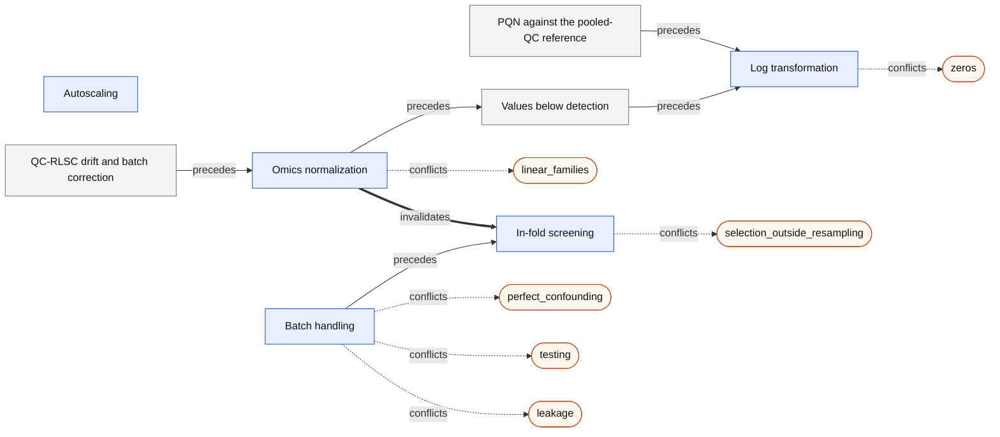

# Genomics: expert review packet

*Generated by `python -m turbotab.core.reference.packet --lens genomics` from the method contracts (`turbotab/core/contracts.py`), the model-family registry, the labels in `turbotab/core/custom_sound.py`, the lens catalog (`turbotab/core/reference/catalog.py`) and the reference journeys' captures (`docs/turbotab-next/review-packets/captures/`, run at commit `2ba3c5727a`). Do not edit it by hand: `turbotab/core/tests/test_reference.py` fails when it differs from what the code and the captures generate.*

**For the reviewer.** TurboTab v2 is released only after one methodologist per lens has reviewed the methods it offers, how they chain, the defaults, and the exact sentences it writes, and each finding is addressed (V2_DEFINITION_OF_DONE §4). This packet holds those four things for the genomics lens; §5 lists the questions we ask you to answer. The full contract of every method, including the shared ones summarized here, is in `docs/turbotab-next/reference/METHODS_REFERENCE.md`.

Every option carries two independent labels (BLUEPRINT North star 5): *customary* (where the field uses it, with a source) and *sound* for the declared purpose (with the reason). The app offers options soundest first and says so when that departs from custom. A *rung* is how hard it holds an option (BLUEPRINT §11.3): recommended, available, ranked lower with its concern stated, blocked until recorded, refused with an exit, or not offered.

## 1 · The methods this lens offers

### 1.1 · Its own methods (5)

#### Omics normalization (`omics_normalization`)

- **Slot:** in-fold (fit on training rows only); place in it 2.
  Options that run elsewhere: `qc_pqn_log2` at in_fold.
- **Data scope:** training fold: learns from study rows, so it is fit in-fold.
- **Needs:**
  - an assay block read as raw counts or raw intensities
- **Question:** These columns are raw counts or intensities: how are they normalized?
- **Lenses:** Metabolomics, Genomics.

**Options**, each labeled customary and sound for each purpose, with its leash rung and its rank (1 is offered first):

| Option | Customary | Sound for prediction | Rung, rank (prediction) | Sound for inference | Rung, rank (inference) |
|---|---|---|---|---|---|
| `pqn_log2`: PQN, then log2 | Customary in metabolomics (Dieterle et al. 2006) | Sound: dilution leaves the values; fit on the training fold. | recommended, 1 | Sound: dilution leaves the values; fit on the training fold. | recommended, 1 |
| `qc_pqn_log2`: PQN to pooled QCs (runs at in_fold) | pmp's default reference (the QC samples) | Sound: the reference is learned from technical replicates only, before the seal. | available, 3 | Sound: the reference is learned from technical replicates only, before the seal. | available, 3 |
| `log2`: Log2 only | Customary when dilution is controlled | Leaves dilution in the values. | ranked lower, concern stated, 5 | Leaves dilution in the values. | ranked lower, concern stated, 5 |
| `log_cpm_tmm`: Log-CPM with TMM | Customary for RNA-seq (edgeR) | Sound: depth and composition leave the values; fit on the training fold. | recommended, 2 | Sound: depth and composition leave the values; fit on the training fold. | recommended, 2 |
| `log_cpm`: Log-CPM | Customary for RNA-seq | Removes depth, not composition. | available, 4 | Removes depth, not composition. | available, 4 |
| `declared_normalized`: Already normalized | The researcher's statement | Sound when true; the app cannot check it. | available, 6 | Sound when true; the app cannot check it. | available, 6 |

**Ranked by the data:** the app offers these options in another order than the rank above where the data decide it; what it offers first under each condition:

- Under prediction, raw counts (sequencing): the count finding offers `log_cpm_tmm`, `log_cpm`, `declared_normalized`: `log_cpm_tmm`
- Under prediction, raw intensities (mass spectrometry): the intensity finding offers `pqn_log2`, `log2`, `declared_normalized`: `pqn_log2`
- Under prediction, raw intensities with pooled-QC injections: `pqn_log2`, `qc_pqn_log2`, `log2`, `declared_normalized`: `pqn_log2`
- Under inference, raw counts (sequencing): the count finding offers `log_cpm_tmm`, `log_cpm`, `declared_normalized`: `log_cpm_tmm`
- Under inference, raw intensities (mass spectrometry): the intensity finding offers `pqn_log2`, `log2`, `declared_normalized`: `pqn_log2`
- Under inference, raw intensities with pooled-QC injections: `pqn_log2`, `qc_pqn_log2`, `log2`, `declared_normalized`: `pqn_log2`

**Storyboard** (the transform player's real steps):

1. Read each sample's total signal
2. Divide by its dilution or depth
3. Take log2

**Methods sentence:**

- Under prediction it is named in the in-fold group: “within each training fold, PQN … were fitted and applied to the held-out fold”.
- Under prediction it is named in the in-fold group (option `log_cpm_tmm`): “within each training fold, log-CPM with TMM factors … were fitted and applied to the held-out fold”.
- Under prediction it is named in the in-fold group (option `log_cpm`): “within each training fold, log-CPM … were fitted and applied to the held-out fold”.

**Relations:**

| Kind | Toward | Fires for | Purposes | What the app says | Enforced by |
|---|---|---|---|---|---|
| conflicts | `linear_families` | any option | prediction, inference | Raw counts or intensities conflict with linear families until a normalization is chosen or the values are declared normalized. *(rung: refused, with an exit)* |  |
| precedes | `detection_limit` | any option | prediction, inference | Normalization comes before values below detection are filled. |  |
| invalidates | `screen` | any option | prediction, inference | A new normalization re-asks which features a screen keeps. |  |

**Primary sources:**

- Dieterle et al. 2006
- Robinson & Oshlack 2010
- Hornung et al. 2015

#### Log transformation (`log_transform`)

- **Slot:** in-fold (fit on training rows only); place in it 4.
- **Data scope:** row-local: needs no other row.
- **Needs:**
  - positive values
- **Question:** (stated: part of the normalization)
- **Lenses:** Metabolomics, Genomics.

**Options**, each labeled customary and sound for each purpose, with its leash rung and its rank (1 is offered first):

| Option | Customary | Sound for prediction | Rung, rank (prediction) | Sound for inference | Rung, rank (inference) |
|---|---|---|---|---|---|
| `log2`: Log2 | Customary for intensities and counts | Sound: makes multiplicative effects additive. | recommended, 1 | Sound: makes multiplicative effects additive. | recommended, 1 |

**Storyboard** (the transform player's real steps):

1. Take log2 of each value

**Methods sentence:**

- Under prediction it is named in the in-fold group: “within each training fold, log transformation … were fitted and applied to the held-out fold”.

**Relations:**

| Kind | Toward | Fires for | Purposes | What the app says | Enforced by |
|---|---|---|---|---|---|
| conflicts | `zeros` | any option | prediction, inference | A zero a log would turn missing routes to the detection-limit question, never to a median fill. *(rung: refused, with an exit)* |  |

**Primary sources:**

- Di Guida et al. 2016

#### Batch handling (`batch`)

- **Slot:** in-fold (fit on training rows only); place in it 5.
  Options that run elsewhere: `covariate` at model.
- **Data scope:** training fold: learns from study rows, so it is fit in-fold.
- **Needs:**
  - a batch column
- **Question:** The samples were measured in batches: how is batch handled?
- **Asked:** never, so never applied from the app. No Router question, proposals card, finding or control posts `set_batch` (the one exit that does, on the confounding refusal, reads the column as not a batch). From the app a batch column is whatever its role says, a covariate or left out, and ComBat is never fit; the reference journeys post `set_batch` themselves. Asking it is V2_DEFINITION_OF_DONE §2's “Genomics, extended: batch correction (ComBat) fit in-fold” row.
- **Where:** recorded by `set_batch` (the contract does not name it).
- **Lenses:** Metabolomics, Genomics.

**Options**, each labeled customary and sound for each purpose, with its leash rung and its rank (1 is offered first):

| Option | Customary | Sound for prediction | Rung, rank (prediction) | Sound for inference | Rung, rank (inference) |
|---|---|---|---|---|---|
| `covariate`: As a covariate (runs at model; scope model) | Recommended practice: batch in the design (limma, DESeq2) | Ranked lower: a new sample's batch must be one the model saw. | ranked lower, concern stated, 2 | Sound, first: account for batch in the analysis (Nygaard, Rødland & Hovig 2016). | recommended, 1 |
| `reference_combat`: Reference ComBat in-fold | Customary: ComBat before analysis is widespread | Sound, first: fitted per fold without the outcome, frozen for new rows (Zhang et al. 2018). | recommended, 1 | Ranked lower: without the outcome it deflates group differences under imbalance (Nygaard, Rødland & Hovig 2016). | ranked lower, concern stated, 2 |
| `outcome_combat`: ComBat, outcome protected (scope model) | Customary, and widespread | Refused: it reads held-out outcomes (leakage). | refused, with an exit, 4 | Refused for testing; figures only (Nygaard, Rødland & Hovig 2016). | refused, with an exit, 4 |
| `none`: Leave it | Common when batch is ignored | Ranked lower: batch effects stay in the values. | ranked lower, concern stated, 3 | Ranked lower: batch differences can read as biology. | ranked lower, concern stated, 3 |

**Storyboard** (the transform player's real steps):

1. Standardize each feature
2. Estimate each batch's location and scale
3. Shrink them across features
4. Align every batch to the reference

**Methods sentence:**

- Its clause in a chain's methods paragraph (`contracts.paragraph`) is written by `turbotab.core.methods.batch:methods_clause`.
- Under prediction it is named in the in-fold group: “within each training fold, reference-batch ComBat without the outcome … were fitted and applied to the held-out fold”.

**Relations:**

| Kind | Toward | Fires for | Purposes | What the app says | Enforced by |
|---|---|---|---|---|---|
| conflicts | `perfect_confounding` | any option | prediction, inference | Batch perfectly confounded with the outcome is refused under both purposes. *(rung: refused, with an exit)* |  |
| conflicts | `testing` | `outcome_combat` | inference | Outcome-protected ComBat is refused for testing; figures only. *(rung: refused, with an exit)* |  |
| conflicts | `leakage` | `outcome_combat` | prediction | Outcome-protected ComBat is refused under prediction: leakage. *(rung: refused, with an exit)* |  |
| precedes | `screen` | `reference_combat` | prediction, inference | Batch correction precedes in-fold screening. |  |

**Primary sources:**

- Johnson, Li & Rabinovic 2007
- Nygaard, Rødland & Hovig 2016
- Zhang et al. 2018
- Hornung et al. 2017

#### In-fold screening (`screen`)

- **Slot:** in-fold (fit on training rows only); place in it 8.
- **Data scope:** model: the outcome model itself.
- **Needs:**
  - an outcome
  - many more features than rows
- **Question:** Screen the features inside each training fold?
- **Lenses:** Metabolomics, Genomics.

**Options**, each labeled customary and sound for each purpose, with its leash rung and its rank (1 is offered first):

| Option | Customary | Sound for prediction | Rung, rank (prediction) | Sound for inference | Rung, rank (inference) |
|---|---|---|---|---|---|
| `sis`: Sure independence screening | Customary in genomic prediction | Sound inside the resampling (Ambroise & McLachlan 2002). | available, 1 | Refused for the reported model: selection under inference. | refused, with an exit, 1 |

**Storyboard** (the transform player's real steps):

1. Correlate each feature with the outcome on the training fold
2. Keep the n / log n strongest

**Methods sentence:**

- Under prediction it is named in the in-fold group: “within each training fold, sure independence screening … were fitted and applied to the held-out fold”.

**Relations:**

| Kind | Toward | Fires for | Purposes | What the app says | Enforced by |
|---|---|---|---|---|---|
| conflicts | `selection_outside_resampling` | any option | prediction | Selection outside the resampling is refused: a false performance number. *(rung: refused, with an exit)* |  |

**Primary sources:**

- Fan & Lv 2008
- Ambroise & McLachlan 2002
- Varma & Simon 2006

#### Autoscaling (`autoscaling`)

- **Slot:** in-fold (fit on training rows only); place in it 9.
- **Data scope:** training fold: learns from study rows, so it is fit in-fold.
- **Needs:**
  - a family that standardizes its inputs
- **Question:** (stated: the family's scaling)
- **Lenses:** Metabolomics, Genomics.

**Options**, each labeled customary and sound for each purpose, with its leash rung and its rank (1 is offered first):

| Option | Customary | Sound for prediction | Rung, rank (prediction) | Sound for inference | Rung, rank (inference) |
|---|---|---|---|---|---|
| `autoscaling`: Autoscaling | Pareto scaling is customary in metabolomics | Sound: van den Berg et al. (2006) found autoscaling performed better in their explorative analysis. | recommended, 1 | Sound: van den Berg et al. (2006) found autoscaling performed better in their explorative analysis. | recommended, 1 |

**Storyboard** (the transform player's real steps):

1. Center each column on the training fold
2. Divide by its SD

**Methods sentence:**

- Under prediction it is named in the in-fold group: “within each training fold, autoscaling … were fitted and applied to the held-out fold”.

**Relations:**

None declared.

**Primary sources:**

- van den Berg et al. 2006

### 1.2 · Model families

The shelf ranks every family that can model the outcome by its own assessment of the data and never shortens the list: no family is withheld from a lens, so every family is offered here.

Reviewed in full in this packet:

#### Feature-wise regression (`featurewise`)

- **Outcomes it models:** regression, binary.
- **Purposes it serves:** inference; it tests and makes no predictions.
- **Inductive bias:** Each exposure tested on its own with the covariates; Benjamini–Hochberg holds the false-discovery rate.
- **Strengths:** Valid tests with more features than rows. Holds the false-discovery rate across thousands of features (Benjamini–Hochberg).
- **Cautions:** Each estimate ignores the other exposures: one separate question per feature. Tests only: it makes no predictions and has no cross-validated score. Intervals assume equal residual variance; robust ones fail at the thresholds it tests.
- **Needs scaled inputs:** no; **uses rows with blanks as they are:** no; **Harrell's bootstrap optimism is sound for it:** not applicable, as it makes no predictions.
- **Lenses:** Metabolomics, Genomics.
- **Question:** asked within the models question (`select_models`); the shelf ranks every family by its own assessment of the data and never shortens the list.

**What the app says it fits**, by outcome and purpose (`describe`):

| Outcome | Purpose | Model | Detail |
|---|---|---|---|
| regression | inference | Feature-wise least squares | Regresses the outcome on each exposure and the covariates, one exposure at a time: the estimate is per unit of that exposure. Classical least-squares intervals, CR2 when a unit's rows repeat; Benjamini–Hochberg q-values across the exposures. |
| binary | inference | Feature-wise least squares | Regresses each exposure on the event and the covariates (the limma design): the estimate is the adjusted difference in its mean. Classical least-squares intervals, CR2 when a unit's rows repeat; Benjamini–Hochberg q-values across the exposures. |

**Not declared, because a family is not a method contract:** options labeled customary and sound, a leash rung per purpose, a storyboard, relations and primary sources (see the gaps).

#### Screened elastic net (`screened_elastic_net`)

- **Outcomes it models:** regression, binary.
- **Purposes it serves:** prediction.
- **Inductive bias:** Only features with a strong marginal association survive; among them, straight-line effects shrunk toward zero.
- **Strengths:** Cuts tens of thousands of features to n / log n before the penalty, inside each fold. Tunes its penalty by cross-validation on training rows.
- **Cautions:** A feature that matters only jointly with others can be screened out. Which features survive changes from fold to fold.
- **Needs scaled inputs:** yes; **uses rows with blanks as they are:** no; **Harrell's bootstrap optimism is sound for it:** yes.
- **Lenses:** Metabolomics, Genomics.
- **Question:** asked within the models question (`select_models`); the shelf ranks every family by its own assessment of the data and never shortens the list.

**What the app says it fits**, by outcome and purpose (`describe`):

| Outcome | Purpose | Model | Detail |
|---|---|---|---|
| regression | prediction | Screened elastic net regression | Keeps the n / log n exposures most correlated with the outcome on each training fold (sure independence screening, Fan & Lv 2008), then chooses the penalty by an inner cross-validation within those rows. |
| binary | prediction | Screened penalized logistic regression | Keeps the n / log n exposures most correlated with the outcome on each training fold (sure independence screening, Fan & Lv 2008), then chooses the penalty by an inner cross-validation within those rows. |

**Not declared, because a family is not a method contract:** options labeled customary and sound, a leash rung per purpose, a storyboard, relations and primary sources (see the gaps).

Every other family on the shelf, each in full in the methods reference:

| Family | Outcomes | Purposes | Inductive bias | Reviewed in full in |
|---|---|---|---|---|
| Linear model (`linear`) | regression, binary, multiclass, ordinal | prediction, inference | Each predictor adds a straight-line effect; effects add up, with no interactions unless you build them. | every lens (shared): the methods reference |
| Elastic net (`elastic_net`) | regression, binary, multiclass, ordinal | prediction, inference | Straight-line effects shrunk toward zero; few predictors matter, correlated ones share weight. | every lens (shared): the methods reference |
| Boosted trees (`boosted_trees`) | regression, binary, multiclass, ordinal | prediction, inference | Effects are step functions that can bend and interact; many shallow trees each correct the last. | every lens (shared): the methods reference |
| Proportional-odds model (`proportional_odds`) | ordinal | prediction, inference | Each predictor shifts the odds of a higher level by one factor, the same at every cut-point. | every lens (shared): the methods reference |
| Random-intercept mixed model (`mixed`) | regression | prediction, inference | Straight-line effects, plus a level of its own for each unit whose rows repeat. | every lens (shared): the methods reference |
| GEE (exchangeable) (`gee`) | regression, binary | prediction, inference | Population-average straight-line or log-odds effects; a unit's rows share one correlation. | every lens (shared): the methods reference |
| Cox proportional hazards (`cox`) | time_to_event | prediction, inference | Each predictor multiplies the hazard by a constant ratio over all of follow-up; effects add on the log scale. | every lens (shared): the methods reference |

### 1.3 · Shared methods (43)

Every lens offers these; their full contracts are in the methods reference.

| Method | Key | Slot | Scope | Recorded by |
|---|---|---|---|---|
| Importing a codebook | `import_codebook` | ingest | descriptive | `import_codebook` |
| Joining files on a shared identifier | `join_files` | ingest | row_local | `join_files` |
| Explore after the seal | `explore` | in_fold | descriptive | `view_outcome` |
| Multiple imputation compatible with the analysis model | `multiple_imputation_compatible` | in_fold | model | `set_missing` |
| Passive multiple imputation (chained equations, terms derived per copy) | `multiple_imputation_passive` | in_fold | model | `set_missing` |
| Single-level multiple imputation on clustered rows | `multiple_imputation_single_level` | in_fold | model | `set_missing` |
| Subgroups of similar people (cluster analysis) | `subgroups` | in_fold | training_fold | not declared |
| A domain transform of the exposure (log, energy model, scale scoring, omics normalization) | `exposure_transform` | in_fold | training_fold | not declared |
| The functional form of a continuous exposure or confounder | `functional_form` | in_fold | training_fold | `set_exposure_form` |
| Splines for every continuous predictor, knots by a stated rule | `spline_rule` | in_fold | training_fold | `set_levers` |
| Nonlinearity chosen by inner cross-validation | `inner_cv_form` | in_fold | model | `set_levers` |
| A variance filter fitted in each training fold | `variance_filter` | in_fold | training_fold | `set_levers` |
| Selection of predictors | `variable_selection` | in_fold | model | `set_selection` |
| An imbalance correction in-fold, then recalibration | `imbalance_correction` | in_fold | model | `set_levers` |
| The adjustment card's guesses, by exposure–outcome pairing | `adjustment_guesses` | model | descriptive | `set_adjustment` |
| Double ML, interactive | `dml_irm` | model | model | `set_causal` |
| Double ML, partially linear | `dml_plr` | model | model | `set_causal` |
| The effect measure (difference or ratio; conditional or marginal) | `effect_measure` | model | descriptive | `set_estimand` |
| Effect modification (the exposure's effect across strata of a modifier) | `effect_modification` | model | model | `set_modification` |
| Marginal standardization (g-computation) | `g_computation` | model | model | `set_estimand` |
| The grouping question, asked by structure | `grouping_by_structure` | model | descriptive | `set_clusters` |
| Interaction (the joint effect of two exposures) | `interaction` | model | model | `set_modification` |
| Post-double-selection lasso | `pds_lasso` | model | model | `set_causal` |
| A time-varying exposure by g-methods | `time_varying` | model | model | `set_time_varying` |
| Targeted maximum likelihood | `tmle` | model | model | `set_causal` |
| Diagnostics of the primary model | `diagnostics` | evaluation | descriptive | `respond_diagnostic` |
| The E-value of a difference, standardized by the estimand's SD | `evalue_sd` | evaluation | descriptive | not declared |
| An exposure family and its multiplicity | `exposure_family` | evaluation | descriptive | `set_estimand` |
| Outcome-model fit statistics wait with the estimates | `fit_statistics_withheld` | evaluation | model | not declared |
| The declared model sequence (Table 2) | `model_sequence` | evaluation | model | `set_model_sequence` |
| The analysis-plan export | `plan_export` | evaluation | descriptive | `lock_plan` |
| Sensitivity to unmeasured confounding | `unmeasured_confounding` | evaluation | descriptive | not declared |
| Model explanations | `explain` | evaluation | model | `set_explain` |
| Multiplicity control | `multiplicity` | evaluation | model | `set_multiplicity` |
| A strictly proper primary score | `proper_primary` | evaluation | training_fold | `set_split` |
| Repeated k-fold comparison substrate | `comparison_substrate` | evaluation | training_fold | `set_split` |
| Bootstrap bias-corrected cross-validation | `bbc_cv` | evaluation | training_fold | `set_split` |
| Bootstrap optimism correction | `bootstrap_optimism` | evaluation | training_fold | `set_split` |
| Calibration by a horizon, and by level | `horizon_calibration` | evaluation | training_fold | `set_split` |
| The nested cross-validation interval | `nested_cv_interval` | evaluation | training_fold | `set_split` |
| Intended use, the decision curve and the threshold | `intended_use` | evaluation | training_fold | `set_intended_use` |
| Agreement between two measurements (Bland–Altman) | `bland_altman` | evaluation | descriptive | not declared |
| The manuscript bundle and its replay | `manuscript_export` | evaluation | descriptive | not declared |

### 1.4 · Methods another lens reviews in full (29)

No method contract is declared for one lens: the app reaches each of these through the data it needs, not through the lens, though some are reached through findings or stages their own lens raises. Each is offered here whenever this lens's data hold what it needs, and is reviewed in full in the packet named.

| Method | Key | Reviewed in full in | Slot | What it needs |
|---|---|---|---|---|
| Stacking NHANES cycles into one sample | `stack_cycles` | the dietary assessment, clinical and survey instruments packets | ingest | two or more NHANES files, each one cycle, with the same weight kind; each file's masked variance strata and PSUs (SDMVSTRA, SDMVPSU); the four-year weight, when 1999–2000 is stacked with another cycle; optional: renames and conversions declared from the release documentation, and measurements declared incompatible across cycles |
| Values below a detection limit belong to the below-detection repair | `censored_below_detection` | the metabolomics and clinical packets | repairs | a text column with values below a detection limit (<0.20) |
| QC detection-rate filter | `qc_detection_filter` | the metabolomics packet | repairs | pooled-QC injections |
| QC-RLSC drift and batch correction | `qc_rlsc` | the metabolomics packet | repairs | pooled-QC injections; an injection order (a reading each option names); a batch column, or the whole run as one batch (a reading each option names); at least five QCs per batch |
| QC-RSD filter | `qc_rsd_filter` | the metabolomics packet | repairs | pooled-QC injections |
| PQN against the pooled-QC reference | `qc_pqn` | the metabolomics packet | repairs | pooled-QC injections |
| Rows read as imputed copies are not repeats | `copies_not_repeats` | the dietary assessment and clinical packets | reshape | rows read as imputed copies (a copy number such as NHANES's _MULT_) |
| The data's own imputed copies, pooled by Rubin's rules | `imputed_copies_pooled` | the dietary assessment and clinical packets | reshape | the column numbering the copies; the unit the copies belong to |
| The QC rows leave | `qc_rows_leave` | the metabolomics packet | eligibility | the pooled-QC label |
| Who a randomized trial analyzes (the analysis set) | `trial_analysis_set` | the clinical and dietary assessment packets | eligibility | the arm each person was randomized to, and the control arm; for the per-protocol set: whether each person followed the protocol (yes/no); optional: the arm each person received (for the CONSORT flow) |
| Dietary patterns: how the food groups are made comparable | `pattern_inputs` | the dietary assessment packet | in_fold | the food-group intake columns; total energy, for the energy-adjusted forms |
| Dietary patterns: foods eaten together | `dietary_patterns` | the dietary assessment packet | in_fold | two or more food-group intake columns; intermediate responses on the pathway, for reduced rank regression; the survey weights, when the rows are a weighted sample |
| Dietary patterns: how many groups of people | `pattern_clusters` | the dietary assessment packet | in_fold | the standardized food groups; a range of group numbers, or the declared one |
| Dietary patterns: how many to keep | `pattern_count` | the dietary assessment packet | in_fold | the food groups' correlation matrix; the number read from the scree plot, for the scree rule |
| D-ratio filter | `d_ratio_filter` | the metabolomics packet | in_fold | pooled-QC standard deviations |
| Regression calibration from repeated 24-hour recalls | `regression_calibration` | the dietary assessment packet | in_fold | two or more recall days for some participants, combined by the mean; the outcome model's covariates (its adjustment set); the energy model's terms the recalls measure; the survey design or the clusters, for the bootstrap |
| Values below detection | `detection_limit` | the metabolomics packet | in_fold | columns whose blanks are non-detections |
| Scale scores, their reliability and the correction for measurement error | `scales` | the survey instruments packet | in_fold | three or more numeric items on one response scale, each a confirmed exposure or covariate (a reflective scale's answers whole numbers; a formative index's components may be continuous scores); the instrument's key: its reverse-coded items and its response scale; for a test–retest reliability: the repeat administration's columns, or its score; for a calibration substudy: a reference measure read as an amount, blank outside the substudy |
| Usual-intake distribution (NCI method) | `nci_usual_intake` | the dietary assessment packet | model | the dietary lens; two or more recalls for at least two people; a dietary component's recalls (a long table's repeated rows or a wide table's day columns); optional: an order column, a weekend indicator, a column marking consumers, the survey design; for a prevalence of inadequacy below an EAR: the answer that it is every participant's DRI life-stage group's EAR (and, for iron, that no participant is a menstruating woman) |
| The population estimand under a survey design | `survey_population` | the dietary assessment, clinical and survey instruments packets | model | design columns read as the weight, the strata and the PSUs (settled readings); purpose: inference |
| Survey-weighted Cox regression (Binder's pseudo-likelihood) | `survey_cox` | the dietary assessment, clinical and survey instruments packets | model | the survey answer: the surveyed population (a weight, and strata and PSUs); a time-to-event outcome with its follow-up; the Cox family chosen |
| Survey-weighted linear, logistic and multinomial models | `survey_linear` | the dietary assessment, clinical and survey instruments packets | model | the survey answer: the surveyed population (a weight, and strata and PSUs); a continuous, yes/no or multiclass outcome; the linear family chosen |
| Survey-weighted proportional-odds model | `survey_ordinal` | the dietary assessment, clinical and survey instruments packets | model | the survey answer: the surveyed population (a weight, and strata and PSUs); an ordered outcome with its declared order; the proportional-odds family chosen |
| The effect of the assigned treatment in a randomized trial | `trial_effect` | the clinical and dietary assessment packets | model | a declared randomized trial (parallel or cluster-randomized); the arm, the control arm and the outcome (a number, or yes/no); the randomization factors and the baseline covariates named before the data were seen (the baseline measure of the outcome among them); a cluster-randomized trial: the randomized cluster of each person |
| The substitution curve over the surveyed population | `survey_substitution` | the dietary assessment packet | evaluation | the survey answer: the surveyed population (a weight, and strata and PSUs); a substitution answer; the linear family chosen |
| Substitution curves for a multiclass outcome, one per class | `multiclass_substitution` | the dietary assessment packet | evaluation | a multiclass outcome (three or more unordered classes); two energy-bearing exposures whose kcal per unit is settled; a fitted family that predicts each class's probability; the substitution answer (donor, recipient and step) |
| Design-based cross-validation | `design_based_cv` | the dietary assessment, clinical and survey instruments packets | evaluation | the surveyed-population answer; the weight, and the strata and PSUs if named |
| Trends across stacked survey cycles | `cycle_trends` | the dietary assessment, clinical and survey instruments packets | evaluation | a stack of two or more cycles (three or more to look for a bend), with each cycle's time; a numeric measure (a mean) or a yes-or-no one (a prevalence); the survey design over the stacked rows, or the answer that the estimates describe these participants; optional: covariates (regression and joinpoint only), and joinpoints named in advance |
| How sensitive a trial's result is to its missing outcomes (the tipping point) | `trial_missing_outcomes` | the clinical and dietary assessment packets | evaluation | a parallel trial analyzed by intention to treat; at least one randomized person with a missing outcome |

### 1.5 · Methods with no contract yet (17)

These are offered (V2_DEFINITION_OF_DONE §2, or by a question the Router asks) and implemented in the code named, but no method contract declares their slot, scope, labeled options, leash, storyboard, sentence and relations. They are gaps in the registry, listed so the review covers them too; one is a limit of the app as well (its note says so).

| Method | Where v2 offers it | Lenses | Recorded by | Implemented in | Labels | Contracts covering part of it | Note |
|---|---|---|---|---|---|---|---|
| Declared secondary analyses (the exclusions' sensitivity view) | Inference (shared); Dietary | every lens (shared) | `set_sensitivity` | `turbotab.core.stages.secondary`, `turbotab.core.stages.sensitivity` | none | none |  |
| Missing values: complete cases, a fill in each training fold, indicators and a missing category | Prediction (shared); Inference (shared) | every lens (shared) | `set_missing` | `turbotab.core.methods.missing` | `custom_sound:missing` | `multiple_imputation_compatible`, `multiple_imputation_passive`, `multiple_imputation_single_level`, `detection_limit` |  |
| The seal and the split (a holdout, k-fold and repeated k-fold, internal–external) | Prediction (shared) | every lens (shared) | `set_split`, `open_seal` | `turbotab.core.seal`, `turbotab.core.models.validation` | `custom_sound:split` | `bootstrap_optimism`, `comparison_substrate`, `bbc_cv`, `nested_cv_interval` |  |
| In-fold preprocessing and nested tuning (the pipeline's fill and scaling; the penalized families' inner cross-validation) | Prediction (shared) | every lens (shared) | `select_models` | `turbotab.core.models.pipeline`, `turbotab.core.models.inner_cv` | none | none |  |
| DeLong's interval and test for the AUC | Prediction (shared) | every lens (shared) | computed, not asked | `turbotab.core.models.performance` | none | none |  |
| The price of explainability, measured | Prediction (shared) | every lens (shared) | computed, not asked | `turbotab.core.models.cost` | none | none |  |
| Cluster-robust (CR2) and HC3 intervals | Inference (shared) | every lens (shared) | `select_models`, `set_clusters` | `turbotab.core.models.inference` | none | `grouping_by_structure` |  |
| Calibration of a continuous or yes/no outcome's predictions | Prediction (shared); Clinical | every lens (shared) | computed, not asked | `turbotab.core.models.performance` | none | `horizon_calibration` | horizon_calibration covers a time to event and an ordinal or multiclass outcome. |
| Orientation (features in rows, turned) | Metabolomics | Metabolomics, Genomics | `set_orientation`, `set_feature_table` | `turbotab.core.detectors.orientation` | none | none |  |
| The model families (linear and logistic, elastic net, boosted trees, feature-wise, proportional odds, mixed, GEE, Cox, screened elastic net) | Prediction (shared); Inference (shared) | every lens (shared) | `select_models` | `turbotab.core.models.base` | none | none | Declared in the model-family registry (tasks, inductive bias, strengths, cautions, each family's own assessment), not as contracts: no family declares a question, options labeled customary and sound, a leash, a storyboard, relations or sources. |
| The architecture lane (the fitted equation, split structure, shrinkage) | Explainability | every lens (shared) | computed, not asked | `turbotab.core.models.explain` | none | `explain` | A display on the canvas; the explain contract covers the curves, SHAP and the interaction ranking. |
| Model updating by uniform shrinkage of the regression's coefficients | Prediction (shared): the evaluation stage's offer (TRIPOD+AI 12f) | every lens (shared) | `set_updating` | `turbotab.core.stages.evaluation`, `turbotab.core.models.decision_curve` | none | none | Offered beside the calibration slope: “As model updating, the regression's coefficients were multiplied by …”. |
| The outcome's scale: the log scale (a ratio of geometric means), an ordinal outcome's level order, and its unit | The Router's task question (its follow-ups) | every lens (shared) | `set_outcome_scale`, `set_outcome_order`, `set_outcome_unit` | `turbotab.core.structural`, `turbotab.core.interview`, `turbotab.core.models.ordinal`, `turbotab.core.units` | none | none | The log scale changes the estimand (a ratio of geometric means for a difference in means); the order and the unit are asked, never inferred. |
| Time-to-event follow-up: a landmark with left truncation, an administrative horizon, the prediction horizon, and the yes/no outcome over one period | The Router's follow-up question | every lens (shared) | `set_follow_up`, `set_censoring` | `turbotab.core.estimand`, `turbotab.core.models.survival` | none | `horizon_calibration` | horizon_calibration covers scoring at the prediction horizon; who is at risk from the landmark, and when follow-up ends, are declared nowhere as a contract. |
| The unit of analysis for repeated rows (one row per unit, or each record) | The Router's grain and unit questions | every lens (shared) | `set_grain`, `set_unit` | `turbotab.core.structural`, `turbotab.core.stages.working` | none | none | With set_aggregation (recall_averaging) it decides what one row of the analysis is. |
| Re-sealing after the held-out rows were opened | Prediction (shared): the seal | every lens (shared) | `reseal` | `turbotab.core.seal` | none | none | The scores at the first opening stay the reported result; later held-out scores are not an independent test. |
| Numbers that are codes for categories, entered as indicators | Inference (shared); Prediction (shared): the code-or-amount reading | every lens (shared) | `set_categorical` | `turbotab.core.readings`, `turbotab.core.models.pipeline` | none | none | One indicator per level after the first, never one straight line. |

Their options are labeled customary and sound outside the registry where shown here:

#### Missing values (`missing`)

Under **prediction**, soundest first. The field reaches for `complete_case` first. Tension the coach names: “Complete cases are the field's habit, but a new row with a blank cannot be scored; a fill learned in each training fold without the outcome can (Sisk et al. 2023, Stat Methods Med Res 32:1461).”

| Rank | Option | Customary (field: text, source) | Sound | Reason |
|---|---|---|---|---|
| 1 | `impute`: Single fill in each training fold | machine learning: Customary in machine-learning pipelines (scikit-learn's SimpleImputer) (scikit-learn's SimpleImputer, the pipelines' default fill) | sound | Sound: fit in each training fold without the outcome, it imputes a new row as it was developed (Josse et al. 2019; Sisk et al. 2023). |
| 2 | `indicators`: Single fill with missing indicators | prediction from health records: Customary in prediction from health records (Sperrin et al. 2020) (Sperrin et al. 2020, J Clin Epidemiol 125:183) | conditional | Sound when a blank carries information, but harmful when missingness depends on the outcome (Sisk et al. 2023). |
| 3 | `complete_case`: Complete cases | epidemiology: Customary in epidemiology; most software's default (Sterne et al. 2009, BMJ 338:b2393: "Researchers usually address missing data by including in the analysis only complete cases") | conditional | Valid but wasteful, and a new row with a blank cannot be scored. |
| 4 | `missing_category`: Blanks as their own level | survey and health-record analysis: Customary for questions not asked (a blank medication answer) (NUTRITION_PACK §06 (a blank that means not asked)) | sound | Sound: keeps the signal when a blank means not asked. |
| 5 | `multiple_imputation`: Multiple imputation (m at least 20, more when more rows are incomplete) | epidemiology: Customary in epidemiology (Sterne et al. 2009, BMJ 338:b2393) (Sterne et al. 2009, BMJ 338:b2393) | unsound | Not here: it uses the outcome, which a new row does not have; impute in each fold without it (Sisk et al. 2023). |

Under **inference**, soundest first. The field reaches for `complete_case` first. Tension the coach names: “Complete cases are the field's habit; when the blanks depend on measured variables they may be biased, and multiple imputation with the outcome is sounder (Sterne et al. 2009, BMJ 338:b2393).”

| Rank | Option | Customary (field: text, source) | Sound | Reason |
|---|---|---|---|---|
| 1 | `multiple_imputation`: Multiple imputation (m at least 20, more when more rows are incomplete) | epidemiology: Customary in epidemiology (Sterne et al. 2009, BMJ 338:b2393) (Sterne et al. 2009, BMJ 338:b2393) | sound | Sound: with the outcome and energy in the imputation model it is unbiased under missing at random and its intervals carry the imputation's uncertainty (Moons et al. 2006). |
| 2 | `complete_case`: Complete cases | epidemiology: Customary in epidemiology; most software's default (Sterne et al. 2009, BMJ 338:b2393: "Researchers usually address missing data by including in the analysis only complete cases") | conditional | Sound if complete cases give unbiased coefficients only if whether a value is missing does not depend on the outcome, given the predictors (Groenwold et al. 2012; White & Carlin 2010); it costs every incomplete row. |
| 3 | `impute`: Single fill in each training fold | machine learning: Customary in machine-learning pipelines (scikit-learn's SimpleImputer) (scikit-learn's SimpleImputer, the pipelines' default fill) | unsound | Unsound for an interval: a single fill treats each imputed value as measured, so the intervals are too narrow, and a median fill biases a coefficient whenever who is missing depends on another variable. |
| 4 | `indicators`: Single fill with missing indicators | prediction from health records: Customary in prediction from health records (Sperrin et al. 2020) (Sperrin et al. 2020, J Clin Epidemiol 125:183) | unsound | Unsound for an estimate: the missing-indicator method almost always biases the estimates of a nonrandomized study (Groenwold et al. 2012); it is valid for baseline covariates in a randomized trial. |
| 5 | `missing_category`: Blanks as their own level | survey and health-record analysis: Customary for questions not asked (a blank medication answer) (NUTRITION_PACK §06 (a blank that means not asked)) | conditional | The missing-indicator method for categories: the missing-indicator method almost always biases the estimates of a nonrandomized study (Groenwold et al. 2012); it is valid for baseline covariates in a randomized trial; sound when a blank means not asked (then it is a value, not missing). |

#### The split and the validation (`split`)

Under **prediction**, soundest first. The field reaches for `holdout` first. Tension the coach names: “A single holdout is the journals' habit; resampling the whole pipeline uses every row and is more efficient at this size (Steyerberg 2018, J Clin Epidemiol 103:131).”

| Rank | Option | Customary (field: text, source) | Sound | Reason |
|---|---|---|---|---|
| 1 | `bootstrap`: Bootstrap optimism correction | clinical prediction: The recommended default (Harrell, Lee & Mark 1996) (CLINICAL_SURVEY_PACK §A5.5) | sound | Uses every row and refits the whole pipeline in each resample (Steyerberg 2018, J Clin Epidemiol 103:131: "more efficient approaches" in small samples). |
| 2 | `repeated_kfold`: Repeated cross-validation | clinical prediction: Acceptable internal validation (CLINICAL_SURVEY_PACK §A5.5) | sound | Draws the folds several times, so the score no longer rests on one partition. |
| 3 | `kfold`: Cross-validation, once | machine learning: The default resampling of scikit-learn and caret (scikit-learn and caret documentation) | conditional | Every row trains and scores, but one partition is noisy at small sizes. |
| 4 | `internal_external`: Internal–external, by cluster | clinical prediction: Increasingly expected across sites or periods (Collins et al. 2024, BMJ 384:e074819) | sound | Each site or period scored by models fit on the others, with the spread: what a new site would see. |
| 5 | `holdout`: Hold out a share of rows | clinical prediction and machine learning: The standard requirement in major medical journals: validity shown outside the development sample (Steyerberg 2018, J Clin Epidemiol 103:131) | conditional | A lockbox against the analyst's own overfitting, sound at large sizes; at small ones its rows neither train nor score the pipeline (Steyerberg 2018, J Clin Epidemiol 103:131). |

Under **inference**, soundest first. The field reaches for `holdout` first. Tension the coach names: “Holding out rows is the journals' habit; under inference every row estimates the coefficients, so no holdout comes first (Shmueli 2010, Stat Sci 25:289).”

| Rank | Option | Customary (field: text, source) | Sound | Reason |
|---|---|---|---|---|
| 1 | `kfold`: Cross-validation, once | machine learning: The default resampling of scikit-learn and caret (scikit-learn and caret documentation) | sound | The scores describe how well the model fits; every row still estimates the coefficients. |
| 2 | `repeated_kfold`: Repeated cross-validation | clinical prediction: Acceptable internal validation (CLINICAL_SURVEY_PACK §A5.5) | sound | Steadier fit scores; it does not change the estimates. |
| 3 | `bootstrap`: Bootstrap optimism correction | clinical prediction: The recommended default (Harrell, Lee & Mark 1996) (CLINICAL_SURVEY_PACK §A5.5) | sound | Corrects the fit scores for optimism; it does not change the estimates. |
| 4 | `internal_external`: Internal–external, by cluster | clinical prediction: Increasingly expected across sites or periods (Collins et al. 2024, BMJ 384:e074819) | conditional | Shows how fit varies across groups; the grouping question decides the intervals. |
| 5 | `holdout`: Hold out a share of rows | clinical prediction and machine learning: The standard requirement in major medical journals: validity shown outside the development sample (Steyerberg 2018, J Clin Epidemiol 103:131) | unsound | Serves no estimand: every analyzed row estimates the coefficients whatever is held out, so it costs rows for a score (Shmueli 2010, Stat Sci 25:289). |

**Ranked by the data:** the app offers these options in another order than the rank above where the data decide it; what it offers first under each condition:

- Under prediction, no time order, fewer than 20,000 units: `bootstrap` (Bootstrap optimism correction): Uses every row and refits the whole pipeline in each resample (Steyerberg 2018, J Clin Epidemiol 103:131: "more efficient approaches" in small samples).
- Under prediction, no time order, 20,000 units or more, the usual 20% holdout at or above its floor (100 rows, or 100 in each class): `holdout` (20%), validated by `kfold` (Cross-validation, once): At this size the held-out rows measure precisely, and they guard against the analyst's own overfitting.
- Under prediction, no time order, 20,000 units or more, the usual 20% holdout below its floor (a rare event): `kfold` (Cross-validation, once): Every row trains and scores, but one partition is noisy at small sizes.
- Under prediction, rows in time order (the temporal seal), the usual 20% holdout below its floor: `kfold` (Time-ordered cross-validation): Every row trains and scores, but one partition is noisy at small sizes.
- Under prediction, rows in time order (the temporal seal), the usual 20% holdout at or above its floor, whatever the number of units (the latest rows held out): `holdout` (20%), validated by `kfold` (Time-ordered cross-validation): At this size the held-out rows measure precisely, and they guard against the analyst's own overfitting.
- Under inference, at any size: `kfold` (Cross-validation, once): The scores describe how well the model fits; every row still estimates the coefficients.

#### The causal lane's estimator (`causal`)

Under **prediction** it is not asked (`causal.plan_reason`): “Under prediction no coefficient is read as an effect, so no causal estimate is offered.”

Under **inference** it is stated, never asked by default (`causal.causal_gate`): “the primary model estimates the declared effect; double/debiased machine learning, targeted maximum likelihood and post-double selection are one step away.” The primary model only (`none`) is the declared analysis; “Ask me anyway” opens the lane, whose estimators are each a method contract (`dml_plr`, `dml_irm`, `tmle`, `pds_lasso`) recorded by `set_causal`. Its options are labeled in `causal.options`, outside the registry, and ranked by the exposure's kind, the outcome, how many candidate terms there are for n (more than one per 10 of the limiting sample size), and the survey answer. Soundest first under each condition:

| When | Rank | Option | Customary (field: text, source) | Sound | Reason |
|---|---|---|---|---|---|
| a yes/no exposure, a numeric outcome with many candidates for n | 1 | `pds_lasso`: Post-double-selection lasso | economics: standard in applied economics (Belloni, Chernozhukov & Hansen 2014, Rev Econ Stud 81:608) | sound | many candidates for n: selecting by both lassos keeps the intervals valid |
|  | 2 | `tmle`: Targeted maximum likelihood | epidemiology: growing in epidemiology; rare in nutrition so far (Schuler & Rose 2017, Am J Epidemiol 185:65) | sound | doubly robust, efficient, and keeps each estimate inside the outcome's range |
|  | 3 | `dml_irm`: Double ML, interactive | econometrics: standard in econometrics; rare in nutrition so far (Chernozhukov et al. 2018, Econom J 21:C1) | sound | doubly robust score with cross-fitting: valid intervals with flexible learners |
|  | 4 | `dml_plr`: Double ML, partially linear | econometrics: standard in econometrics; rare in nutrition so far (Chernozhukov et al. 2018, Econom J 21:C1) | conditional | for a yes/no exposure it estimates a variance-weighted average, not the average effect |
|  | 5 | `none`: The primary model only | nutritional epidemiology: a regression adjusted for a set chosen from subject knowledge is the field's analysis (Walter & Tiemeier 2009, Eur J Epidemiol 24:733) | conditional | valid when the outcome model's form is right; the lane checks that |
| a yes/no exposure, a numeric outcome with few candidates for n | 1 | `tmle`: Targeted maximum likelihood | epidemiology: growing in epidemiology; rare in nutrition so far (Schuler & Rose 2017, Am J Epidemiol 185:65) | sound | doubly robust, efficient, and keeps each estimate inside the outcome's range |
|  | 2 | `dml_irm`: Double ML, interactive | econometrics: standard in econometrics; rare in nutrition so far (Chernozhukov et al. 2018, Econom J 21:C1) | sound | doubly robust score with cross-fitting: valid intervals with flexible learners |
|  | 3 | `dml_plr`: Double ML, partially linear | econometrics: standard in econometrics; rare in nutrition so far (Chernozhukov et al. 2018, Econom J 21:C1) | conditional | for a yes/no exposure it estimates a variance-weighted average, not the average effect |
|  | 4 | `pds_lasso`: Post-double-selection lasso | economics: standard in applied economics (Belloni, Chernozhukov & Hansen 2014, Rev Econ Stud 81:608) | conditional | with few candidates for n there is little to select; valid all the same |
|  | 5 | `none`: The primary model only | nutritional epidemiology: a regression adjusted for a set chosen from subject knowledge is the field's analysis (Walter & Tiemeier 2009, Eur J Epidemiol 24:733) | conditional | valid when the outcome model's form is right; the lane checks that |
| a yes/no exposure, a numeric outcome, the surveyed population | 1 | `tmle`: Targeted maximum likelihood | epidemiology: growing in epidemiology; rare in nutrition so far (Schuler & Rose 2017, Am J Epidemiol 185:65) | sound | doubly robust, efficient, and keeps each estimate inside the outcome's range |
|  | 2 | `dml_irm`: Double ML, interactive | econometrics: standard in econometrics; rare in nutrition so far (Chernozhukov et al. 2018, Econom J 21:C1) | sound | doubly robust score with cross-fitting: valid intervals with flexible learners |
|  | 3 | `dml_plr`: Double ML, partially linear | econometrics: standard in econometrics; rare in nutrition so far (Chernozhukov et al. 2018, Econom J 21:C1) | conditional | for a yes/no exposure it estimates a variance-weighted average, not the average effect |
|  | 4 | `pds_lasso`: Post-double-selection lasso | economics: standard in applied economics (Belloni, Chernozhukov & Hansen 2014, Rev Econ Stud 81:608) | unsound | its plug-in penalty assumes unweighted rows, so a population estimate is blocked |
|  | 5 | `none`: The primary model only | nutritional epidemiology: a regression adjusted for a set chosen from subject knowledge is the field's analysis (Walter & Tiemeier 2009, Eur J Epidemiol 24:733) | conditional | valid when the outcome model's form is right; the lane checks that |
| a yes/no exposure, a yes/no outcome | 1 | `tmle`: Targeted maximum likelihood | epidemiology: growing in epidemiology; rare in nutrition so far (Schuler & Rose 2017, Am J Epidemiol 185:65) | sound | doubly robust, efficient, and keeps each estimate inside the outcome's range |
|  | 2 | `dml_irm`: Double ML, interactive | econometrics: standard in econometrics; rare in nutrition so far (Chernozhukov et al. 2018, Econom J 21:C1) | sound | doubly robust score with cross-fitting: valid intervals with flexible learners |
|  | 3 | `dml_plr`: Double ML, partially linear | econometrics: standard in econometrics; rare in nutrition so far (Chernozhukov et al. 2018, Econom J 21:C1) | conditional | for a yes/no exposure it estimates a variance-weighted average, not the average effect |
|  | 4 | `none`: The primary model only | nutritional epidemiology: a regression adjusted for a set chosen from subject knowledge is the field's analysis (Walter & Tiemeier 2009, Eur J Epidemiol 24:733) | conditional | valid when the outcome model's form is right; the lane checks that |
| a continuous exposure, a numeric outcome with many candidates for n | 1 | `pds_lasso`: Post-double-selection lasso | economics: standard in applied economics (Belloni, Chernozhukov & Hansen 2014, Rev Econ Stud 81:608) | sound | many candidates for n: selecting by both lassos keeps the intervals valid |
|  | 2 | `dml_plr`: Double ML, partially linear | econometrics: standard in econometrics; rare in nutrition so far (Chernozhukov et al. 2018, Econom J 21:C1) | sound | orthogonal score with cross-fitting: valid intervals with flexible learners |
|  | 3 | `none`: The primary model only | nutritional epidemiology: a regression adjusted for a set chosen from subject knowledge is the field's analysis (Walter & Tiemeier 2009, Eur J Epidemiol 24:733) | conditional | valid when the outcome model's form is right; the lane checks that |
| a continuous exposure, a numeric outcome with few candidates for n | 1 | `dml_plr`: Double ML, partially linear | econometrics: standard in econometrics; rare in nutrition so far (Chernozhukov et al. 2018, Econom J 21:C1) | sound | orthogonal score with cross-fitting: valid intervals with flexible learners |
|  | 2 | `pds_lasso`: Post-double-selection lasso | economics: standard in applied economics (Belloni, Chernozhukov & Hansen 2014, Rev Econ Stud 81:608) | conditional | with few candidates for n there is little to select; valid all the same |
|  | 3 | `none`: The primary model only | nutritional epidemiology: a regression adjusted for a set chosen from subject knowledge is the field's analysis (Walter & Tiemeier 2009, Eur J Epidemiol 24:733) | conditional | valid when the outcome model's form is right; the lane checks that |
| a continuous exposure, a numeric outcome, the surveyed population | 1 | `dml_plr`: Double ML, partially linear | econometrics: standard in econometrics; rare in nutrition so far (Chernozhukov et al. 2018, Econom J 21:C1) | sound | orthogonal score with cross-fitting: valid intervals with flexible learners |
|  | 2 | `pds_lasso`: Post-double-selection lasso | economics: standard in applied economics (Belloni, Chernozhukov & Hansen 2014, Rev Econ Stud 81:608) | unsound | its plug-in penalty assumes unweighted rows, so a population estimate is blocked |
|  | 3 | `none`: The primary model only | nutritional epidemiology: a regression adjusted for a set chosen from subject knowledge is the field's analysis (Walter & Tiemeier 2009, Eur J Epidemiol 24:733) | conditional | valid when the outcome model's form is right; the lane checks that |
| a continuous exposure, a yes/no outcome | 1 | `dml_plr`: Double ML, partially linear | econometrics: standard in econometrics; rare in nutrition so far (Chernozhukov et al. 2018, Econom J 21:C1) | sound | orthogonal score with cross-fitting: valid intervals with flexible learners |
|  | 2 | `none`: The primary model only | nutritional epidemiology: a regression adjusted for a set chosen from subject knowledge is the field's analysis (Walter & Tiemeier 2009, Eur J Epidemiol 24:733) | conditional | valid when the outcome model's form is right; the lane checks that |

**Ranked by the data:** the app offers these options in another order than the rank above where the data decide it; what it offers first under each condition:

- Under inference, a yes/no exposure, a numeric outcome with many candidates for n: `none` (the primary model only), stated and not asked; “Ask me anyway” opens the lane, which offers `pds_lasso`, then `tmle`, then `dml_irm`, then `dml_plr` (conditional)
- Under inference, a yes/no exposure, a numeric outcome with few candidates for n: `none` (the primary model only), stated and not asked; “Ask me anyway” opens the lane, which offers `tmle`, then `dml_irm`, then `dml_plr` (conditional), then `pds_lasso` (conditional)
- Under inference, a yes/no exposure, a numeric outcome, the surveyed population: `none` (the primary model only), stated and not asked; “Ask me anyway” opens the lane, which offers `tmle`, then `dml_irm`, then `dml_plr` (conditional), then `pds_lasso` (unsound)
- Under inference, a yes/no exposure, a yes/no outcome: `none` (the primary model only), stated and not asked; “Ask me anyway” opens the lane, which offers `tmle`, then `dml_irm`, then `dml_plr` (conditional)
- Under inference, a continuous exposure, a numeric outcome with many candidates for n: `none` (the primary model only), stated and not asked; “Ask me anyway” opens the lane, which offers `pds_lasso`, then `dml_plr`
- Under inference, a continuous exposure, a numeric outcome with few candidates for n: `none` (the primary model only), stated and not asked; “Ask me anyway” opens the lane, which offers `dml_plr`, then `pds_lasso` (conditional)
- Under inference, a continuous exposure, a numeric outcome, the surveyed population: `none` (the primary model only), stated and not asked; “Ask me anyway” opens the lane, which offers `dml_plr`, then `pds_lasso` (unsound)
- Under inference, a continuous exposure, a yes/no outcome: `none` (the primary model only), stated and not asked; “Ask me anyway” opens the lane, which offers `dml_plr`

## 2 · How they chain

Every relation this lens's own methods take part in: declared by them, or declared by another method toward them (BLUEPRINT §13). Blue: this lens's methods; grey: other methods; orange: a named consequence (a state, a concern or a refusal, not a method). Solid: implies or precedes; dotted: enables, disables or conflicts; thick: invalidates.

The relations, with the sentence the app states when each fires:

| From | Kind | Toward | Fires for | Purposes | What the app says |
|---|---|---|---|---|---|
| `omics_normalization` | invalidates | `screen` | any option | prediction, inference | A new normalization re-asks which features a screen keeps. |
| `batch` | conflicts | `leakage` | `outcome_combat` | prediction | Outcome-protected ComBat is refused under prediction: leakage. *(rung: refused, with an exit)* |
| `batch` | conflicts | `perfect_confounding` | any option | prediction, inference | Batch perfectly confounded with the outcome is refused under both purposes. *(rung: refused, with an exit)* |
| `batch` | conflicts | `testing` | `outcome_combat` | inference | Outcome-protected ComBat is refused for testing; figures only. *(rung: refused, with an exit)* |
| `log_transform` | conflicts | `zeros` | any option | prediction, inference | A zero a log would turn missing routes to the detection-limit question, never to a median fill. *(rung: refused, with an exit)* |
| `omics_normalization` | conflicts | `linear_families` | any option | prediction, inference | Raw counts or intensities conflict with linear families until a normalization is chosen or the values are declared normalized. *(rung: refused, with an exit)* |
| `screen` | conflicts | `selection_outside_resampling` | any option | prediction | Selection outside the resampling is refused: a false performance number. *(rung: refused, with an exit)* |
| `batch` | precedes | `screen` | `reference_combat` | prediction, inference | Batch correction precedes in-fold screening. |
| `detection_limit` | precedes | `log_transform` | any option | prediction, inference | Values below detection are filled before the log, so no zero or blank is logged. |
| `omics_normalization` | precedes | `detection_limit` | any option | prediction, inference | Normalization comes before values below detection are filled. |
| `qc_pqn` | precedes | `log_transform` | any option | prediction, inference | The quotient normalization precedes the log. |
| `qc_rlsc` | precedes | `omics_normalization` | any option | prediction, inference | QC drift correction precedes every in-fold normalization. |

## 3 · The defaults, by purpose

The option each method offers first for each purpose, its rung, and the reason its *sound* label gives. Where the app ranks a method's options by the data in front of it (the outcome's event share, the number of units, time order, the data's kind, what can run on the table, a failed check), the cell says so and §3.4 gives the first option under each condition, computed by the app's own ranking code; elsewhere it is the method's rank 1 in the registry. A default is never applied silently: the option is asked, or stated in the Record with its phrase changeable (BLUEPRINT §11.4). A method no question asks says “never asked”: from the app it is not applied at all, whatever its rank.

### 3.1 · This lens's own methods

| Method | Prediction | Inference |
|---|---|---|
| Omics normalization (`omics_normalization`) | ranked by the data: §3.4 | ranked by the data: §3.4 |
| Log transformation (`log_transform`) | `log2` (recommended): Sound: makes multiplicative effects additive. | `log2` (recommended): Sound: makes multiplicative effects additive. |
| Batch handling (`batch`) | never asked, so never applied from the app (§1); posted to the API, the registry ranks `reference_combat` first (recommended): Sound, first: fitted per fold without the outcome, frozen for new rows (Zhang et al. 2018). | never asked, so never applied from the app (§1); posted to the API, the registry ranks `covariate` first (recommended): Sound, first: account for batch in the analysis (Nygaard, Rødland & Hovig 2016). |
| In-fold screening (`screen`) | `sis` (available): Sound inside the resampling (Ambroise & McLachlan 2002). | refused under inference (`sis`): Refused for the reported model: selection under inference. |
| Autoscaling (`autoscaling`) | `autoscaling` (recommended): Sound: van den Berg et al. (2006) found autoscaling performed better in their explorative analysis. | `autoscaling` (recommended): Sound: van den Berg et al. (2006) found autoscaling performed better in their explorative analysis. |

### 3.2 · Questions labeled outside the registry

| Question | Prediction | Inference |
|---|---|---|
| missing values (`missing`) | `impute` (sound): Sound: fit in each training fold without the outcome, it imputes a new row as it was developed (Josse et al. 2019; Sisk et al. 2023). | `multiple_imputation` (sound): Sound: with the outcome and energy in the imputation model it is unbiased under missing at random and its intervals carry the imputation's uncertainty (Moons et al. 2006). |
| the split and the validation (`split`) | ranked by the data: §3.4 | ranked by the data: §3.4 |
| the causal lane's estimator (`causal`) | not asked under prediction | ranked by the data: §3.4 |

### 3.3 · Shared methods

| Method | Prediction | Inference |
|---|---|---|
| Importing a codebook (`import_codebook`) | `import` (recommended): Sound for both purposes: it is the user's own documentation; its structured fields settle readings, its labels only guide the guesses. | `import` (recommended): Sound for both purposes: it is the user's own documentation; its structured fields settle readings, its labels only guide the guesses. |
| Joining files on a shared identifier (`join_files`) | `left` (recommended): Sound for both purposes: no row of the table is lost, and a row with no partner holds blanks for the file's columns. | `left` (recommended): Sound for both purposes: no row of the table is lost, and a row with no partner holds blanks for the file's columns. |
| Explore after the seal (`explore`) | `in_fold_rule` (recommended): Sound: the resampling repeats the rule, so its optimism is in the corrected score | `by_hand` (available): Recorded and disclosed as made after the view (forking paths); never blocked |
| Multiple imputation compatible with the analysis model (`multiple_imputation_compatible`) | refused under prediction (`compatible`): Not here: it uses the outcome, which a new row does not have | `compatible` (recommended): Sound: SMC-FCS where the model holds a spline, a log, a ratio or a logistic or Cox outcome, chained equations where it is linear in the imputed values (Bartlett et al. 2015) |
| Passive multiple imputation (chained equations, terms derived per copy) (`multiple_imputation_passive`) | refused under prediction (`passive`): Not here: it uses the outcome, which a new row does not have | `passive` (blocked until recorded): Unsound with a declared nonlinear term: passive imputation draws each value from a model linear in it and only then derives the declared nonlinear terms, so the curvature and the nonlinearity tests would be biased toward the null (Bartlett et al. 2015) |
| Single-level multiple imputation on clustered rows (`multiple_imputation_single_level`) | refused under prediction (`single_level`): Not here: it uses the outcome, which a new row does not have | `single_level` (blocked until recorded): Unsound on clustered rows: imputing clustered rows one at a time gives a unit's time-invariant values different draws on its different rows and erases the correlation within units (Lüdtke, Robitzsch & Grund 2017) |
| Subgroups of similar people (cluster analysis) (`subgroups`) | `kmeans_silhouette` (recommended): Sound as a feature when refitted inside each training fold; numbers only; survey weights, passed to each fold's fit as sample weights, enter its standardization, objective and silhouette | `kmeans_silhouette` (available): Under inference the subgroups are described beside the analysis (sizes, profiles, stability); a difference in the outcome between subgroups found in the same data is not a confirmatory test; sound as a description |
| A domain transform of the exposure (log, energy model, scale scoring, omics normalization) (`exposure_transform`) | ranked by the data: §3.4 | ranked by the data: §3.4 |
| The functional form of a continuous exposure or confounder (`functional_form`) | `spline` (recommended): Sound: nests the line | ranked by the data: §3.4 |
| Splines for every continuous predictor, knots by a stated rule (`spline_rule`) | `rule` (recommended): Sound: the rule is stated in advance and the resampling repeats it | not offered under inference: Not offered: under inference each form is declared before the estimates (set_exposure_form), never chosen by the data |
| Nonlinearity chosen by inner cross-validation (`inner_cv_form`) | `inner_cv` (recommended): Sound under prediction: the choice is made inside each training fold | not offered under inference: Not offered: under inference each form is declared before the estimates (set_exposure_form), never chosen by the data |
| A variance filter fitted in each training fold (`variance_filter`) | `near_zero` (recommended): Sound in-fold: outcome-free, learned on the fold | not offered under inference: Not offered: under inference each form is declared before the estimates (set_exposure_form), never chosen by the data |
| Selection of predictors (`variable_selection`) | `none` (recommended): Sound: no selection to correct; a penalized family shrinks instead | `none` (recommended): The declared model: the adjustment set is declared, not selected |
| An imbalance correction in-fold, then recalibration (`imbalance_correction`) | `none` (recommended): Sound: imbalance is not a problem in itself; moving the threshold gives the same sensitivity and specificity (van den Goorbergh et al. 2022) | not offered under inference: Not offered: under inference each form is declared before the estimates (set_exposure_form), never chosen by the data |
| The adjustment card's guesses, by exposure–outcome pairing (`adjustment_guesses`) | not offered under prediction: Not offered: under prediction no covariate's causal place is asked. | `accept_block` (recommended): Sound when the guess fits the covariate: the criterion derives its role, and every guess shows its source |
| Double ML, interactive (`dml_irm`) | refused under prediction (`dml_irm`): Refused: under prediction no coefficient is read as an effect. | ranked by the data: §3.4 (the causal lane's estimator, `causal`) |
| Double ML, partially linear (`dml_plr`) | refused under prediction (`dml_plr`): Refused: under prediction no coefficient is read as an effect. | ranked by the data: §3.4 (the causal lane's estimator, `causal`) |
| The effect measure (difference or ratio; conditional or marginal) (`effect_measure`) | not offered under prediction: Not offered: a prediction reports no effect measure. | ranked by the data: §3.4 |
| Effect modification (the exposure's effect across strata of a modifier) (`effect_modification`) | not offered under prediction: Not offered: a prediction estimates no effect. | `declared` (recommended): Sound: both scales with intervals (Knol & VanderWeele 2012) |
| Marginal standardization (g-computation) (`g_computation`) | not offered under prediction: Not offered: a prediction reports no effect measure. | `standardized` (recommended): Sound: the marginal risks of the declared contrast, the intervals from a bootstrap of the whole chain |
| The grouping question, asked by structure (`grouping_by_structure`) | `group` (recommended): Sound: no group trains and scores at once, so the score is a new group's; internal–external cross-validation folds by it (Steyerberg & Harrell 2016) | `fixed_effects` (recommended): Sound: between-group confounding removed, intervals CR2 with Bell–McCaffrey df |
| Interaction (the joint effect of two exposures) (`interaction`) | not offered under prediction: Not offered: a prediction estimates no effect. | `declared` (recommended): Sound: both exposures' confounders adjusted, both scales reported |
| Post-double-selection lasso (`pds_lasso`) | refused under prediction (`pds_lasso`): Refused: under prediction no coefficient is read as an effect. | ranked by the data: §3.4 (the causal lane's estimator, `causal`) |
| A time-varying exposure by g-methods (`time_varying`) | refused under prediction (`msm_iptw`): not offered: under prediction no coefficient is read as an effect | `msm_iptw` (recommended): sound with a confounder affected by prior exposure: the weights adjust for it without blocking the earlier exposure's effect; it needs a correct exposure model and positivity |
| Targeted maximum likelihood (`tmle`) | refused under prediction (`tmle`): Refused: under prediction no coefficient is read as an effect. | ranked by the data: §3.4 (the causal lane's estimator, `causal`) |
| Diagnostics of the primary model (`diagnostics`) | not offered under prediction: Not offered: a prediction reports no effect measure. | ranked by the data: §3.4 |
| The E-value of a difference, standardized by the estimand's SD (`evalue_sd`) | not offered under prediction: Not offered: a prediction reports no effect | ranked by the data: §3.4 |
| An exposure family and its multiplicity (`exposure_family`) | not offered under prediction: Not offered: a prediction reports no effect measure. | `family` (available): Sound with its multiplicity method stated; this is not selection |
| Outcome-model fit statistics wait with the estimates (`fit_statistics_withheld`) | not offered under prediction: Not offered: under prediction the scores are the result | `withheld` (recommended): Sound: under inference an R² describes the outcome model, not the estimate, and reading it before the plan is a fork |
| The declared model sequence (Table 2) (`model_sequence`) | not offered under prediction: Not offered: a prediction reports no effect measure. | `declared_sequence` (recommended): Sound when only the exposure's rows are read as effects |
| The analysis-plan export (`plan_export`) | not offered under prediction: Not offered: a prediction reports no effect measure. | `export` (available): Sound: it says what was declared in the software and when |
| Sensitivity to unmeasured confounding (`unmeasured_confounding`) | not offered under prediction: Not offered: a prediction reports no effect measure. | ranked by the data: §3.4 |
| Model explanations (`explain`) | `ale` (recommended): Sound with correlated intakes: it averages local changes among rows that hold such values (Apley & Zhu 2020, J R Stat Soc B 82:1059–1086). | `ale` (recommended): Describes the fitted model beside the declared estimate; it is not an effect estimate. |
| Multiplicity control (`multiplicity`) | `bh` (recommended): Sound: holds the false-discovery rate (Benjamini & Hochberg 1995). | `bh` (recommended): Sound: holds the false-discovery rate (Benjamini & Hochberg 1995). |
| A strictly proper primary score (`proper_primary`) | `proper` (recommended): Stated, not asked: compare, choose and declare on the primary; the customary headline reported beside it with the tension | `proper` (available): Stated: the scores describe fit, not the estimate |
| Repeated k-fold comparison substrate (`comparison_substrate`) | `repeated_kfold` (recommended): Stated: whatever validation leads, at least 10 × K folds | not offered under inference: Not a comparison |
| Bootstrap bias-corrected cross-validation (`bbc_cv`) | `bbc_cv` (recommended): Stated: the choice among families is corrected; with no holdout the selection-corrected estimate is the result (refuse the winner's own score as the result) | not offered under inference: Not applicable |
| Bootstrap optimism correction (`bootstrap_optimism`) | `bootstrap` (recommended): Asked (the split question), ranked first below 20,000 units; at least 500 resamples (Collins et al. 2024) | `bootstrap` (available): Offered after one cross-validation run |
| Calibration by a horizon, and by level (`horizon_calibration`) | `by_horizon_and_level` (recommended): Stated: the prediction horizon is declared with the follow-up, else the median follow-up time | `by_horizon_and_level` (available): Stated beside the fit scores |
| The nested cross-validation interval (`nested_cv_interval`) | `nested_cv` (available): Offered with its compute estimate where p/n > 1; else the interval is labeled likely too narrow | not offered under inference: Not applicable |
| Intended use, the decision curve and the threshold (`intended_use`) | `decision_support` (recommended): Sound: net benefit over the declared threshold range (Vickers & Elkin 2006; STRATOS TG6 lists it as essential) | not offered under inference: Not asked: no score is reported under inference |
| Agreement between two measurements (Bland–Altman) (`bland_altman`) | `differences` (available): Sound for two models' out-of-fold predictions of a number; describes how far apart they are, not which is right | not offered under inference: Not offered under Estimate an effect: agreement describes two measurements and is not an effect (offered under Describe; see DESCRIBE_LABELS) |
| The manuscript bundle and its replay (`manuscript_export`) | `bundle` (recommended): every sentence is the record's own and the result is the declared one (selection-corrected without a holdout), so a reviewer can reconstruct the analysis and replay it | `bundle` (recommended): every sentence is the record's own, the plan's hash is the lock's, and Table 2 shows the exposure only, so a reviewer can reconstruct the analysis and replay it |

### 3.4 · Where the app ranks by the data

Each condition the app ranks by, and what it offers first under it, computed by calling the function the app ranks with (`turbotab/core/reference/defaults.py` names each).

| Method | Purpose | When | What the app offers first |
|---|---|---|---|
| Omics normalization (`omics_normalization`) | prediction | raw counts (sequencing): the count finding offers `log_cpm_tmm`, `log_cpm`, `declared_normalized` | `log_cpm_tmm` |
| Omics normalization (`omics_normalization`) | prediction | raw intensities (mass spectrometry): the intensity finding offers `pqn_log2`, `log2`, `declared_normalized` | `pqn_log2` |
| Omics normalization (`omics_normalization`) | prediction | raw intensities with pooled-QC injections: `pqn_log2`, `qc_pqn_log2`, `log2`, `declared_normalized` | `pqn_log2` |
| Omics normalization (`omics_normalization`) | inference | raw counts (sequencing): the count finding offers `log_cpm_tmm`, `log_cpm`, `declared_normalized` | `log_cpm_tmm` |
| Omics normalization (`omics_normalization`) | inference | raw intensities (mass spectrometry): the intensity finding offers `pqn_log2`, `log2`, `declared_normalized` | `pqn_log2` |
| Omics normalization (`omics_normalization`) | inference | raw intensities with pooled-QC injections: `pqn_log2`, `qc_pqn_log2`, `log2`, `declared_normalized` | `pqn_log2` |
| A domain transform of the exposure (log, energy model, scale scoring, omics normalization) (`exposure_transform`) | prediction | an intake on a table with total energy | `standard`, the energy model's first (the energy-adjustment question) |
| A domain transform of the exposure (log, energy model, scale scoring, omics normalization) (`exposure_transform`) | prediction | a multi-item scale | `score`: declared with its items and key (`set_scales`), never ranked; no question asks it, so from the app the items enter on their own (the scales contract) |
| A domain transform of the exposure (log, energy model, scale scoring, omics normalization) (`exposure_transform`) | prediction | raw counts or intensities | the omics normalization by the data's kind (`log_cpm_tmm` for counts, `pqn_log2` for intensities) |
| A domain transform of the exposure (log, energy model, scale scoring, omics normalization) (`exposure_transform`) | inference | an intake on a table with every source of energy as a column (all components needs each) | `all_components`, the energy model's first (the energy-adjustment question) |
| A domain transform of the exposure (log, energy model, scale scoring, omics normalization) (`exposure_transform`) | inference | an intake on a table without every source, or whose sources nest (a total beside its parts, such as sugar inside carbohydrate: the partition check refuses it, `proposals.partition_check`) | `standard`, the energy model's first (the energy-adjustment question) |
| A domain transform of the exposure (log, energy model, scale scoring, omics normalization) (`exposure_transform`) | inference | a multi-item scale | `score`: declared with its items and key (`set_scales`), never ranked; no question asks it, so from the app the items enter on their own (the scales contract) |
| A domain transform of the exposure (log, energy model, scale scoring, omics normalization) (`exposure_transform`) | inference | raw counts or intensities | the omics normalization by the data's kind (`log_cpm_tmm` for counts, `pqn_log2` for intensities) |
| The functional form of a continuous exposure or confounder (`functional_form`) | inference | a continuous exposure or confounder (the form card's proposal, one tap for all) | `spline`, knots by Harrell's rule on the effective sample size (`exposure_form.knots_by_rule`) |
| The functional form of a continuous exposure or confounder (`functional_form`) | inference | an exposure with at least 5% of its values exactly zero and none negative | `zero_spline`: non-consumers apart, a spline among consumers |
| The functional form of a continuous exposure or confounder (`functional_form`) | inference | a confounder with a mass at zero | `spline`, knots by Harrell's rule on the effective sample size (`exposure_form.knots_by_rule`) |
| The effect measure (difference or ratio; conditional or marginal) (`effect_measure`) | inference | a numeric outcome | `mean_difference`: collapsible: the conditional and the marginal difference agree in a linear model |
| The effect measure (difference or ratio; conditional or marginal) (`effect_measure`) | inference | a yes/no outcome whose event share is above 10% | `risk_difference`: marginal: each row's predicted risk averaged over the analyzed rows (g-computation from the logistic model), so adding a cause of the outcome only does not change it; ranked first because a common event's odds ratio overstates the risk ratio (Zhang & Yu 1998, JAMA 280:1690) |
| The effect measure (difference or ratio; conditional or marginal) (`effect_measure`) | inference | a yes/no outcome whose event share is 10% or less | `odds_ratio`: conditional and non-collapsible: adding a covariate that predicts the outcome changes it even without confounding |
| The effect measure (difference or ratio; conditional or marginal) (`effect_measure`) | inference | a time-to-event outcome | `hazard_ratio`: conditional and non-collapsible: adding a covariate that predicts the outcome changes it even without confounding |
| The effect measure (difference or ratio; conditional or marginal) (`effect_measure`) | inference | an ordered outcome | `cumulative_odds_ratio`: conditional and non-collapsible: adding a covariate that predicts the outcome changes it even without confounding |
| The effect measure (difference or ratio; conditional or marginal) (`effect_measure`) | inference | a multiclass outcome | `relative_risk_ratio`: conditional and non-collapsible: adding a covariate that predicts the outcome changes it even without confounding |
| The effect measure (difference or ratio; conditional or marginal) (`effect_measure`) | inference | an exposure family (each exposure in turn), a numeric outcome | `mean_difference`: collapsible: the conditional and the marginal difference agree in a linear model |
| The effect measure (difference or ratio; conditional or marginal) (`effect_measure`) | inference | an exposure family (each exposure in turn), a yes/no outcome | `exposure_mean_difference`: the feature-wise family's: each exposure modeled on the outcome and the covariates |
| Diagnostics of the primary model (`diagnostics`) | inference | a failed proportional-hazards check (a Cox fit) | `period_hazard_ratios`: the exposure's hazard ratio before and after the median event time, beside the average over follow-up |
| Diagnostics of the primary model (`diagnostics`) | inference | a failed influence check (Cook's distance) | `without_influential`: the primary model refit without the influential rows, beside it |
| Diagnostics of the primary model (`diagnostics`) | inference | no check failed | nothing is asked: the checks are reported beside the estimate |
| The E-value of a difference, standardized by the estimand's SD (`evalue_sd`) | inference | the surveyed-population answer (the analysis weights) | `design_weighted`: the surveyed population's SD |
| The E-value of a difference, standardized by the estimand's SD (`evalue_sd`) | inference | the sample answer (no weights) | `sample`: the analyzed rows' SD |
| Sensitivity to unmeasured confounding (`unmeasured_confounding`) | inference | a difference from a least-squares fit (a linear outcome's coefficient) | `robustness_value` then `e_value` |
| Sensitivity to unmeasured confounding (`unmeasured_confounding`) | inference | a ratio (an odds, hazard or risk ratio), or a difference with no least-squares fit | `e_value` |
| The split and the validation (`split`) | prediction | no time order, fewer than 20,000 units | `bootstrap` (Bootstrap optimism correction): Uses every row and refits the whole pipeline in each resample (Steyerberg 2018, J Clin Epidemiol 103:131: "more efficient approaches" in small samples). |
| The split and the validation (`split`) | prediction | no time order, 20,000 units or more, the usual 20% holdout at or above its floor (100 rows, or 100 in each class) | `holdout` (20%), validated by `kfold` (Cross-validation, once): At this size the held-out rows measure precisely, and they guard against the analyst's own overfitting. |
| The split and the validation (`split`) | prediction | no time order, 20,000 units or more, the usual 20% holdout below its floor (a rare event) | `kfold` (Cross-validation, once): Every row trains and scores, but one partition is noisy at small sizes. |
| The split and the validation (`split`) | prediction | rows in time order (the temporal seal), the usual 20% holdout below its floor | `kfold` (Time-ordered cross-validation): Every row trains and scores, but one partition is noisy at small sizes. |
| The split and the validation (`split`) | prediction | rows in time order (the temporal seal), the usual 20% holdout at or above its floor, whatever the number of units (the latest rows held out) | `holdout` (20%), validated by `kfold` (Time-ordered cross-validation): At this size the held-out rows measure precisely, and they guard against the analyst's own overfitting. |
| The split and the validation (`split`) | inference | at any size | `kfold` (Cross-validation, once): The scores describe how well the model fits; every row still estimates the coefficients. |
| The causal lane's estimator (`causal`) | inference | a yes/no exposure, a numeric outcome with many candidates for n | `none` (the primary model only), stated and not asked; “Ask me anyway” opens the lane, which offers `pds_lasso`, then `tmle`, then `dml_irm`, then `dml_plr` (conditional) |
| The causal lane's estimator (`causal`) | inference | a yes/no exposure, a numeric outcome with few candidates for n | `none` (the primary model only), stated and not asked; “Ask me anyway” opens the lane, which offers `tmle`, then `dml_irm`, then `dml_plr` (conditional), then `pds_lasso` (conditional) |
| The causal lane's estimator (`causal`) | inference | a yes/no exposure, a numeric outcome, the surveyed population | `none` (the primary model only), stated and not asked; “Ask me anyway” opens the lane, which offers `tmle`, then `dml_irm`, then `dml_plr` (conditional), then `pds_lasso` (unsound) |
| The causal lane's estimator (`causal`) | inference | a yes/no exposure, a yes/no outcome | `none` (the primary model only), stated and not asked; “Ask me anyway” opens the lane, which offers `tmle`, then `dml_irm`, then `dml_plr` (conditional) |
| The causal lane's estimator (`causal`) | inference | a continuous exposure, a numeric outcome with many candidates for n | `none` (the primary model only), stated and not asked; “Ask me anyway” opens the lane, which offers `pds_lasso`, then `dml_plr` |
| The causal lane's estimator (`causal`) | inference | a continuous exposure, a numeric outcome with few candidates for n | `none` (the primary model only), stated and not asked; “Ask me anyway” opens the lane, which offers `dml_plr`, then `pds_lasso` (conditional) |
| The causal lane's estimator (`causal`) | inference | a continuous exposure, a numeric outcome, the surveyed population | `none` (the primary model only), stated and not asked; “Ask me anyway” opens the lane, which offers `dml_plr`, then `pds_lasso` (unsound) |
| The causal lane's estimator (`causal`) | inference | a continuous exposure, a yes/no outcome | `none` (the primary model only), stated and not asked; “Ask me anyway” opens the lane, which offers `dml_plr` |

The model families have no static default: the shelf ranks them on the data (each family's own assessment) and the journeys below show what it ranked first.

## 4 · The sentences the app writes: the reference journeys

Each journey ran headlessly through the real server (the acceptance harness's drivers, two workers) from upload to the export bundle (`turbotab/core/export`). The methods section is quoted exactly as the bundle's `methods.md` holds it; the checklist is the bundle's, item by item.

### Prediction: How well does an expression count matrix predict case status?

- **Fixture:** `turbotab/sample_data/genomics_expression.csv`. MODELING_SEQUENCE §6 chain 5: p ≫ n raw counts in three batches (60 samples, 495 genes).
- **Lens declared:** genomics; **outcome:** `condition`.
- **Run:** at commit `2ba3c5727a`, with local changes on 2026-10-05, 689 s on 2 workers; engine 2.0.0.dev0.

#### How the journey answered

Every decision posted, in order, with where its answer came from (the journey's own research question, the app's first-ranked option, the journey's readings, or a refusal's way forward).

| # | Decision | What was answered | Where the answer came from | Server |
|---|---|---|---|---|
| 1 | `set_lens` | {"lenses": ["genomics"]} | the journey | recorded as #1 |
| 2 | `set_orientation` | {"orientation": "sample_major"} | the fixture's layout | recorded as #2 |
| 3 | `apply_repair` | {"finding_id": "omics_scale", "option": "log_cpm_tmm"} | the finding's first repair option | recorded as #3 |
| 4 | `set_target` | {"column": "condition"} | the journey | recorded as #4 |
| 5 | `set_event` | {"column": "condition", "level": "case"} | the journey | recorded as #5 |
| 6 | `set_purpose` | {"purpose": "prediction"} | the journey | recorded as #6 |
| 7 | `set_grain` | {"grain": "one_row_per_unit"} | the fixture's layout | recorded as #7 |
| 8 | `set_roles` | identifier: sample_id; excluded: batch; covariate: sex, age; exposure: gene_0001, gene_0002, gene_0003, gene_0004, gene_0005, gene_0006 and 489 more | the app's proposed roles, confirmed | recorded as #8 |
| 9 | `confirm_readings` | 496 readings (role 496): role:batch=excluded, role:gene_0001=exposure, role:gene_0002=exposure, role:gene_0003=exposure and 492 more | a reading the server asked about, answered from the journey's readings (the fixture's declared truth and the journey's own, listed below), else the app's guess (listed below) | recorded as #9 |
| 10 | `set_exclusions` | {"rules": []} | the app's first-ranked option | recorded as #10 |
| 11 | `set_missing` | {"strategy": "impute"} | the app's first-ranked option | recorded as #11 |
| 12 | `set_split` | {"holdout": 0.0, "seed": 0, "folds": 5, "validation": "bootstrap"} | the app's first-ranked option (the seal plan) | recorded as #12 |
| 13 | `set_batch` | {"column": "batch", "method": "reference_combat"} | the batch contract's first-ranked option for the purpose (declared, not asked) | recorded as #13 |
| 14 | `select_models` | {"models": ["elastic_net", "screened_elastic_net"]} | the shelf's first-ranked families | refused (`reading_unsettled`): `age` holds whole numbers, which may be codes for categories (one indicator per level) or amounts (one slope); the fit waits for the answer for each. Tell me about this column: `age`: an amount? (`39` whole-number values from 31 to 79). |
| 15 | `confirm_readings` | 1 reading (code_or_count 1): code_or_count:age=amount | a reading the server asked about, answered from the journey's readings (the fixture's declared truth and the journey's own, listed below), else the app's guess (listed below) | recorded as #14 |
| 16 | `select_models` | {"models": ["elastic_net", "screened_elastic_net"]} | the shelf's first-ranked families | recorded as #15 |

#### The readings the journey answered from

**The journey's own readings**, beside or in place of the fixture's declared truth: the causal assumptions of its research question and the units and nesting it states (the server asks only some of them; a prediction asks no covariate's causal place). They are the journey author's, not the fixture's; please check each:

| Reading | Column | Value |
|---|---|---|
| `code_or_count` | `age` | amount |
| `code_or_count` | `batch` | code |
| `adjust` | `age` | yes,yes,no |
| `adjust` | `sex` | yes,yes,no |
| `adjust` | `batch` | yes,no,no |
| `exposure` | `condition` | family |

The fixture's declared truth (`truths.FIXTURE_TRUTHS["genomics_expression.csv"]`) holds none of the readings it answered.

Notes from the run:

- findings with repairs: omics_scale, binary_text__condition, binary_text__sex

#### The methods section, verbatim

Quoted from the export bundle's `methods.md`, unchanged:

> # Methods: genomics_expression
>
> _Each sentence below is the decision record's own, as it stood when this bundle was exported: answers changed before anything was seen are folded out, every change made after the held-out rows were opened is kept and marked, and a sentence that counts rows counts them as they stand. Sections follow TRIPOD+AI; a paragraph that is not the record's was written by the analysis on these answers._
>
> ## Data (TRIPOD+AI 5)
>
> The table was read through the `genomics` lens. Each row was declared a different participant: no one appears in more than one row.
>
> ## Participants (TRIPOD+AI 6)
>
> No rows were excluded: every row with `condition` measured stays in the analysis.
>
> ## Data preparation (TRIPOD+AI 7)
>
> The table was confirmed as one row per sample, as supplied, and was not transposed. Of the 486 count columns, those of them the models take as exposures were transformed to log2 counts per million (edgeR cpm, prior count 2) on library sizes scaled by TMM factors (Robinson and Oshlack 2010), fit within each training fold. Batch effects across `batch` are removed by ComBat with a reference batch, the largest batch of each training fold, fitted without the outcome; held-out rows are adjusted by the fold's estimates (Zhang et al. 2018), and a batch absent from the fold by add-on adjustment (Hornung et al. 2017).
>
> ## Outcome (TRIPOD+AI 8)
>
> `condition` was chosen as the outcome; it is measured on all `60` rows. `case` of `condition` was taken as the event and coded 1; `control` was coded 0.
>
> ## Predictors (TRIPOD+AI 9)
>
> Column roles were set for `499` columns: exposures `gene_0001`, `gene_0002`, `gene_0003` and 492 more; covariates `sex` and `age`; identifier `sample_id`; excluded `batch`; `batch`, `gene_0001` and 494 more were proposed below high confidence and wait for their own confirmation before any default reads them. Confirmed together, each as the question showed it: `batch` was confirmed as excluded; `495` columns (from `gene_0001`) were confirmed as an exposure. Confirmed together, each as the question showed it: `age` was confirmed to hold amounts or counts.
>
> ## Missing data (TRIPOD+AI 11)
>
> Missing predictor values were imputed in each training fold without the outcome: the median for numbers, the most frequent value for categories; no row was dropped for a missing predictor.
>
> ## Analytical methods (TRIPOD+AI 12)
>
> The analysis was declared for `prediction`: models are judged on rows they never saw. No rows were held out; performance was estimated by `5`-fold cross-validation (seed `0`, stratified by `condition`); the optimism of each model's apparent performance was estimated by Harrell's bootstrap (`500` resamples, the whole pipeline refit on each) and subtracted, except for a family that nearly memorizes its rows (boosted trees), whose cross-validated score stands because the bootstrap overstates it; models were compared with each other and with the no-predictor baseline on `5`-fold cross-validation repeated `10` times, by the corrected repeated k-fold t (Nadeau & Bengio 2003; Bouckaert & Frank 2004). Two model families were chosen: elastic net and `screened_elastic_net`; with no rows held out, the choice among them is corrected by bootstrap bias-corrected cross-validation (Tsamardinos et al. 2018), and that selection-corrected estimate is the reported result, not the best family's own score. Read from the values, no question asked: `sample_id` is the unit's identifier (Named like an identifier; it names rows or samples: `60` labels, one per row); `sex` is a covariate (A person's characteristic, usually adjusted for rather than studied); `age` is a covariate (A person's characteristic, usually adjusted for rather than studied); `condition` is a binary outcome (Text with two values, `case` and `control` — read as a binary outcome); `sex` is coded F female, M male (the labels spell the sexes (`F` female)).
>
> Within each training fold, log-CPM with TMM factors, reference-batch ComBat without the outcome and autoscaling were fitted and applied to the held-out fold; elastic-net parameters were tuned by an inner CV within the rows each fit was given.
>
> Within each training fold, log-CPM with TMM factors, reference-batch ComBat without the outcome, sure independence screening and autoscaling were fitted and applied to the held-out fold; elastic-net parameters were tuned by an inner CV within the rows each fit was given.
>
> Cross-validated scores are the mean over folds; the fold values show the spread.
>
> Each standard error counts which rows were scored, with each fold's model as fitted (LeDell et al. 2015; DeLong's for the AUC); it leaves out how the models would vary with other training rows.
>
> ## Reproducibility
>
> The analysis was run in TurboTab 2.0.0.dev0 (source revision `2ba3c5727a13`, with local changes). The supplementary provenance record holds the decision log (`15` records), the SHA-256 of the input file `genomics_expression.csv` (SHA-256 `8019dd6e6cf9`), the analysis plan (SHA-256 `c07fe5c6ade8`) and the model matrix (`60` rows by `497` columns; SHA-256 `fb791615d6cb` as Parquet). Replaying it with `python -m turbotab.replay` checks each input file against its hash and refuses one that differs; otherwise it rebuilds the analysis from the input files and the decision log alone and compares the model matrix and every reported estimate with these.

#### The TRIPOD+AI checklist

Collins GS, Moons KGM, Dhiman P, et al. TRIPOD+AI statement: updated guidance for reporting clinical prediction models that use regression or machine learning methods. BMJ 2024;385:e078378. doi:10.1136/bmj-2023-078378. 52 items: 3 answered, 12 partly answered, 37 unanswered.

| Item | Topic | Status | Where the bundle answers it | The author must supply |
|---|---|---|---|---|
| 1 (D;E) | Title | unanswered | – | – |
| 2 (D;E) | Abstract | unanswered | – | – |
| 3a (D;E) | Background | unanswered | – | – |
| 3b (D;E) | Background | unanswered | – | – |
| 3c (D;E) | Background | unanswered | – | – |
| 4 (D;E) | Objectives | partly answered | decision #6 (`set_purpose`) | the study's objectives, and whether it develops or validates a model (or both) |
| 5a (D;E) | Data | unanswered | – | – |
| 5b (D;E) | Data | unanswered | – | – |
| 6a (D;E) | Participants | unanswered | – | – |
| 6b (D;E) | Participants | partly answered | decision #10 (`set_exclusions`) | the study's own eligibility criteria before the table was assembled |
| 6c (D;E) | Participants | unanswered | – | – |
| 7 (D;E) | Data preparation | partly answered | decision #2 (`set_orientation`); decision #3 (`apply_repair`); decision #13 (`set_batch`); decision #9 (`confirm_readings`); decision #14 (`confirm_readings`) | whether the checks were similar across sociodemographic groups |
| 8a (D;E) | Outcome | partly answered | decision #4 (`set_target`); decision #5 (`set_event`) | how and when the outcome was assessed, why it was chosen, and whether its assessment is consistent across sociodemographic groups |
| 8b (D;E) | Outcome | unanswered | – | – |
| 8c (D;E) | Outcome | unanswered | – | – |
| 9a (D) | Predictors | partly answered | decision #8 (`set_roles`) | why these predictors, and any pre-selection of predictors before model building |
| 9b (D;E) | Predictors | partly answered | decision #8 (`set_roles`); decision #9 (`confirm_readings`); decision #14 (`confirm_readings`) | how and when each predictor was measured |
| 9c (D;E) | Predictors | unanswered | – | – |
| 10 (D;E) | Sample size | unanswered | – | – |
| 11 (D;E) | Missing data | answered | decision #11 (`set_missing`) | – |
| 12a (D) | Analytical methods | answered | decision #6 (`set_purpose`); decision #12 (`set_split`) | – |
| 12b (D) | Analytical methods | answered | `figures/lineage.svg` | – |
| 12c (D) | Analytical methods | partly answered | decision #12 (`set_split`); decision #15 (`select_models`); the analysis's paragraph (`fit`); the analysis's paragraph (`fit`); the analysis's paragraph (`fit`); the analysis's paragraph (`fit`) | the rationale for each model family |
| 12d (D;E) | Analytical methods | unanswered | – | – |
| 12e (D;E) | Analytical methods | partly answered | the analysis's paragraph (`fit`); the analysis's paragraph (`fit`); the analysis's paragraph (`fit`); the analysis's paragraph (`fit`); `results/performance.md` | the rationale for each measure |
| 12f (E) | Analytical methods | unanswered | – | – |
| 12g (E) | Analytical methods | unanswered | – | – |
| 13 (D;E) | Class imbalance | unanswered | – | – |
| 14 (D;E) | Fairness | unanswered | – | – |
| 15 (D) | Model output | unanswered | – | – |
| 16 (D;E) | Training versus evaluation | unanswered | – | – |
| 17 (D;E) | Ethical approval | unanswered | – | – |
| 18a (D;E) | Funding | unanswered | – | – |
| 18b (D;E) | Conflicts of interest | unanswered | – | – |
| 18c (D;E) | Protocol | unanswered | – | – |
| 18d (D;E) | Registration | unanswered | – | – |
| 18e (D;E) | Data sharing | unanswered | – | – |
| 18f (D;E) | Code sharing | partly answered | `provenance.json` | where the bundle, and the TurboTab version it names, can be obtained |
| 19 (D;E) | Patient and public involvement | unanswered | – | – |
| 20a (D;E) | Participants | partly answered | `figures/participant_flow.svg` | the number of participants with and without the outcome, and any follow-up time |
| 20b (D;E) | Participants | unanswered | – | – |
| 20c (E) | Participants | unanswered | – | – |
| 21 (D;E) | Model development | partly answered | `figures/participant_flow.svg` | the number of participants (and outcome events) in each analysis: development, tuning and evaluation |
| 22 (D) | Model specification | unanswered | – | – |
| 23a (D;E) | Model performance | partly answered | `results/performance.md` | performance in key subgroups, with intervals |
| 23b (D;E) | Model performance | unanswered | – | – |
| 24 (E) | Model updating | unanswered | – | – |
| 25 (D;E) | Interpretation | unanswered | – | – |
| 26 (D;E) | Limitations | unanswered | – | – |
| 27a (D) | Usability of the model in the context of current care | unanswered | – | – |
| 27b (D) | Usability of the model in the context of current care | unanswered | – | – |
| 27c (D;E) | Usability of the model in the context of current care | unanswered | – | – |

### Inference: Which genes are differentially expressed between cases and controls?

- **Fixture:** `turbotab/sample_data/genomics_expression.csv`. MODELING_SEQUENCE §6 chain 5's inference twin: feature-wise models with Benjamini–Hochberg.
- **Lens declared:** genomics; **outcome:** `condition`; **exposure:** `family`.
- **Run:** at commit `2ba3c5727a`, with local changes on 2026-10-05, 84 s on 2 workers; engine 2.0.0.dev0.

#### How the journey answered

Every decision posted, in order, with where its answer came from (the journey's own research question, the app's first-ranked option, the journey's readings, or a refusal's way forward).

| # | Decision | What was answered | Where the answer came from | Server |
|---|---|---|---|---|
| 1 | `set_lens` | {"lenses": ["genomics"]} | the journey | recorded as #1 |
| 2 | `set_orientation` | {"orientation": "sample_major"} | the fixture's layout | recorded as #2 |
| 3 | `apply_repair` | {"finding_id": "omics_scale", "option": "log_cpm_tmm"} | the finding's first repair option | recorded as #3 |
| 4 | `set_target` | {"column": "condition"} | the journey | recorded as #4 |
| 5 | `set_event` | {"column": "condition", "level": "case"} | the journey | recorded as #5 |
| 6 | `set_purpose` | {"purpose": "inference"} | the journey | recorded as #6 |
| 7 | `set_grain` | {"grain": "one_row_per_unit"} | the fixture's layout | recorded as #7 |
| 8 | `set_roles` | identifier: sample_id; covariate: batch, sex, age; exposure: gene_0001, gene_0002, gene_0003, gene_0004, gene_0005, gene_0006 and 489 more | the app's proposed roles, confirmed | recorded as #8 |
| 9 | `confirm_readings` | 496 readings (role 496): role:batch=covariate, role:gene_0001=exposure, role:gene_0002=exposure, role:gene_0003=exposure and 492 more | a reading the server asked about, answered from the journey's readings (the fixture's declared truth and the journey's own, listed below), else the app's guess (listed below) | recorded as #9 |
| 10 | `set_exclusions` | {"rules": []} | the app's first-ranked option | recorded as #10 |
| 11 | `set_missing` | {"strategy": "multiple_imputation"} | the app's first-ranked option | recorded as #11 |
| 12 | `set_split` | {"holdout": 0.0, "seed": 0, "folds": 5, "validation": "kfold"} | the app's first-ranked option (the seal plan) | recorded as #12 |
| 13 | `set_estimand` | {"family": true, "measure": "exposure_mean_difference", "contrast": null} | the journey's exposure, else the fixture's declared one, else the estimand card's first column; the estimand card's first-ranked measure unless the readings declare one (listed below); an energy-bearing exposure's contrast from the readings, else the substitution | recorded as #13 |
| 14 | `set_adjustment` | {"exposure": "*", "answers": {"sex": {"causes_exposure": "yes", "causes_outcome": "yes", "after_exposure": "no"}, "age": {"causes_exposure": "yes", "causes_outcome": "yes", "after_exposure": "no"}}} | each covariate's causal place from the journey's readings (listed below), grouped as the adjustment card groups them | recorded as #14 |
| 15 | `set_adjustment` | {"exposure": "*", "answers": {"batch": {"after_exposure": "no", "causes_exposure": "yes", "causes_outcome": "no", "instrument": false, "proxy": false}}} | each covariate's causal place from the journey's readings (listed below), grouped as the adjustment card groups them | recorded as #15 |
| 16 | `set_forms` | {"forms": {"age": {"form": "spline"}}} | the form card's proposal for each column it asks about (a spline, k by the card's rule; non-consumers apart for an exposure with a mass at zero), unless the readings declare a form (listed below) | recorded as #16 |
| 17 | `set_batch` | {"column": "batch", "method": "covariate"} | the batch contract's first-ranked option for the purpose (declared, not asked) | recorded as #17 |
| 18 | `select_models` | {"models": ["featurewise"]} | the shelf's first-ranked families | refused (`reading_unsettled`): `age` holds whole numbers, which may be codes for categories (one indicator per level) or amounts (one slope); the fit waits for the answer for each. Tell me about this column: `age`: an amount? (`39` whole-number values from 31 to 79). |
| 19 | `confirm_readings` | 1 reading (code_or_count 1): code_or_count:age=amount | a reading the server asked about, answered from the journey's readings (the fixture's declared truth and the journey's own, listed below), else the app's guess (listed below) | recorded as #18 |
| 20 | `select_models` | {"models": ["featurewise"]} | the shelf's first-ranked families | recorded as #19 |

#### The readings the journey answered from

**The journey's own readings**, beside or in place of the fixture's declared truth: the causal assumptions of its research question and the units and nesting it states (the server asks only some of them; a prediction asks no covariate's causal place). They are the journey author's, not the fixture's; please check each:

| Reading | Column | Value |
|---|---|---|
| `code_or_count` | `age` | amount |
| `code_or_count` | `batch` | code |
| `adjust` | `age` | yes,yes,no |
| `adjust` | `sex` | yes,yes,no |
| `adjust` | `batch` | yes,no,no |
| `exposure` | `condition` | family |

The fixture's declared truth (`truths.FIXTURE_TRUTHS["genomics_expression.csv"]`) holds none of the readings it answered.

Taken as the app ranked them, no reading declaring one: the form of `age`: `spline`.

Notes from the run:

- findings with repairs: omics_scale, binary_text__condition, binary_text__sex
- the export waited for the plan lock: the estimates were shown (effects), and the first shown locks it

#### The methods section, verbatim

Quoted from the export bundle's `methods.md`, unchanged:

> # Methods: genomics_expression
>
> _Each sentence below is the decision record's own, as it stood when this bundle was exported: answers changed before anything was seen are folded out, every change made after the estimates were seen is kept and marked, and a sentence that counts rows counts them as they stand. Sections follow STROBE and STROBE-nut; a paragraph that is not the record's was written by the analysis on these answers._
>
> ## Study design (STROBE 4)
>
> The analysis was declared for `inference`: associations are estimated with their uncertainty. Each row was declared a different participant: no one appears in more than one row.
>
> ## Participants (STROBE 6)
>
> No rows were excluded: every row with `condition` measured stays in the analysis.
>
> ## Variables (STROBE 7)
>
> `condition` was chosen as the outcome; it is measured on all `60` rows. `case` of `condition` was taken as the event and coded 1; `control` was coded 0. Column roles were set for `499` columns: exposures `gene_0001`, `gene_0002`, `gene_0003` and 492 more; covariates `batch`, `sex` and `age`; identifier `sample_id`; `batch`, `gene_0001` and 494 more were proposed below high confidence and wait for their own confirmation before any default reads them. Confirmed together, each as the question showed it: `batch` was confirmed as a covariate; `495` columns (from `gene_0001`) were confirmed as an exposure. The analysis estimates the total effect of each exposure in turn on `condition`, as the difference in each exposure's mean between the event and the other level (the limma design), every member reported with its Benjamini–Hochberg q-value across all 495 tests. Confirmed together, each as the question showed it: `age` was confirmed to hold amounts or counts.
>
> ## Data sources and measurement (STROBE 8)
>
> The table was read through the `genomics` lens. The table was confirmed as one row per sample, as supplied, and was not transposed. Of the 486 count columns, those of them the models take as exposures were transformed to log2 counts per million (edgeR cpm, prior count 2) on library sizes scaled by TMM factors (Robinson and Oshlack 2010), fit within each training fold. `batch` enters the outcome model as a covariate, so batch differences are not read as biology (Nygaard, Rødland & Hovig 2016).
>
> ## Quantitative variables (STROBE 11)
>
> `age` entered the models as a restricted cubic spline with `4` knots, k = 4 by Harrell's rule (3 knots below an effective sample size of 30, 5 from 100, else 4; here 30, the smaller of the events and the non-events), at the 5, 35, 65 and 95 percentiles of its values on its transformed scale in the rows each model was fit on (Harrell's placement); the test of association is the Wald test that every term is zero, and nonlinearity was tested by a Wald test that its nonlinear terms are zero, a non-significant result never refitting a straight line.
>
> ## Statistical methods (STROBE 12)
>
> Missing predictor values were imputed by multiple imputation compatible with the analysis model (SMC-FCS where the model holds a spline, a log, a ratio, or a logistic or Cox outcome; chained equations where it is linear in the imputed values), m = 20 or the percentage of rows with an imputed value if that is larger, with the outcome in the imputation model, and every estimate pooled over the imputations by Rubin's rules; no row was dropped for a missing predictor. No rows were held out; performance was estimated by `5`-fold cross-validation (seed `0`, stratified by `condition`). For the effect of each exposure, by the disjunctive cause criterion: `sex` and `age` are confounders, adjusted for. For the effect of each exposure, by the disjunctive cause criterion: `batch` is a cause of the exposure, adjusted for. One model family was chosen: feature-wise least-squares tests with Benjamini–Hochberg false-discovery control. Read from the values, no question asked: `sample_id` is the unit's identifier (Named like an identifier; it names rows or samples: `60` labels, one per row); `sex` is a covariate (A person's characteristic, usually adjusted for rather than studied); `age` is a covariate (A person's characteristic, usually adjusted for rather than studied); `condition` is a binary outcome (Text with two values, `case` and `control` — read as a binary outcome); `batch` holds codes for categories (one indicator per label) (`3` labels, not numbers); `sex` is coded F female, M male (the labels spell the sexes (`F` female)).
>
> The estimate of each exposure is reported across a declared sequence of models fit on all 60 analyzed rows: unadjusted; Model 2, the primary, adjusted for `batch`, `sex` and `age`. Only the exposure's estimates are shown as effects; every other coefficient is listed apart as an adjustment term, not an effect estimate (Westreich & Greenland 2013, Am J Epidemiol 177:292). 495 exposures were tested, each in turn; Benjamini–Hochberg q-values control the false-discovery rate across all 495 (Benjamini & Hochberg 1995, J R Stat Soc B 57:289), and every member is shown, significant or not.
>
> Batch was included as a covariate. Counts were transformed to log2 counts per million on library sizes scaled by TMM factors (edgeR, prior count 2; Robinson and Oshlack 2010). Each of the 495 features was tested in its own linear model with the covariates; Benjamini–Hochberg q-values across the 495 tests (15 below 0.05), every feature shown.
>
> The analysis plan recorded above was declared in TurboTab before any estimate was displayed (SHA-256 `5772fb1b62f0`); every later change is marked as made after the estimates were seen.
>
> ## Reproducibility
>
> The analysis was run in TurboTab 2.0.0.dev0 (source revision `2ba3c5727a13`, with local changes). The supplementary provenance record holds the decision log (`20` records), the SHA-256 of the input file `genomics_expression.csv` (SHA-256 `8019dd6e6cf9`), the analysis plan (SHA-256 `5772fb1b62f0`) and the model matrix (`60` rows by `501` columns; SHA-256 `0dfcfb4c4d79` as Parquet). Replaying it with `python -m turbotab.replay` checks each input file against its hash and refuses one that differs; otherwise it rebuilds the analysis from the input files and the decision log alone and compares the model matrix and every reported estimate with these.

#### The STROBE-nut checklist

Lachat C, Hawwash D, Ocké MC, et al. Strengthening the Reporting of Observational Studies in Epidemiology—Nutritional Epidemiology (STROBE-nut): an extension of the STROBE statement. PLoS Med 2016;13(6):e1002036. doi:10.1371/journal.pmed.1002036. 58 items: 8 answered, 9 partly answered, 41 unanswered.

| Item | Topic | Status | Where the bundle answers it | The author must supply |
|---|---|---|---|---|
| 1a | Title and Abstract | unanswered | – | – |
| nut-1 | Title and Abstract | unanswered | – | – |
| 1b | Title and Abstract | unanswered | – | – |
| 2 | Background Rationale | unanswered | – | – |
| 3 | Objectives | partly answered | decision #13 (`set_estimand`) | the study's objectives and hypotheses, in the author's words |
| 4 | Study Design | partly answered | decision #6 (`set_purpose`); decision #7 (`set_grain`) | the study design by its usual name (cohort, case-control or cross-sectional) |
| 5 | Settings | unanswered | – | – |
| nut-5 | Settings | unanswered | – | – |
| 6a | Participants | partly answered | decision #10 (`set_exclusions`) | the sources and methods of selection of participants, and of follow-up |
| nut-6 | Participants | unanswered | – | – |
| 6b | Participants | unanswered | – | – |
| 7 | Variables | partly answered | decision #4 (`set_target`); decision #5 (`set_event`); decision #8 (`set_roles`); decision #9 (`confirm_readings`); decision #13 (`set_estimand`); decision #18 (`confirm_readings`); decision #14 (`set_adjustment`); decision #15 (`set_adjustment`) | each variable's definition beyond its column, and any diagnostic criteria |
| nut-7.1 | Variables | unanswered | – | – |
| nut-7.2 | Variables | unanswered | – | – |
| 8 | Data Sources—Measurements | partly answered | decision #17 (`set_batch`) | each variable's source and method of assessment |
| nut-8.1 | Data Sources—Measurements | unanswered | – | – |
| nut-8.2 | Data Sources—Measurements | unanswered | – | – |
| nut-8.3 | Data Sources—Measurements | unanswered | – | – |
| nut-8.4 | Data Sources—Measurements | unanswered | – | – |
| nut-8.5 | Data Sources—Measurements | unanswered | – | – |
| nut-8.6 | Data Sources—Measurements | unanswered | – | – |
| 9 | Bias | partly answered | decision #14 (`set_adjustment`); decision #15 (`set_adjustment`); the analysis's paragraph (`effects`) | any other source of bias the author addressed, and how |
| nut-9 | Bias | unanswered | – | – |
| 10 | Study Size | unanswered | – | – |
| 11 | Quantitative Variables | unanswered | – | – |
| nut-11 | Quantitative Variables | unanswered | – | – |
| 12a | Statistical Methods | answered | decision #14 (`set_adjustment`); decision #15 (`set_adjustment`); decision #19 (`select_models`); the analysis's paragraph (`effects`) | – |
| 12b | Statistical Methods | unanswered | – | – |
| 12c | Statistical Methods | answered | decision #11 (`set_missing`) | – |
| 12d | Statistical Methods | unanswered | – | – |
| 12e | Statistical Methods | answered | the analysis's paragraph (`effects`) | – |
| nut-12.1 | Statistical Methods | unanswered | – | – |
| nut-12.2 | Statistical Methods | unanswered | – | – |
| nut-12.3 | Statistical Methods | unanswered | – | – |
| 13a | Participants | partly answered | decision #10 (`set_exclusions`); decision #11 (`set_missing`); `figures/participant_flow.svg` | the numbers before the table was assembled: potentially eligible, examined for eligibility, and completing follow-up |
| 13b | Participants | partly answered | `figures/participant_flow.svg` | the reasons for nonparticipation before the table was assembled |
| 13c | Participants | answered | `figures/participant_flow.svg` | – |
| nut-13 | Participants | answered | decision #10 (`set_exclusions`); decision #11 (`set_missing`); `figures/participant_flow.svg` | – |
| 14a | Descriptive Data | unanswered | – | – |
| 14b | Descriptive Data | unanswered | – | – |
| 14c | Descriptive Data | unanswered | – | – |
| nut-14 | Descriptive Data | unanswered | – | – |
| 15 | Outcome Data | unanswered | – | – |
| 16a | Main Results | answered | decision #14 (`set_adjustment`); decision #15 (`set_adjustment`); `results/table2.md` | – |
| 16b | Main Results | unanswered | – | – |
| 16c | Main Results | unanswered | – | – |
| nut-16 | Main Results | unanswered | – | – |
| 17 | Other Analyses | answered | `results/table2_sensitivity.md` | – |
| nut-17 | Other Analyses | answered | decision #11 (`set_missing`) | – |
| 18 | Key Results | unanswered | – | – |
| 19 | Limitation | unanswered | – | – |
| nut-19 | Limitation | unanswered | – | – |
| 20 | Interpretation | unanswered | – | – |
| nut-20 | Interpretation | unanswered | – | – |
| 21 | Generalizability | unanswered | – | – |
| 22 | Funding | unanswered | – | – |
| nut-22.1 | Ethics | unanswered | – | – |
| nut-22.2 | Supplementary Material | partly answered | `provenance.json` | the data collection tools and the data, or how they can be accessed |

### What a reference fixture for this lens must hold

The journeys above are only as good as their fixtures. A fixture that exercises this lens's own methods needs:

- raw integer counts, samples in rows, with p ≫ n
- a batch column that varies library size
- a yes/no outcome balanced within batch, and age and sex

Where a journey above notes that a method of this lens was refused or set aside, its sentence is not in that methods section; a fixture meeting these needs is owed before the review can cover it.

## 5 · The questions for the reviewer

Please answer each, citing the section and the method key or the sentence:

1. **Is any default unsound, or uncustomary without saying so?** (§3, and the options tables in §1.) A default is unsound when its *sound* reason is wrong for the purpose; it is uncustomary without saying so when the field would reach for another option first and the app's labels do not name that tension.
2. **Is any chain wrong?** (§2.) A relation that should not fire, one that is missing (a choice that should re-ask, close or refuse another and does not), or a run order that is wrong.
3. **Is any sentence unpublishable?** (§4.) A methods sentence a journal reviewer would reject: wrong, unclear, missing what STROBE-nut or TRIPOD+AI asks for, or claiming more than the analysis did. The checklist tables show which items the bundle answers and which it leaves to the author.
4. **Is any source misread?** Some sources were read as abstracts or page summaries (MODELING_SEQUENCE §7); please check the ones this lens's labels cite against the full texts.
5. **Is a method missing, or a gap in §1.5 more than a gap?** A method the field expects that the app does not offer, or an uncontracted method whose behavior you would not sign off on.
